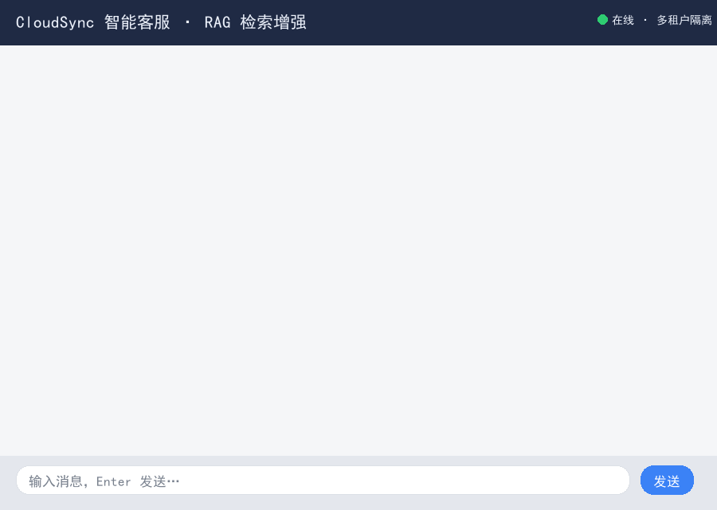
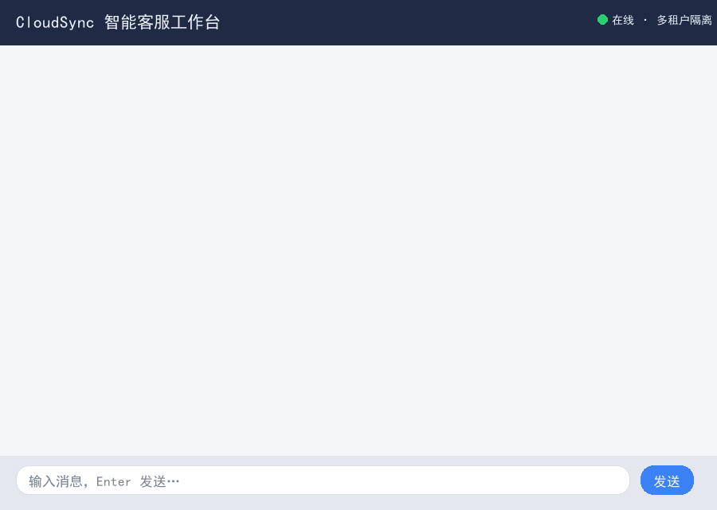
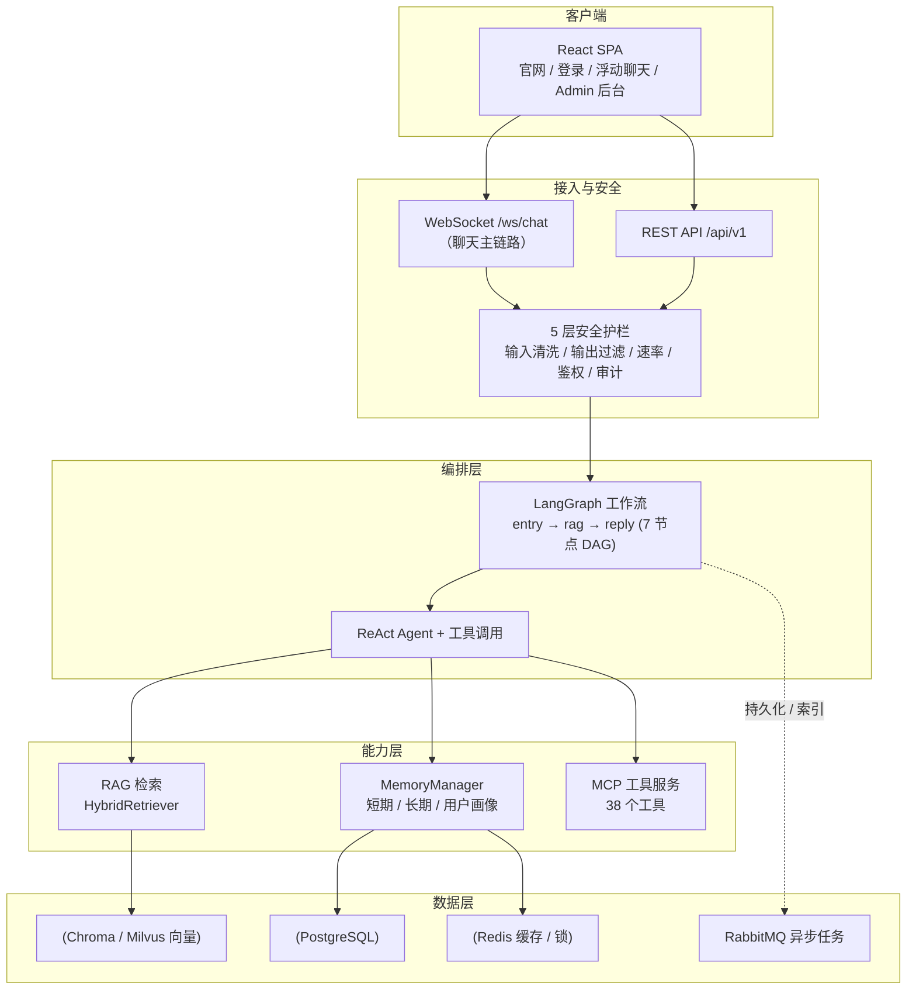

# Enterprise Customer Service Agent

> 一个**对标「阿里云 AI 助理」形态**的企业级智能客服系统，作为全栈 AI 工程**作品集**构建。
> 覆盖 LangGraph 工作流编排、RAG 检索增强、工具调用（MCP）、多租户隔离、RBAC 权限、5 层安全护栏与评估监控。

[](https://github.com/addhai/enterprise-agent/actions/workflows/ci.yml)
[](https://www.python.org/downloads/)
[](https://github.com/addhai/enterprise-agent)
[](LICENSE)

---

## 🔧 环境要求

- **Python 3.11+**（部署与 CI 基准锁定 3.11，见 `Dockerfile` / `.github/workflows/ci.yml`；本地开发建议 3.11 以与部署完全一致）
- **Node.js 22+**（前端 Vite 构建）
- **Docker 20.10+ / Compose v2**（可选，用于全栈云原生部署；`docker compose up -d` 一键起网关 + 双副本 api/ws + 监控）
- 真实大模型密钥 `OPENAI_API_KEY`（通义千问 DashScope 兼容）；缺失时部分 AI 能力降级，系统仍可启动与演示

## ✨ 项目亮点（为什么值得看）

- **端到端可跑的真实 demo**：单进程即可拉起「前端官网 + 浮动智能客服 + 后端 API + WebSocket 聊天」，AI 回复由真实大模型（通义千问）生成，不是 mock。
- **LangGraph 工作流编排**：`entry → rag → reply` 的多节点 DAG，含工具调用（ReAct）、记忆注入、安全护栏与人工接管（HITL）分支。
- **RAG 检索增强**：HybridRetriever（向量 + 关键词混合检索），开发用 Chroma、生产用 Milvus，支持多租户 Partition Key 隔离。
- **MCP 工具服务**：开箱即暴露 **38 个标准化工具**（工单 / 账单 / 用户 / SSO / API Key / 审计 / 知识库），任意 MCP 兼容 Agent 可自动发现并调用。
- **企业级工程能力**：RBAC 三层防护（工具级 + 参数级 + 审计）、多租户强制隔离（LLM 无法跨租户）、5 层安全护栏、GitHub Actions CI（lint + 确定性测试 + SAST）。
- **真实云资源查询**：对话中可查真实阿里云 ECS / RDS / SLB / Redis 实例与云监控指标（手写阿里云 RPC Signature V1 签名，`requests` 零额外依赖客户端，只读）；无 AK/SK 时自动回退样本数据，demo 不空。
- **容器化多副本部署**：应用层（api/ws/worker/rag/frontend）去除固定 `container_name`、api/ws 设 `replicas: 2`，网关与数据层保持单实例；水平扩展 `docker compose up -d --scale api-service=3 --scale ws-service=3 ...`。
- **云原生部署**：APISIX 网关、RabbitMQ 异步、Prometheus/Grafana 监控，Docker Compose / K3s + Helm 两条部署路径。
- **引用气泡（坐席可溯源）**：AI 回复下方透出"引用知识片段 N"可展开气泡，回复有据可依，对标阿里云智能客服坐席引用。

---

## 🎬 实时 Demo

> 下面是真实跑通的智能客服对话（非截图伪造，由真实大模型生成、WebSocket 流式返回）：

### RAG 检索增强（核心能力）

用户提出 CloudSync 产品技术问题，AI 从知识库精准检索并引用来源片段作答。



### 工具调用 + 工单创建

用户描述同步故障，AI 调用工具创建工单并给出排查建议。



### Demo 制作可复现

两张 GIF **全部由真实后端对话驱动、脚本化生成**，不依赖手工截图或 PS。完整链路：

```bash
# 1) 起后端（默认 8001，DEMO_WS_PORT 可覆盖）
uvicorn src.api.server:app --port 8001

# 2) 工具调用 Demo（demo.gif）
python scripts/ws_capture.py      # 抓取真实对话 → scripts/.cache/ws_reply.json
python scripts/make_demo_gif.py   # 渲染 demo.gif

# 3) RAG Demo（rag_demo.gif）
python scripts/rag_capture.py     # 抓多条、挑命中知识库术语的一条 → scripts/.cache/rag_api_best.json
python scripts/rag_demo_gif.py    # 渲染 rag_demo.gif
```

- 中间产物落在 `scripts/.cache/`（已 gitignore，不进仓库）；需要真实 LLM key（`.env` 的 `OPENAI_API_KEY` / DashScope）。
- `rag_capture.py` 支持 `RAG_RUNS=N` 控制抓取条数（默认 5，取命中知识库术语最多的一条）。

---

## 🔒 可验证能力证据链

作品集不是「某一功能亮眼」，而是「全栈都经得起问」。下面两条都做成了**可复现的自动化证据**，而非口头声称。

### 多租户 RBAC 隔离（A 租户看不到 B 租户数据）

租户与身份完全由服务端 JWT 解析决定，客户端无法注入 `tenant_id` 越权串台。证据是进 CI 长期复跑的 pytest：

```bash
pytest tests/test_websocket/test_ws_tenant_isolation.py -v
```

覆盖四点：

- 匿名连接 → 服务端解析为 `anon-<session_id>`，按连接粒度隔离，且被资源查询拦截
- 登录用户 → WebSocket 派生的 `tenant_id` 与 JWT 真实租户一致
- 越权防护 → 客户端在消息体注入 `tenant_id` 被服务端忽略，以 token 为准
- 伪造 token → 降级为匿名隔离，不会冒充任何租户

### 云原生多副本水平扩展（无状态 + 共享存储）

`docker-compose.yml` 已为 `api-service` / `ws-service` 设 `replicas: 2`，水平扩展命令：

```bash
docker compose up -d --scale api-service=3 --scale ws-service=3
```

docker daemon 不可用环境，用 `scripts/verify_multireplica.py` 在单机起 2 个独立 uvicorn 实例（等价于 2 个容器副本）实测：每个副本各自 `/api/v1/health == 200`、各自独立 accept WebSocket、副本 A 创建的工单副本 B 用同一 token 能读到（共享存储一致）。本质是**状态外置到共享存储（SQLite/PostgreSQL），任意无状态副本承接流量结果一致**。

```bash
python scripts/verify_multireplica.py   # 退出码 0 = 验证通过
```

---

## 🏗️ 系统架构



**聊天主链路说明**：前端浮动聊天组件通过 **WebSocket `/ws/chat`** 与后端实时通信（流式返回 AI 回复）；登录、KPI 看板、会话列表等才走 REST `/api/v1`。后端在根路径用 `StaticFiles` 同源托管前端 `static/` 目录，因此单进程即可同时提供页面、API 与 WS。

---

## 🚀 快速开始

### 路径 A：最轻量（推荐，已验证 ✅）

无需 Docker，一个 Python 进程同时托管前端页面、API 与 WebSocket。3 步即可看到完整 demo：

```bash
# 1. 准备后端依赖与密钥
python -m venv venv
venv/Scripts/activate              # Windows；macOS/Linux: source venv/bin/activate
pip install -r requirements.txt
cp .env.example .env               # 编辑 .env，填入 OPENAI_API_KEY（DashScope 兼容模式，见 .env.example 的 OPENAI_API_BASE）

# 2. 构建前端（产物自动输出到后端托管的 static/ 目录）
cd frontend
npm install
npm run build                      # vite.config 已配 build.outDir = ../static
cd ..

# 3. 启动（用 Chroma 规避 Milvus，开箱即跑）
make demo                            # 或：python scripts/run_demo.py
# 脚本会自动选择 venv Python、设置 VECTOR_STORE_BACKEND=chroma 并启动 uvicorn
```

浏览器打开 **http://localhost:8000** → 右下角浮动客服 → 发消息即可获得真实 AI 回复。

> 验证状态：`/api/v1/health` 返回 `{"status":"ok"}`；WebSocket 聊天实测可流式返回由 Qwen 生成的回复。Redis 本地可用时自动启用会话缓存；缺失仅告警，不影响聊天。

### 路径 B：Docker Compose 全栈（12 个服务）

适合完整体验网关 / 消息队列 / 监控等云原生组件（较重，需构建多个镜像）：

```bash
cp .env.example .env               # 填入 OPENAI_API_KEY（DashScope 兼容模式）
make up                            # = docker compose up -d（apisix + 4 业务服务 + pg/milvus/minio/redis/rabbitmq + nginx）
make ingest                        # 知识库文档入库
bash scripts/smoke-test.sh         # 冒烟验证
```

前端访问 http://localhost（nginx），API 经 APISIX 网关。监控栈可选：

```bash
docker compose -f docker-compose.monitoring.yml up -d
# Grafana:  http://localhost:3000 (admin/admin)
# Prometheus: http://localhost:9090
# MinIO:      http://localhost:9001
# RabbitMQ:   http://localhost:15672 (agent/agent)
```

### 路径 C：本地开发（热重载）

```bash
make install                       # pip install + npm ci
make demo                          # 一键启动最小可演示实例（单进程、无 Docker）
make dev                           # API Server (uvicorn --reload, port 8000)
make dev-rag                       # RAG Server (port 8001)
# 前端另开终端：cd frontend && npm run dev (port 3000，已配代理到 :8000 /ws)
```

---

## 🧱 技术栈

| 组件 | 选型 |
|------|------|
| 编排 | LangGraph（7 节点 DAG） |
| Agent | LangChain ReAct Agent + 工具调用 |
| LLM | 阿里百炼 Qwen-Plus / Qwen-Max |
| Embedding | text-embedding-v4 (1024 维) |
| 向量库 | Chroma（开发）/ Milvus（生产） |
| 服务 | FastAPI + uvicorn（WebSocket 聊天主链路） |
| 网关 | APISIX（路由 / 限流 / 熔断 / 鉴权 / SSL） |
| 消息队列 | RabbitMQ（异步推理 / 记忆持久化 / 文档索引） |
| 对象存储 | MinIO（文档 / 日志 / 模型权重 / 备份） |
| 前端 | React + TypeScript + Vite |
| 监控 | Prometheus + Grafana |
| CI/CD | **GitHub Actions**（lint + 确定性测试 + SAST） |
| 云资源查询 | 阿里云 OpenAPI（ECS/RDS/SLB/Redis 只读 + 云监控，手写 RPC 签名零依赖；无密钥回退样本） |
| 鉴权 | JWT（HS256 零依赖，无状态，支持多副本 / 多进程部署） |
| 部署 | Docker Compose **多副本**（`--scale`）/ K3s + Helm（生产） |

> 注：仓库内存在 `.gitlab-ci.yml` 但与当前 CI 无关，实际流水线运行在 GitHub Actions（`.github/workflows/ci.yml`），请勿混淆。

---

## 🔌 MCP 服务（含工单管理）

`src/protocols/mcp_server.py` 暴露标准化 MCP HTTP 接口，任意 MCP 兼容 Agent（Claude Desktop / Cursor / Claude Agent SDK / 自定义 Agent）连接后可自动发现并调用工具。

### 启动方式

```bash
# 1. 默认启动（所有 38 个工具，端口 9000）
pip install zeromcp
python -m src.protocols.mcp_server

# 2. 仅启动工单管理 MCP Server（6 个工具，端口 9005）
python -m src.protocols.mcp_server --ticket-only

# 3. 仅启动管理后台工具（35 个工具，端口 9010，不含客服基础工具）
python -m src.protocols.mcp_server --admin-only

# 4. 仅启动账单管理（5 个工具，端口 9011）
python -m src.protocols.mcp_server --billing-only

# 5. 带身份上下文启动（注入 admin 角色）
python -m src.protocols.mcp_server --user-id agent_007 --tenant-id tenant_A --roles admin,support_agent

# 6. 禁用特定工具集
python -m src.protocols.mcp_server --no-audit --no-kb    # 禁用审计和知识库工具
```

### 工具清单（共 38 个）

| 分类 | 工具 | 角色 | 说明 |
|---|---|---|---|
| **客服** | `search_knowledge_base` / `search_faq` / `escalate_to_human` | 任何用户 | 基础客服工具 |
| **工单** | `ticket_create` / `ticket_query` / `ticket_list` / `ticket_update` / `ticket_close` / `ticket_add_comment` | 用户/Admin | 创建、查询、更新、关闭工单 |
| **账单** | `billing_query_subscription` / `billing_change_plan` / `billing_refund` / `billing_list_transactions` / `billing_deduct` | Admin/Billing | 查询订阅、变更套餐、退款、扣款 |
| **用户** | `user_get_profile` / `user_reset_password` / `user_disable_account` / `user_list` / `user_update_profile` | Admin | 用户资料、密码重置、禁用账号 |
| **SSO** | `sso_configure` / `sso_list_providers` / `sso_test_connection` / `sso_enable` / `sso_disable` | Admin | 配置 SAML/OIDC 单点登录 |
| **API Key** | `api_key_generate` / `api_key_revoke` / `api_key_list` / `api_key_get` / `api_key_rotate` | Admin | 生成、吊销、轮换 API Key |
| **审计** | `audit_query_logs` / `audit_export_report` / `audit_search_by_user` / `audit_get_log_details` | Admin | 查询、导出审计日志 |
| **知识库** | `kb_ingest_document` / `kb_rebuild_index` / `kb_list_items` / `kb_delete_item` / `kb_search` | Admin/用户 | 导入文档、重建索引、搜索 |

### 权限模型

- **三层防护**：工具级权限 + 参数级校验 + 审计日志（复用 `PermissionChecker`）
- **多租户隔离**：`tenant_id` 由后端从调用者上下文强制注入，LLM 无法跨租户
- **角色粒度**：`admin` 拥有全部权限，`support_agent` 可操作工单，`billing_manager` 可操作账单
- **幂等保证**：`ticket_create` / `billing_deduct` 支持 `idempotency_key`

### MCP 客户端接入示例

```python
# Claude Agent SDK / 任意 MCP 客户端
client = MCPClient("http://localhost:9000/mcp")
await client.initialize()
tools = await client.list_tools()           # 自动发现 38 个工具

# 创建工单
result = await client.call_tool(
    "ticket_create",
    title="无法登录账号",
    description="点击登录无响应",
    category="account",
    priority="high",
    idempotency_key="req-2026-07-15-001",
)

# 查询订阅
result = await client.call_tool("billing_query_subscription")

# 生成 API Key
result = await client.call_tool("api_key_generate", name="my-app-key")
```

能力契约详见 [capability-ticket.yaml](capability-ticket.yaml)。

---

## 🧪 测试与 CI

GitHub Actions 运行 3 个阶段：代码检查（ruff lint / format）、确定性单元测试（pytest + 覆盖率）、SAST（Bandit + Semgrep）。

```bash
make test            # 运行全部测试（带覆盖率门槛）
make test-cov        # 测试 + 覆盖率报告
make ci-full         # 本地跑完整 CI 流水线
make lint            # ruff 检查 + 格式化
```

**可验证指标（CI 裸环境真实运行：无 API Key / 无 .env）：**
- 测试：**856 passed / 17 skipped**（全量 `tests/`，`-m "not integration"`），覆盖 agent / MCP 工具 / 安全护栏 / 工单 / 评估 / 多租户 WS 隔离 / API 接线守卫等
- 覆盖率：**48.83%**（门禁 40%），`--cov-fail-under=40` 同时固化进 pytest 与 CI，本地 `make test` 与 CI 行为一致
- 多租户 WS 隔离守卫（`tests/test_websocket/test_ws_tenant_isolation.py`）：匿名按连接隔离、登录派生真实租户、客户端注入 tenant 被忽略、伪造 token 降级匿名，4 点全绿
- 应用接线守卫（`tests/test_api/test_app_wiring.py`）：19 个 router 模块逐个导入探测 + 鉴权关键路由存在性断言，任一 router 静默消失立即红灯
- 类型 / lint：ruff（line-length 88，target py311）；安全：Bandit 中高危阻断 + Semgrep ERROR 级

> 测试运行全量 `tests/`，靠 `requires_llm` / `integration` marker 自动跳过需真实 LLM / 外部依赖的用例（默认 skip，设 `RUN_LLM_TESTS=1` 且配 Key 才跑）。无需真实密钥即可稳定转绿。

---

## 📁 项目结构

```
src/
├── api/            FastAPI 服务 + 路由（含 WebSocket /ws/chat）+ 指标
├── agent/          ReAct Agent (tools + prompt)
├── graph/          LangGraph 工作流 (7节点 DAG)
├── memory/         MemoryManager (短期/长期/用户画像)
├── rag/            RAG 子系统 (加载/切块/嵌入/检索/Chroma/Milvus)
├── ticket/         工单管理 (models + store + MCP 工具)
├── websocket/      WebSocket 会话管理（聊天主链路）
├── worker/         RabbitMQ 消费者
├── infrastructure/ Redis 锁 + MinIO 客户端
├── safety/         安全护栏 (输入/输出/清洗)
├── evaluation/     评估指标 + 追踪器
├── channels/       多渠道接入 (微信/电话/Chatwoot)
├── protocols/      A2A + MCP 协议 (含工单 MCP Server)
└── dispatch/       消息标准化 + 仲裁
deploy/
├── helm/enterprise-agent/  K3s 部署 Chart
├── apisix/                 APISIX 网关配置
├── rabbitmq/               RabbitMQ 队列拓扑
├── postgres/init/          PG Schema + 种子数据
├── monitoring/             Prometheus + Grafana
├── argocd/                 ArgoCD Applications
├── nginx-frontend.conf     前端 Nginx
└── docker-compose.dev.yml  开发热重载覆盖
docker/                       多服务 Dockerfile
scripts/                      迁移/备份/冒烟/CI 脚本
frontend/                     React + TS + Vite（npm run build → static/）
```

---

## 📄 License

MIT
