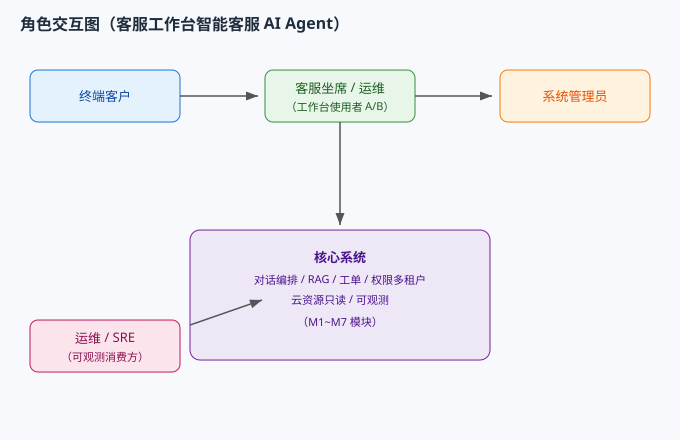

# AICoding 架构设计 · UserStory

> 本文档为《AICoding 架构设计》核心产物之一，定位为**产品需求与用户故事（UserStory）**，对应 Gate G4（与系统设计同门，G4 通过前主理人不得进入部署/安全阶段）。
> 上游输入：《高层架构设计》（G3 已通过，业务边界 / 角色场景 / MVP 范围 F1~F8 / Out-of-Scope O1~O6 / 三态标注冻结基线）+ 《系统设计》（G4 已通过，模块 M1~M7 / 术语表 / 接口契约 SLA，仅用于对齐术语与功能归属，不重新设计模块边界）。
> 下游输出：驱动《部署设计》《安全设计》的具体功能实现。
>
> **三态标注约定（继承上游口径，诚信声明）**：全文以【已实现】= 代码已落地可演示；【架构就绪未运行化】= 架构/代码已具备但运行态仅 default 单租户；【演示回退】= 默认以 demo 样本 / 单进程核心链路 / 架构就绪方式演示，真实长链路未运行化。区分【事实】/【假设】/【建议】。

---

## 1. 业务背景与价值

### 1.1 业务背景

- **当前业务现状（行业 / 产品 / 用户规模）**：本项目为个人简历作品集（作者 hai/拾一，大三 AI 应用开发方向），非团队生产系统；对标「阿里云 AI 助理」智能客服形态，按生产级标准开发（真实云 API、多租户 + RBAC、可观测、云原生）。系统为面向**坐席 / 运维**的客服工作台智能客服 AI Agent（非纯 C 端），技术栈 Python FastAPI + LangGraph + RAG + MCP，前端 React/TypeScript，单仓库 `github.com/addhai/enterprise-agent`（master）。当前已有 856 测试 + 覆盖率门禁、38 个 MCP 工具、多副本 compose 部署等工程底座。
- **触发本次需求的事件**：用户启动 AICoding 架构专家团，要求基于项目背景资料交付五份架构文档；本 UserStory 作为下游设计输入，把已冻结的高层架构能力翻译成研发与产品可直接消费的故事化表达。
- **本系统在产品矩阵中的位置**：位于个人作品集内的「客服工作台智能客服」核心，向上游对接阿里云只读 API（demo 回退）与模型 demo key，向下无外部下游（管理后台看板为内部消费），形成完整可演示闭环。对外演示严守「真实密钥永不上公网」红线。

### 1.2 行业方案

> 同类功能、痛点的行业标杆系统及解决方案（详见《高层架构设计》§3 行业调研，本表做产品侧对齐摘要）。

| 标杆系统 | 厂商 | 可借鉴的方案要点 | 对本产品的启示 |
| --- | --- | --- | --- |
| 阿里云百炼 + 通义晓蜜 | Alibaba Cloud（SaaS 头部） | 企业级智能客服、RAG 知识问答、Agent 工具调用、工单流转、权限隔离 | 多轮对话 + RAG 命中 + 工单流转 + 权限隔离的「企业级智能客服工作台」范式对标（场景契合 5/5） |
| Dify | LangGenius（开源） | 可视化工作流、RAG 混合检索 + 重排、多租户、企业 SSO/RBAC | 自托管零服务费 + 红线下，工程实现最高契合（加权 4.55） |
| Rasa | Rasa（开源） | CALM 对话状态管理、on-prem 数据主权、RBAC/SSO | 对话/业务规则分离、数据主权可借鉴（偏语音，不全盘对齐） |
| 重型闭源 CCaaS（Genesys / Salesforce） | 闭源 SaaS | 大规模联络中心、全渠道、CRM 原生 | 需真实采购 + 闭源全托管，与学生作品集目标冲突，已否决（加权 2.30） |

### 1.3 方案收益与价值

| 项 | 说明 | 量化标准 |
| --- | --- | --- |
| 功能模块 | 可演示的生产级 AI 工程能力点：编排（LangGraph 7 节点）/ 混合检索（向量+BM25+RRF）/ MCP 38 工具 / 双重隔离（SQL 级 + 向量级）/ 5 层护栏 + LLM-as-Judge / 可观测（12 面板 8 告警） | 6 类能力点 MVP 全可证明 |
| 预期价值收益 | 对招聘方/面试官：工程深度与架构完整性可经得起追问；对坐席/运维：缩短问题处理路径、提升知识命中率与工单流转效率；对自身：全自托管零服务费 | 工程深度可证明；诚信声明 100% 覆盖 |
| 量化标准 | 成本 0 元（全自托管）；覆盖率门禁 40% 实测 48.83%；RAG 评测基准 Recall 0.6528 / MRR 0.8333；WS 首字 P99 少于等于 3s | 见《高层架构设计》§1.3 价值主张与《系统设计》§5.3 SLA |

### 1.4 术语清单

> 与《系统设计》§1.3 术语表对齐（应用层核心对象 / 数据库表名继承自系统设计，本表聚焦产品与角色侧术语）。

| 术语 | 中文含义 | 产品侧说明 |
| --- | --- | --- |
| 坐席（Agent） | 工作台使用者 A | 通过 WS /ws/chat 发起多轮对话、创建工单、查询云资源的客服/运维人员 |
| 管理员（Admin） | 管理后台使用者 B | 负责租户 / RBAC / 知识库 / 工单的后台配置与越权校验 |
| 终端客户 | 经坐席被服务的用户 | 不直接操作系统，由坐席服务，关注问题解决与等待时长 |
| 多租户双重隔离 | SQL 级 + 向量级隔离 | 租户数据在关系库与向量库双重物理/逻辑隔离；当前【架构就绪未运行化】（运行态仅 default） |
| 三态标注 | 已实现 / 架构就绪未运行化 / 演示回退 | 本作品集诚实声明「演示口径 vs 运行态」差异的标注口径 |
| 红线 | 真实密钥永不上公网 | 仅 localhost / 可吊销 demo key 对外演示；真实 AK 不直连公网 |
| MVP | 最小可演示版本 | 覆盖 F1~F8 核心链路，单进程/核心链路演示 |
| demo fallback | 演示回退样本 | 云资源查询默认 `ALIYUN_DEMO_FALLBACK=true`，回退样本数据并透明标注来源 |
| 租户（Tenant） | 多租户隔离单元 | O-01 Tenant / t_tenant |
| 会话（Conversation） | 一次 WS 对话上下文 | O-03 Conversation / t_conversation |
| 工单（Ticket） | 客服流转任务实体 | O-06 Ticket / t_ticket |
| 角色权限（RBAC） | 角色与权限点 | O-07/O-08 Role / t_rbac_role |

---

## 2. 范围与边界

### 2.1 系统内模块及功能

> 一级功能清单（与《高层架构设计》§6.2 模块全景 + 《系统设计》模块 M1~M7 互查一致；详细三层功能清单见 §3）。

| 一级模块 | 说明 | MVP 是否包含 |
| --- | --- | --- |
| 智能对话编排 | 多轮对话 + 5 层护栏 + LLM-as-Judge（M1） | 是 |
| RAG 知识问答 | 混合检索 + 语料灌入复验（M2） | 是 |
| 工单中心 | 工单创建流转（M3） | 是 |
| 权限与多租户 | RBAC 越权拦截 + 双重隔离（M4） | 是（架构就绪） |
| 云资源只读查询 | 只读 RPC + demo fallback（M5） | 是（演示回退） |
| 可观测 | 监控面板与告警（M7） | 是 |
| 接入层（前端） | 坐席工作台 + 管理后台（M 前端） | 是 |
| 部署 | 自托管 compose 多副本（M6 网关 + 基础设施） | 是 |

### 2.2 系统外模块及功能

> 当前系统**不覆盖**的功能及其原因（继承《高层架构设计》§6.1 Out-of-Scope O1~O6，不得突破）。

| 编号 | 不做的事 | 原因 | 后续计划 |
| --- | --- | --- | --- |
| O1 | 完整 12 服务栈长时间联跑 | 【事实】卡 milvus 内存 2G（R-01），MVP 以单进程/核心链路演示 | 完整版：milvus 内存修复或 chroma fallback |
| O2 | 多渠道接入（邮件/电话/APP） | 非 MVP 必需，聚焦核心链路 | 完整版 |
| O3 | 真实 AK 直连对外演示 | 【事实】红线禁止真实 key 上公网；仅 localhost / demo key | 不做对外真实直连；完整版仅本地/demo |
| O4 | 运行态多租户（租户管理端点 + 租户维度 RBAC） | 【事实】架构就绪但运行态仅 default（X9/D6） | 完整版（D-01/D-02） |
| O5 | 重型 CCaaS 全渠道 / CRM 原生能力 | 【事实】闭源采购、触红线、作品集无法承载（加权 2.30 否决） | 不借鉴 |
| O6 | 覆盖率 80% KPI | 【事实】D15 不适用本项目；门禁 40% 实测 48.83% 已达标 | 不追 80% |

### 2.3 外部依赖

| 依赖系统 | 提供方 | 依赖能力 | 接入方式 | 接口人 |
| --- | --- | --- | --- | --- |
| 阿里云 OpenAPI | 阿里云 | 只读云资源查询 / 诊断 | HTTPS / REST（手写 RPC Signature V1） | 本项目（ACL 防腐层，红线约束） |
| 通义千问模型 API | 阿里云百炼 | LLM 推理 | HTTPS / REST（WS/SSE） | 本项目（仅可吊销 demo key） |
| LangGraph | 本项目 | 对话编排 | 进程内调用 | 后端团队 |
| APISIX 网关 | 本项目 / 部署 | 路由鉴权限流熔断 | 本地部署 | 平台/运维 |
| RabbitMQ | 本项目 / 部署 | 异步工单 / 通知 | MQ | 平台/运维 |
| Chroma / Milvus | 本项目 | 向量检索 | 本地 | 平台团队 |
| PostgreSQL | 本项目 | 持久化 | 本地 | 平台团队 |
| Redis | 本项目 | 缓存 / 限流 / 锁 | 本地 | 平台团队 |
| Prometheus / Grafana | 本项目 | 可观测 | 本地拉取 | 平台/SRE |
| 管理后台看板 | 内部 | 运营视图 | WS / REST | 前端团队（无外部下游） |

---

## 3. 功能清单

> **定位**：全景骨架表，进入「角色 / 场景 / US」之前先看到完整功能版图。三层结构：**一级模块 → 二级模块 → 功能项**；与《高层架构设计》§6.3 功能清单（F1~F15）互查一致；优先级 P0/P1/P2；MVP 范围 vs 完整版范围区分。

### 3.1 功能清单结构

| 一级模块 | 二级模块 | 功能项 | 优先级 | MVP 范围 | 完整版范围 | 备注（三态标注） |
| --- | --- | --- | --- | --- | --- | --- |
| 智能对话编排 | 多轮对话编排 | F1 多轮对话主链路（WS /ws/chat，LangGraph 7 节点 DAG + ReAct） | P0 | ✅ | ✅ | 【已实现】 |
| 智能对话编排 | 对话护栏与评估 | F8 5 层安全护栏 + LLM-as-Judge 5 维评分 + 幻觉检测 | P0 | ✅ | ✅ | 【已实现】 |
| RAG 知识问答 | 知识库命中检索 | F2 HybridRetriever 向量+BM25+RRF + 引用气泡溯源 | P0 | ✅ | ✅ | 【演示回退】三 bug 已修复 + 单测复验通过（pytest 全绿） |
| RAG 知识问答 | 语料灌入与复验 | F3 语料灌入 205 切片（KBS-CD0480）+ 三 bug 复验 | P0 | ✅ | ✅ | 【演示回退】已灌 + 单测复验通过（pytest 全绿） |
| 工单中心 | 工单创建流转 | F4 工单创建/分派/流转/关闭（MCP 工单域 6 工具） | P0 | ✅ | ✅ | 【已实现】运行态单租户 |
| 权限与多租户 | 三角色越权 403 | F5 RBAC 角色口径统一后验证越权拦截 | P0 | ✅ | ✅ | 【已实现】运行态单租户 |
| 权限与多租户 | 多租户双重隔离 | F6 SQL 级 + 向量级双重隔离（Chroma 查询带 where DB 级隔离） | P0 | ✅ | ✅ | 【已实现(运行化)】建租户后跨实体隔离已验证；运行态默认仍单 default 租户（需显式建租户） |
| 权限与多租户 | 多租户运行化 | F13 租户管理端点 + 租户维度 RBAC | P1 | ✅ | ✅ | 【已实现(运行化)】租户管理端点（含预置管理员）+ 租户维度 RBAC(R4) 均已落地并含单测；跨工单/满意度/通知/RBAC用户/看板隔离集成测试验证（tests/test_api/test_multitenant_runtime.py） |
| 云资源只读查询 | 资源查询诊断 | F7 手写 RPC 只读客户端，默认 demo fallback | P0 | ✅ | ✅ | 【演示回退】真实 AK 不上公网 |
| 可观测 | 监控面板与告警 | F9 Prometheus + Grafana 12 面板 8 告警 | P1 | ✅ | ✅ | 【已实现】Grafana 已 VERIFIED |
| 接入层 | 坐席/运维工作台 | F10 React SPA + WS/REST 对话工作台 | P1 | ✅ | ✅ | 【已实现】 |
| 接入层 | 管理后台 | F11 租户/RBAC/工单/知识库管理 | P1 | ✅ | ✅ | 【已实现】 |
| 部署 | 自托管多副本 | F12 compose 部署，api/ws replicas:2 | P1 | ✅ | ✅ | 【已实现】MVP 单进程核心链路演示 |
| 部署 | 完整 12 服务联跑 | F14 milvus 内存修复 / chroma fallback | P2 | ❌ | ✅ | 【演示回退】卡 R-01 |
| 部署 | 多渠道接入 | F15 邮件/电话/APP 接入 | P2 | ❌ | ✅ | 完整版（不在 MVP） |

> **互查说明**：上表 15 个功能项与《高层架构设计》§6.3（F1~F15）编号、优先级、MVP/完整版范围逐项一致；P0 功能（F1~F8）全部在 MVP 范围 ✅，未做任何裁剪或扩展。

---

## 4. 角色与场景

### 4.1 角色清单

| 角色 | 业务身份 | 主要操作 | 核心关注点 |
| --- | --- | --- | --- |
| 甲方决策者（招聘方 / 面试官） | 作品集评审方 | 审阅项目、面试深挖 | 工程深度与架构完整性的**可证明性**（能否经得起追问，而非规模） |
| 最终用户 A（客服坐席 / 运维） | 工作台使用者 | 对话问答、工单创建流转、云资源只读查询 | 多轮对话**命中知识库**、工单顺畅流转、操作高效 |
| 最终用户 B（系统管理员） | 管理后台使用者 | 租户 / RBAC / 知识库 / 工单管理 | 权限隔离正确（越权拦截）、配置可控、审计留痕 |
| 受影响方：终端客户 | 经坐席被服务的用户 | 经坐席获得问答 / 工单 | 问题被准确解决、等待时间短 |
| 受影响方：运维 / SRE | 可观测消费方 | 监控、告警响应、容量查看 | 系统可用性与告警及时性、故障快速定位 |



### 4.2 关键场景清单

| 编号 | 角色 | 触发条件 | 期望结果 | 频率（日均 / QPS） |
| --- | --- | --- | --- | --- |
| S1 | 坐席（A） | 在工作台 WS 发起提问 | 流式回复 + 引用气泡，命中知识库 | 高频（坐席日常，单用户 50 QPS 上限） |
| S2 | 坐席（A） | 对话中识别需人工跟进 | 一键创建工单并进入流转 | 中频（按会话量） |
| S3 | 任意角色 | 发起越权 / 跨租户请求 | 网关 + RBAC 返回 HTTP 403 | 低频（异常态，CI 已覆盖） |
| S4 | 坐席（A） | 对话中触发云资源查询意图 | 只读查询结果（demo fallback 透明标注） | 中频 |
| S5 | 管理员（B） | 后台配置租户 / 角色 / 知识库 | 配置生效、越权被拦截、审计留痕 | 低频（运营操作） |
| S6 | 运维 / SRE | Grafana 告警触发 | 实时看到指标与告警，快速干预 | 低频（按异常） |
| S7 | 坐席（A）/ 系统 | 会话结束 | 对话评估（LLM-as-Judge）评分 + 复盘 | 每会话一次 |

---

## 5. 用户旅程（UserStory）

> 每条 UserStory 按 5.1.1~5.1.7 七段式展开（业务场景 / 业务流程 / UE 原型 / 业务逻辑 / 数据描述 / 验收标准 / 外部集成接口）。验收标准严格使用英文 **Given / When / Then**，含正常路径与异常路径。

### 5.1 US-1 坐席多轮对话与知识库命中

#### 5.1.1 业务场景

- **视角**：客服坐席（最终用户 A）
- **描述逻辑**：坐席在客服工作台通过 WebSocket /ws/chat 与智能客服展开多轮对话；连续追问同一问题或换角度提问时，系统基于 LangGraph 7 节点 DAG 编排，调用 HybridRetriever（向量 + BM25 + RRF）命中已灌入的知识库切片，返回流式文本并附**可点击溯源的引用气泡**；全程经过 5 层安全护栏与 LLM-as-Judge 评分。

#### 5.1.2 业务流程

- **视角**：用户（坐席）
- **描述方式**：Given / When / Then

正常路径：

```
Given 坐席已登录且持有有效 JWT（角色 agent/viewer），前端工作台已打开对话页
When 坐席在输入框发送一条提问（message 长度少于等于 2000 字）并通过 WS /ws/chat 提交
Then 系统建立/续接会话，编排引擎执行 LangGraph 7 节点（entry → rag → reply），RAG 命中知识库切片，前端以流式增量渲染回复，并在回复末尾展示可点击的引用气泡（citations），WS 首字延迟 P99 少于等于 3s
```

异常路径：

```
Given 坐席已登录并发送提问
When RAG 检索置信度低于阈值或检索失败（三 bug 复验前的不稳定态）
Then 编排触发转人工（transfer_notice），回复提示「未找到相关知识，已转人工」，并通过 RabbitMQ 异步创建工单，不返回崩溃
```

#### 5.1.3 UE 原型

```
┌─────────────────────────────── 坐席工作台 (/workbench) ─────────────────────────────┐
│  会话列表(B)   │   对话主区域                                                    │
│  ● 会话1       │   坐席：ECS 实例无法启动怎么办？                              │
│  ● 会话2       │   AI  ：请检查实例状态与安全组… [引用① SOP-启动指引] [引用② 计费说明] │
│                │   坐席：那 410 Gone 是什么？  ← 多轮追问                      │
│   输入框 ┌──────┴──────────────┐  发送按钮                                    │
│         │ 输入问题…            │  [发送]                                     │
└─────────┴─────────────────────┴─────────────────────────────────────────────┘
 说明：引用气泡①/②可点击溯源至知识库切片；WS 流式首字少于等于 3s。
```

#### 5.1.4 业务逻辑

- **视角**：业务系统
- **描述方式**：坐席经 WS 发送 chat_message（带 trace_id + JWT 派生 tenant_id）→ ① 会话建立：校验 JWT 有效、解析 tenant_id/user_id/roles，消息长度校验，无 session 则创建 Conversation；② 编排执行：LangGraph 7 节点 entry → rag → reply，调用 HybridRetriever（tenant 过滤）得到命中切片 + citations，调用模型网关（仅 demo key）流式生成 token，落 Message（tenant_id 强制）并加分布式锁 lock:session:{id}；③ 护栏：5 层安全护栏过滤敏感/越权内容，LLM-as-Judge 异步评分；④ 转人工分支：低置信时推送 transfer_notice 并 MQ 异步创建工单。

#### 5.1.5 数据描述

- 输入：ChatMessage（message、session_id、user_id、trace_id；tenant_id 客户端传入但服务端以 JWT 为准忽略）
- 流转：Conversation（t_conversation）→ Message（t_message）→ 检索命中 Chunk → citations 数组 → StreamingChunk（text/delta/citations/done）
- 存储：PostgreSQL 持久化会话与消息；Redis 缓存会话状态与分布式锁；向量库承载 Chunk 嵌入

#### 5.1.6 验收标准 AC

- **正常路径**

```
Given 坐席使用 admin/admin123 登录后进入 /workbench，WebSocket 已连接
When 发送提问「ECS 实例无法启动怎么办」且知识库已灌入相关 SOP 文档
Then 系统在 P99 少于等于 3s 内返回首字，完整回复含可点击引用气泡，且引用内容来自知识库切片（非编造）
```

- **异常路径**

```
Given 坐席发送提问但 RAG 检索未命中（或检索服务临时不可用）
When 编排判定低置信度
Then 系统返回「已转人工」提示，并通过异步消息创建工单，HTTP/WS 不返回 5xx 崩溃，回复内容不搪塞
```

#### 5.1.7 外部集成接口

- WS `/ws/chat`（M1，流式主链路，天然幂等）
- REST `/api/v1/chat`（M1，兜底对话，幂等键 biz_req_no）
- POST `/api/v1/evaluation/runs`（M1，发起对话评估，幂等键 idempotency_key）
- 模型网关（E-02 通义千问，仅 demo key，流式首字 3s、总超时 30s，重试 1 次）
- 向量库 Chroma/Milvus（M2 检索子能力）；Redis（锁/缓存）；RabbitMQ（转人工建单）

### 5.2 US-2 坐席发起工单创建与流转

#### 5.2.1 业务场景

- **视角**：客服坐席（最终用户 A）
- **描述逻辑**：在对话过程中或对话结束后，坐席识别需人工跟进的问题，通过工作台一键创建工单（标题/描述/分类/优先级），系统经 MCP 工单域 6 工具落库并返回工单号；工单进入状态机流转（CREATED → ASSIGNED → IN_PROGRESS → RESOLVED → CLOSED），管理员可在后台分派、催办、关闭。

#### 5.2.2 业务流程

- **视角**：用户（坐席 / 管理员）
- **描述方式**：Given / When / Then

正常路径：

```
Given 坐席在对话页点击「创建工单」并填写 title/description/category/priority，携带有效 JWT
When 调用 POST /api/v1/tickets 并传入强制幂等键 idempotency_key
Then 系统创建工单并返回 TicketVO（status=CREATED，含 ticket_id），同一幂等键重复提交返回相同结果，不重复建单
```

异常路径：

```
Given 坐席提交工单创建请求但网络抖动触发重试
When 两次请求携带相同 idempotency_key
Then 系统依据 DB 唯一索引（tenant_id + biz_req_no）去重，返回首次结果（A030001 类业务失败仅在不重试场景提示），绝不产生双单
```

#### 5.2.3 UE 原型

```
┌──────── 工单详情/创建 (/tickets) ─────────┐
│ 标题：[输入框]                            │
│ 描述：[多行输入框]                        │
│ 分类：account │ billing │ tech …（下拉）  │
│ 优先级：low │ normal │ high │ critical     │
│ [取消]                    [提交工单]       │
└──────────────────────────────────────────┘
 状态机：CREATED → ASSIGNED → IN_PROGRESS → RESOLVED → CLOSED（ANY→reopen）
```

#### 5.2.4 业务逻辑

- **视角**：业务系统
- 工单创建：校验 JWT 与角色 → 写入 t_ticket（tenant_id 强制）→ 返回 TicketVO；幂等键写入幂等表（TTL 24h）。
- 流转：assign() 校验 tenant 归属 + 操作角色后发通知坐席；start()/wait_customer()/resolve()/close() 按状态机迁移；并发 close 与 resolve 以乐观锁 version 拒绝旧版本（返回 C409 冲突，调用方退避重试）。
- 事件：ticket.created / ticket.updated 以标准事件经 RabbitMQ 多消费者订阅（管理后台/通知）。

#### 5.2.5 数据描述

- 输入：TicketCreateRequest（title、description、category、priority、creator_id、idempotency_key）
- 流转：t_ticket（status 状态机）→ t_rbac_user_role（操作角色校验）→ 幂等表（idem:{uuid}）→ RabbitMQ 事件
- 输出：TicketVO（ticket_id、status、created_time、updated_time）

#### 5.2.6 验收标准 AC

- **正常路径**

```
Given 坐席已登录且具备工单创建权限
When 提交合法工单（priority=high）并携带唯一 idempotency_key
Then 返回 status=CREATED 的 TicketVO，工单出现在 /tickets 列表且 tenant 归属正确
```

- **异常路径**

```
Given 坐席连续两次提交相同 idempotency_key 的工单请求
When 第二次请求到达时首次仍在处理或已完成
Then 系统返回与首次一致的结果（处理中或已创建），不产生第二条工单（幂等去重）
```

#### 5.2.7 外部集成接口

- POST `/api/v1/tickets`（M3，创建，幂等键 idempotency_key）
- GET `/api/v1/tickets`（M3，列表，天然幂等）
- PUT `/api/v1/tickets/{ticket_id}`（M3，更新，id+version 乐观锁）
- POST `/api/v1/tickets/{ticket_id}/assign`（M3，分派，幂等）
- POST `/api/v1/tickets/{ticket_id}/close`（M3，关闭，幂等）
- RabbitMQ（M3 事件发布，4 队列 + DLX）

### 5.3 US-3 三角色越权 403 拦截与多租户隔离

#### 5.3.1 业务场景

- **视角**：系统管理员（最终用户 B）/ 任意角色
- **描述逻辑**：系统对受保护接口执行 RBAC 鉴权与多租户双重隔离。普通用户/坐席访问 admin 接口，或客户端注入 tenant_id 试图跨租户访问时，网关（APISIX jwt-auth + limit-count + api-breaker）与后端 RBAC 中间件统一拦截，返回 HTTP 403（C403001），以 token 派生身份为准，绝不信任客户端传入的 tenant_id。

#### 5.3.2 业务流程

- **视角**：用户（任意角色）
- **描述方式**：Given / When / Then

正常路径：

```
Given 管理员（admin 角色）携带有效 JWT 访问 /manager/dashboard 管理接口
When 网关校验 JWT 有效且角色命中接口所需权限标签
Then 请求放行，返回对应管理数据，tenant_id 以 token 派生为准
```

异常路径：

```
Given 坐席（agent 角色）携带有效 JWT 尝试访问仅 admin 可见的接口，或请求体注入 tenant_id 试图跨租户
When 网关 + 后端 RBAC 中间件校验权限标签 / tenant 归属失败
Then 系统返回 HTTP 403（C403001「无权访问」），不泄露任何跨角色或跨租户数据
```

#### 5.3.3 UE 原型

```
┌──────── 鉴权/隔离拦截示意 ────────┐
│ 请求 → APISIX 网关              │
│   ├─ jwt-auth（校验 token）     │
│   ├─ RBAC 权限标签校验          │
│   └─ tenant_id 以 token 为准    │
│        ↓ 失败                  │
│   返回 403 [无权访问]           │
└─────────────────────────────────┘
```

#### 5.3.4 业务逻辑

- **视角**：业务系统
- 认证：POST `/api/v1/auth/login` 返回 JWT HS256（access_token 有效期 2h，refresh_token）；后续请求经 APISIX jwt-auth 校验。
- 鉴权：网关校验 JWT → 解析 tenant_id/user_id/roles → 后端 RBAC 中间件按接口权限标签校验；列表/详情接口均校验数据归属（tenant_id 以 token 为准），横向/纵向越权均拦截。
- 多租户：SQL 级（tenant_id 复合主键前缀）+ 向量级（Partition Key 物理隔离）双重过滤；客户端注入 tenant_id 被忽略。

#### 5.3.5 数据描述

- 输入：Authorization: Bearer [token]；ChatMessage.tenant_id（客户端传入，服务端忽略）
- 流转：JWT → 解析身份 → RBAC 权限点（t_rbac_role / t_rbac_user_role）→ tenant_id 强制注入 SQL/向量查询
- 输出：放行数据 或 HTTP 403（C403001）+ 审计日志（t_audit_log）

#### 5.3.6 验收标准 AC

- **正常路径**

```
Given 具备 admin 角色的用户访问管理后台接口
When 网关与 RBAC 校验通过
Then 返回业务数据，且所有数据限定在该用户 token 派生的 tenant_id 范围内
```

- **异常路径**

```
Given 坐席（agent）或匿名用户访问 admin 接口，或任意请求注入非本人 tenant_id
When 网关/RBAC 判定越权或跨租户
Then 统一返回 HTTP 403（C403001），且 CI 中多租户 WS 隔离测试 4 点全绿可复现
```

#### 5.3.7 外部集成接口

- POST `/api/v1/auth/login`（M4，登录获取 token，天然幂等）
- GET `/api/v1/auth/me`（M4，当前用户，天然幂等）
- GET `/api/v1/rbac/roles`（M4，角色列表）
- PUT `/api/v1/rbac/users/{user_id}/role`（M4，调整角色，幂等）
- GET `/api/v1/rbac/me/permissions`（M4，当前权限）
- APISIX 网关（M6，jwt-auth / limit-count / api-breaker 插件）

### 5.4 US-4 云资源只读查询与诊断

#### 5.4.1 业务场景

- **视角**：客服坐席（最终用户 A）
- **描述逻辑**：对话编排在识别到资源查询意图（如「查一下 ECS 状态」）时，调用云资源只读查询模块，经手写阿里云 RPC Signature V1 零依赖客户端发起只读 Describe* 请求；受红线约束默认 `ALIYUN_DEMO_FALLBACK=true`，无真实 AK 或超时情况下由 FallbackProvider 回退样本数据，并在响应 `source` 字段透明标注来源（aliyun / sample / aliyun+sample），**绝不携带真实 AK 上公网**。

#### 5.4.2 业务流程

- **视角**：用户（坐席）/ 系统
- **描述方式**：Given / When / Then

正常路径：

```
Given 坐席在对话中触发云资源查询意图，且环境已配置可吊销 demo key
When 编排调用 POST /api/v1/cloud/describe（resource_type=ecs, region_id=cn-hangzhou）
Then 系统经 AliyunProvider 只读查询并返回 ResourceSnapshot 列表，source 字段标注 aliyun，全程仅 Describe* 类只读操作
```

异常路径：

```
Given 坐席触发云资源查询但真实 API 超时或未配置 key（默认 demo fallback）
When 防腐层 FallbackProvider 判定回退
Then 系统返回样本数据，source 字段标注 sample / aliyun+sample 并在 note 提示「demo 样本」，不暴露真实 AK，不返回 5xx
```

#### 5.4.3 UE 原型

```
┌──────── 云资源查询浮层 ────────┐
│ 资源类型：[ecs▾] 地域：[cn-hangzhou▾] [查询] │
│ ── 结果 ──                      │
│ ECS i-xxxx  status=Running      │
│ CPU 12% / 内存 38%              │
│ 来源标注：[demo 样本] ✅红线透明 │
└────────────────────────────────┘
```

#### 5.4.4 业务逻辑

- **视角**：业务系统
- Provider 抽象：AliyunProvider（有 AK/SK 直连真实云，只读）/ SampleProvider（无 AK 回退样本）/ FallbackProvider（真实优先，查空回退样本，受 ALIYUN_DEMO_FALLBACK 控制）。
- 只读边界：仅允许 Describe* 类操作；任何写操作（Create/Modify/Reboot）不在适配层范围。
- tenant_id 强制注入，匿名返回「请先登录」。

#### 5.4.5 数据描述

- 输入：CloudQueryRequest（resource_type、region_id）
- 流转：CloudQueryRequest → Provider 抽象（ACL 防腐层）→ 阿里云 OpenAPI（只读）或样本 → CloudQueryVO（items、source、note）
- 输出：source ∈ {aliyun, sample, aliyun+sample}，note 透明标注红线

#### 5.4.6 验收标准 AC

- **正常路径**

```
Given 环境配置可吊销 demo key 且网络可达
When 坐席查询 ecs 资源
Then 返回 ResourceSnapshot 列表且 source=aliyun，仅含只读字段，无任何写操作发生
```

- **异常路径**

```
Given 真实云 API 超时或未配置 key（默认 demo fallback 开启）
When 查询触发回退
Then 返回样本数据且 source 标注 sample，前端展示「demo 样本」提示，系统不携带真实 AK 上公网
```

#### 5.4.7 外部集成接口

- POST `/api/v1/cloud/describe`（M5，只读资源查询，天然幂等）
- GET `/api/v1/health`（M5，健康检查，暴露 aliyun_demo_fallback 标记）
- 阿里云 OpenAPI（E-01，ACL 防腐层，手写 RPC Signature V1，只读边界）
- `ALIYUN_DEMO_FALLBACK` 配置开关（红线联动）

### 5.5 US-5 管理员后台工单 / 知识库 / 租户 RBAC 管理

#### 5.5.1 业务场景

- **视角**：系统管理员（最终用户 B）
- **描述逻辑**：管理员在管理后台（/manager/dashboard）进行工单总览与批量操作、知识库文档上传/切片/索引、租户与 RBAC 角色权限配置。所有写操作受 RBAC 角色校验，且对运行态单租户事实做诚实声明（不声称多租户已运行化）。

#### 5.5.2 业务流程

- **视角**：用户（管理员）
- **描述方式**：Given / When / Then

正常路径：

```
Given 管理员（admin 角色）登录并进入 /manager/dashboard
When 在知识库页上传一份 PDF 并触发切片索引，或在工单页筛选/批量处理工单
Then 系统完成上传与索引（写入 t_knowledge_base + 向量库），工单列表按筛选条件返回，操作记入审计日志
```

异常路径：

```
Given 非 admin 角色用户尝试访问 /manager/dashboard 或执行角色调整
When 网关/RBAC 校验失败
Then 返回 HTTP 403（C403001），管理操作不执行，不泄露后台数据
```

#### 5.5.3 UE 原型

```
┌──────── 管理后台 (/manager/dashboard) ────────┐
│ [工单总览] [租户RBAC] [知识库] [监控告警]      │
│ 工单：筛选[状态▾][优先级▾] [批量分派]          │
│ 知识库：上传[选择文件]→切片→索引✅            │
│ 租户RBAC：角色配置（声明：运行态单租户）       │
└──────────────────────────────────────────────┘
```

#### 5.5.4 业务逻辑

- **视角**：业务系统
- 工单管理：复用 M3 接口（列表/分派/关闭），增加后台筛选与批量操作。
- 知识库管理：上传文档 → 切片（chunk_size 调优）→ 向量化 → 写入 t_knowledge_base + 向量库；当前语料 KBS-CD0480（205 切片，tenant=default）。
- 租户 RBAC：角色/权限配置经 M4 接口调整，运行态仅 default 租户（诚实声明）。

#### 5.5.5 数据描述

- 输入：文档文件、筛选条件、角色调整请求（RoleUpdateRequest + idempotency_key）
- 流转：t_knowledge_base（文档/切片/索引状态）→ 向量库 → t_rbac_role / t_rbac_user_role → t_audit_log
- 输出：索引状态、工单列表、权限生效结果

#### 5.5.6 验收标准 AC

- **正常路径**

```
Given 管理员登录并进入知识库管理页
When 上传 PDF 并触发切片索引
Then 系统完成切片与向量化，文档出现在知识库列表且可被 RAG 检索命中
```

- **异常路径**

```
Given 坐席（agent）尝试访问管理后台角色调整接口
When RBAC 校验失败
Then 返回 HTTP 403（C403001），角色未被修改，操作不记入有效审计
```

#### 5.5.7 外部集成接口

- M3 工单接口（GET /api/v1/tickets、assign、close）
- M2 知识库上传/索引接口（管理后台侧）
- M4 RBAC 接口（GET /api/v1/rbac/roles、PUT /api/v1/rbac/users/{user_id}/role）
- MinIO（文档存储）、向量库（索引）

### 5.6 US-6 运维可观测监控与告警处置

#### 5.6.1 业务场景

- **视角**：运维 / SRE（受影响方）
- **描述逻辑**：运维在监控页查看 Prometheus + Grafana 的 12 个面板与 8 条告警，关注 WS 主链路 5xx 错误率、对话 P99 延迟等核心指标；告警触发时（如 WS 5xx 大于 1% 持续 5min）实时收到通知并快速干预。

#### 5.6.2 业务流程

- **视角**：用户（运维）/ 系统
- **描述方式**：Given / When / Then

正常路径：

```
Given 运维登录并打开监控/告警面板
When Grafana 每 N 秒刷新拉取 Prometheus /metrics
Then 面板展示 12 类指标实时数据，对话 P99 少于等于 3000ms、WS 首字 P99 少于等于 3s 在健康区间
```

异常路径：

```
Given 系统出现 WS 主链路 5xx 错误率大于 1% 持续 5min
When Prometheus 告警规则 AL-01 触发
Then 系统向 @架构（SRE）推送告警，运维可在面板一键查看 runbook 并干预，不遗漏
```

#### 5.6.3 UE 原型

```
┌──────── 监控/告警面板 (/manager/dashboard 监控) ────────┐
│ 12 面板：QPS / P99延迟 / 5xx率 / 工单量 / RAG命中 …    │
│ 告警：🔴 AL-01 WS 5xx>1% (5min)  @架构                  │
│ [查看 runbook] [标记处理]                              │
└───────────────────────────────────────────────────────┘
```

#### 5.6.4 业务逻辑

- **视角**：业务系统
- 指标采集：各模块暴露 /metrics，Prometheus 拉取，Grafana 渲染 12 面板（【事实】Grafana 已实跑 VERIFIED，12/18 面板出数）。
- 告警：8 条告警规则（AL-01 P0 WS 5xx、AL-03 P1 对话 P99 等），分级推送到对应责任方，关联 wiki/runbook。
- 日志/链路：结构化日志 + Trace 透传（trace_id 贯穿对话主链路）。

#### 5.6.5 数据描述

- 输入：/metrics 拉取请求
- 流转：各模块运行指标 → Prometheus TSDB → Grafana 面板 / 告警规则 → 通知渠道
- 输出：面板数据、告警事件（含 runbook 链接）

#### 5.6.6 验收标准 AC

- **正常路径**

```
Given 系统稳定运行且 Grafana 已接入
When 运维打开监控面板
Then 12 个面板中已 VERIFIED 的面板正常出数，核心延迟指标在 SLA 区间内（P99 少于等于 3000ms）
```

- **异常路径**

```
Given WS 主链路 5xx 错误率超过 1% 并持续 5min
When AL-01 告警规则求值命中
Then 系统推送 P0 告警至责任方并关联 runbook，运维可在面板确认处置
```

#### 5.6.7 外部集成接口

- M7 可观测接口（指标 /metrics、面板、告警）
- Prometheus（C-08，拉取式 RPC）、Grafana（C-09，渲染）
- 告警通知渠道（@架构/SRE，wiki/runbook 链接）

### 5.7 US-7 对话评估与护栏闭环

#### 5.7.1 业务场景

- **视角**：系统 / 坐席（最终用户 A）
- **描述逻辑**：每轮/每会话对话结束后，系统经 5 层安全护栏过滤敏感与越权内容，并调用 LLM-as-Judge 对回复做 5 维评分（准确性/相关性/安全性/合规性/可读性）+ 幻觉检测；评分结果进入评估库，用于周度复盘优化检索策略与提示词。

#### 5.7.2 业务流程

- **视角**：系统 / 用户
- **描述方式**：Given / When / Then

正常路径：

```
Given 一轮对话回复生成完毕
When 系统对该回复执行 5 层护栏校验并调用 LLM-as-Judge 评分
Then 返回 5 维评分与幻觉检测结论，评分写入评估库，低分回复被标记待复盘，不向用户暴露内部评分子项
```

异常路径：

```
Given 模型返回内容触发护栏拦截（含敏感/越权/高危指令）
When 护栏判定不合规
Then 系统拦截该内容并返回安全兜底回复，违规事件记入审计日志，不产生越权输出
```

#### 5.7.3 UE 原型

```
┌──────── 对话评估闭环 ────────┐
│ 回复 → 5层护栏 → LLM-as-Judge │
│   5维评分 + 幻觉检测          │
│   低分 → 标记复盘（周度）     │
│   违规 → 拦截 + 审计          │
└──────────────────────────────┘
```

#### 5.7.4 业务逻辑

- **视角**：业务系统
- 护栏：输入/输出双层 5 层安全护栏（注入防护、越权防护、敏感信息、合规、内容安全）。
- 评估：POST `/api/v1/evaluation/runs` 触发 LLM-as-Judge 5 维评分 + 幻觉检测，结果落评估库。
- 复盘：周度汇总 RAG 评测（Recall/MRR）驱动检索与提示词调优（反馈回路见《高层架构设计》§5.3）。

#### 5.7.5 数据描述

- 输入：待评估回复文本 + 上下文（session_id、tenant_id）
- 流转：护栏判定 → LLM-as-Judge（5 维）→ 评估库（评分/幻觉结论）→ 复盘聚合
- 输出：EvalRunVO（评分、幻觉标记）、审计日志（违规事件）

#### 5.7.6 验收标准 AC

- **正常路径**

```
Given 一轮合规回复生成完毕
When 触发对话评估
Then 系统返回 5 维评分与幻觉检测结论并落库，评分可用于周度 RAG 指标复盘
```

- **异常路径**

```
Given 模型返回含敏感或越权指令的内容
When 5 层护栏判定不合规
Then 系统拦截并返回安全兜底回复，违规事件记入 t_audit_log，不向用户泄露越权内容
```

#### 5.7.7 外部集成接口

- POST `/api/v1/evaluation/runs`（M1，发起对话评估，幂等键 idempotency_key）
- 模型网关（E-02，仅 demo key，用于 Judge 评分）
- 评估库（持久化评分）、t_audit_log（审计）

---

## 6. 非功能性需求

### 6.1 易用性需求

- **操作便利性**：坐席工作台单页完成「对话 + 引用溯源 + 工单创建 + 云资源查询浮层」，核心操作 ≤ 3 次点击；管理后台按角色分模块导航。
- **UI 一致性**：前端遵循统一设计语言（kebab-case 路由、History 模式、meta.requireAuth + meta.roles 鉴权元信息），对话页/工单页/知识库页交互范式一致。
- **引导提示**：引用气泡可点击溯源至知识库切片；云资源查询浮层显式标注「demo 样本」红线提示；越权返回 403 给出明确「无权访问」文案（C403001 用户文案）。
- **错误反馈**：所有错误响应统一结构（code/msg/msgI18n/data/traceId/timestamp），参数错误返回 C400001「参数错误」，限流返回 C429001「操作太频繁，请稍后再试」并带 Retry-After。
- **无障碍**：关键操作按钮有可读文本与状态提示；流式回复提供加载态与中断提示。

### 6.2 性能响应需求

> 目标值继承自《系统设计》§5.3 SLA 与 §3.5 接口契约（上游已冻结，非本阶段自定）。

- **接口时延（P50/P90/P99）**：单接口分位响应时延 P95 少于等于 1500ms，P99 少于等于 3000ms；WS 流式首字 P99 少于等于 3s（对齐 NFR-01 TTFT≤3s）。
- **RAG 检索时延**：RAG 检索 P95 少于等于 500ms（对齐 NFR-01）。
- **吞吐量（QPS）**：全局 QPS 上限 10000；单租户 1000；单 IP 100；单用户 50；重保接口（登录/模型调用）单用户 5 次/分钟（超限锁定 15 分钟）。
- **并发用户数**：compose 多副本（api/ws replicas:2）支撑演示并发；单进程核心链路演示满足 MVP 验收。
- **超时与重试**：内部同步 API 默认超时 3s、重试 0；外部 API（E-xx）默认超时 10s、重试 2 次（指数退避 1s/2s，仅网络错误/5xx）；模型调用 30s（流式首字 3s）、重试 1 次；异步 MQ 消费 30s、重试 16 次封顶 1h。
- **数据规模上限**：单条消息长度 ≤ 2000 字；知识库切片 205 已灌（KBS-CD0480）；分页 limit 上限 100。

### 6.3 操作与环境需求

- **浏览器兼容性**：前端 React SPA 支持现代 Chromium 内核浏览器（Chrome/Edge 最新两个大版本），管理后台与工作台同源托管（单进程 StaticFiles）。
- **网络环境**：对外演示仅 localhost / 可吊销 demo 子 key（红线）；APISIX 网关终止于 9080/9443；真实密钥永不上公网。
- **设备规格**：演示机型为个人开发机（Docker Desktop + compose 多副本）；milvus 生产栈建议内存 ≥ 4G（当前 MVP 以 chroma / 单进程核心链路演示回退，规避 R-01）。
- **运行环境约束**：Python 3.11+ 锁定；Node 22+；PostgreSQL 16 / Redis 7 / RabbitMQ 4.0 / MinIO / APISIX 3.x；自托管零服务费。
- **降级环境**：真实云 API 不可达时自动 demo fallback，不阻断主链路。

### 6.4 安全性需求

#### 6.4.1 安全密码设置

- 账号密码设置强度：**8 位以上大小写字母 + 数字 + 特殊字符**；管理员初始账号 admin/admin123（MVP 演示，完整版强制改密）。
- 密码存储使用 bcrypt 哈希（对齐 NFR-03），不以明文落库。

#### 6.4.2 安全软件架构

- 各模块通信经 APISIX 网关统一鉴权（jwt-auth）、限流（limit-count）、熔断（api-breaker）；WS/REST 均走网关。
- 组件、用户、资源的认证与访问控制由 JWT HS256 + RBAC 三层防护保障；跨服务调用以 token 派生身份为准。
- 与外部系统（阿里云 OpenAPI）交互建 ACL 防腐层（手写 RPC 适配器），限制未经许可的接口访问，仅允许只读 Describe* 操作，绝不携带真实 AK 上公网。

#### 6.4.3 安全设计

- 提供认证授权功能：登录签发 JWT（access_token 2h + refresh_token），refresh 机制；RBAC 角色权限标签绑定到每个接口（与 §3.5 调用契约对齐）。
- 越权防护：列表/详情接口均校验数据归属（tenant_id 以 token 为准），横向/纵向越权均拦截（三角色 403 已验证）。

#### 6.4.4 安全开发

- 对函数入口参数做合法性与准确性检查；输入边界检查（消息 ≤ 2000 字、分页 limit ≤ 100）。
- 输入输出模块做适当过滤，防范恶意指令与内部信息泄露（5 层护栏覆盖注入防护）。
- 禁止使用未经授权和验证的代码；不存在可绕行安全机制的行为或遗留后门。
- CI 含 SAST 门禁（Bandit 中高危 + Semgrep ERROR），# nosec 必须同行带理由。

#### 6.4.5 安全测试和部署

- 进行安全扫描测试（SAST）与安全配置基线检查；安全功能测试覆盖越权 403、注入防护、密钥不落公网。
- 系统上线前不存在高危风险；多租户 WS 隔离测试 4 点全绿进 CI。

#### 6.4.6 数据安全

- **存储与传输加密**：用户密码、身份鉴别信息等重要数据在存储与传输过程适当加密（JWT HS256 签名、bcrypt 哈希）；WS/HTTPS 加密传输。
- 多租户数据 SQL 级 + 向量级双重隔离，tenant_id 强制注入，客户端传入 tenant_id 被忽略，杜绝跨租户泄露。

---

## 7. 待确认项与人工审核要点

> 以下内容需在 G4 人工审核阶段由主理人/用户拍板或已知晓，本 UserStory 严格继承冻结边界，未自行扩张。

| 编号 | 待确认项 | 说明 | 建议关注阶段 |
| --- | --- | --- | --- |
| Q-01 | 多租户运行化决策（是否补齐租户管理端点 F13） | 运行态仅 default，架构就绪未运行化（X9/D6） | 安全设计 / 部署设计（D-01） |
| Q-02 | RBAC 角色集合统一（5 角色口径 + 补租户维度） | X5/D6 R4 口径不一致 | 安全设计（D-02） |
| Q-03 | 12 服务联跑：milvus 内存修复 vs chroma fallback | R-01 硬阻塞（D-03） | 部署设计 |
| Q-04 | 云资源真实 API vs demo fallback 对外承诺边界 | 红线 + 对外演示口径（D-04） | 产品形态 / 对外承诺 |
| Q-05 | RAG 三 bug 端到端复验结论 | 已修复待复验（D1 §9.3），影响 F2/F3 三态标注 | 完整版验收前 |

---

## 附录 A：关键决策点自检报告（中间确认协议 §2.4）

> 本附录为 G4 审核追溯材料。按协议 §2.4，在 §3 / §4 / §5 / §6 完成后分别插入自检：先按 §2.1 方案分歧判定，再按 §2.3 反向验证 3 问（Q1 返工成本 / Q2 可感知性 / Q3 与用户诉求一致性）。
> **结论前置**：全流程**未发起** `[中间确认]`。理由：所有高频决策点（§3 功能优先级 / §4.1 角色细分 / §5 拆分粒度 / §5.1.6 验收严格度 / §6.2 非功能目标值 / 与 §6.3 边界冲突）均已被用户原始诉求 / 上游已冻结文档明确选择，协议 §2.1 条件 3（上游已冻结文档对该决策点做出过明确选择）成立，故不命中；且 §2.3 三问均指向「与已冻结决策一致、感知不到、返工可控」。

### A.1 §3 完成（功能清单三层结构 + 优先级）自检

- **§2.1 方案分歧判定**：**未命中**。
  - 功能范围与优先级：F1~F15 编号、P0/P1/P2、MVP/完整版范围全部继承《高层架构设计》§6.3 冻结表，未做裁剪/扩展（O1~O6 未突破）。
  - 角色细分：未将管理员拆分为子角色，沿用高层架构 §2.1 的「坐席 A / 管理员 B」两级用户角色 + 甲方决策者/终端客户/运维 受影响方，未触发 §4.1 角色细分分支。
  - → 各决策点上游已冻结，无 ≥2 种合理且需用户裁决的方案。
- **§2.3 反向验证 3 问**：
  - Q1（返工成本）：返工范围 = §3.1 功能清单表；切换成本 ≈ 0.3 人日（文档级修订，无代码架构返工）。**可控**。
  - Q2（可感知性）：功能清单为内部规划表达，不改变用户可见功能/形态/承诺。**感知不到**。
  - Q3（一致性）：直接引用《高层架构设计》§6.3「F1~F15…P0 功能（F1~F8）全部在 MVP 范围 ✅」与 §6.1 In-Scope F1~F8 + Out-of-Scope O1~O6。**一致**。

### A.2 §4 完成（角色清单 + 关键场景）自检

- **§2.1 方案分歧判定**：**未命中**。
  - 角色集合：沿用高层架构 §2.1 五类角色（甲方决策者/坐席 A/管理员 B/终端客户/运维），未做子角色拆分（管理员未拆为运营/合规管理员），不触发跨界模块边界变化。
  - 场景清单 S1~S7：由 MVP 核心链路（对话/工单/越权/云资源/后台/可观测/评估）直接导出，与 §2.2 痛点 P1-1/P1-2 对齐。
  - → 无方案分歧需用户裁决。
- **§2.3 反向验证 3 问**：
  - Q1：返工范围 = §4.1/§4.2 表；切换成本 ≈ 0.3 人日。**可控**。
  - Q2：角色与场景为内部设计表达，不改变用户可见功能。**感知不到**。
  - Q3：直接引用《高层架构设计》§2.1 核心角色关注点表（坐席 A 多轮对话命中、管理员 B 越权拦截）。**一致**。

### A.3 §5 完成（US-1~US-7 七段式展开）自检

- **§2.1 方案分歧判定**：**未命中**。
  - US 拆分粒度：7 条 US 对应 F1~F8 核心链路（US-1 对话+RAG+护栏主链、US-2 工单、US-3 越权隔离、US-4 云资源、US-5 后台、US-6 可观测、US-7 评估闭环），单条 US 不跨多角色/多核心场景，拆分粒度与高层架构 §6.3 功能项一一对齐，不显著改变 §3 功能总数。
  - 验收严格度：错误率/超时阈值直接继承《系统设计》§5.3 SLA（P99 少于等于 3000ms、WS 首字 P99 少于等于 3s）与 §3.5 限流（单用户 50 QPS），非本阶段自定，不构成对外 SLA 隐性新承诺。
  - → 无方案分歧需用户裁决。
- **§2.3 反向验证 3 问**：
  - Q1：返工范围 = §5.1~§5.7 七条 US；切换成本 ≈ 0.5 人日（文档级）。**可控**。
  - Q2：US 文档结构不改变用户可见功能/形态；验收阈值继承自已冻结 SLA。**感知不到**。
  - Q3：直接引用《高层架构设计》§6.3 F1~F8 与用户原始诉求「对标阿里云 AI 助理智能客服、生产级标准」（D3 §1.1）。**一致**。

### A.4 §6 完成（非功能性 §6.1~§6.4）自检

- **§2.1 方案分歧判定**：**未命中**。
  - 非功能目标值：§6.2 性能值全部继承自《系统设计》§5.3 SLA 与 §3.5 接口契约（已冻结，上游未留待定项），未自定新基线；§6.4 安全对齐 NFR-03（bcrypt、JWT、防注入）与红线。
  - 与边界冲突：§6 未扩张 In/Out 范围，三态标注与高层架构 §6.1 / 附录 B.3 一致。
  - → 无方案分歧需用户裁决。
- **§2.3 反向验证 3 问**：
  - Q1：返工范围 = §6.1~§6.4；切换成本 ≈ 0.3 人日。**可控**。
  - Q2：非功能指标继承已冻结 SLA，不改变用户可见行为/合同/合规承诺。**感知不到**。
  - Q3：直接引用《系统设计》§5.3 SLA 表（P95 少于等于 1500ms / P99 少于等于 3000ms / WS 首字 P99 少于等于 3s）与《高层架构设计》§6.4 原型约束。**一致**。

### A.5 待主理人/用户裁决的依赖项（移交下游）

| 编号 | 依赖项 | 说明 | 建议关注阶段 |
| --- | --- | --- | --- |
| D-01 | 多租户运行化决策（是否补齐租户管理端点 F13） | X9/D6 运行态仅 default、无租户端点 | 安全设计 / 部署设计 |
| D-02 | RBAC 角色集合统一（5 角色口径 + 补租户维度） | X5/D6 R4 | 安全设计 |
| D-03 | 12 服务联跑：milvus 内存修复 vs chroma fallback 选型 | R-01/U-01 | 部署设计 |
| D-04 | 云资源真实 API vs demo fallback 对外承诺边界 | 红线 + 对外演示口径 | 产品形态 / 对外承诺 |

### A.6 三态标注总览（诚信声明，继承上游口径）

| 能力点 | 状态标注 | 依据 |
| --- | --- | --- |
| 多租户 + RBAC | 架构就绪 / 运行态单租户 | X9 / D6 |
| 完整 12 服务联跑 | 演示回退（单进程/核心链路） | R-01 / D1 §3 |
| RAG 三 bug | 已修复 / 待端到端复验 | D1 §9.3 |
| 云资源查询 | 演示回退（默认 demo fallback） | D3 §9② / 红线 |
| F1/F4/F8/F9/F10/F11/F12 | 已实现 | 代码已落地可演示 |

---

> **decision**: "UserStory 冻结，可进入部署与安全设计"
> （待主理人走 G4 人工审核通过后，由主理人归档至 `delivery/UserStory.md`；若返工按意见定点修订重传。）
