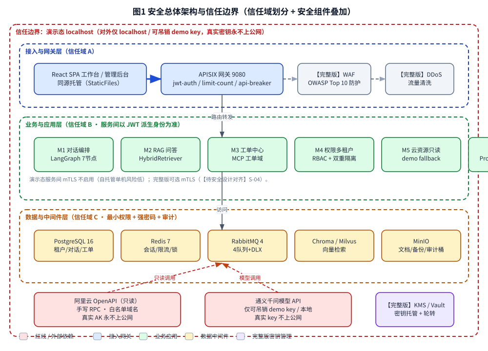
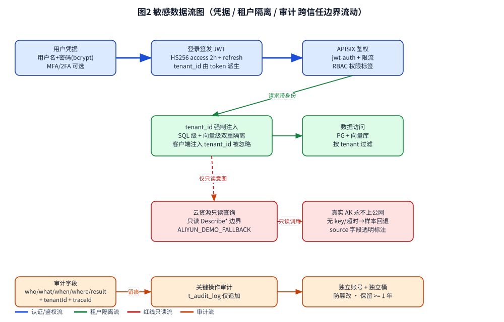
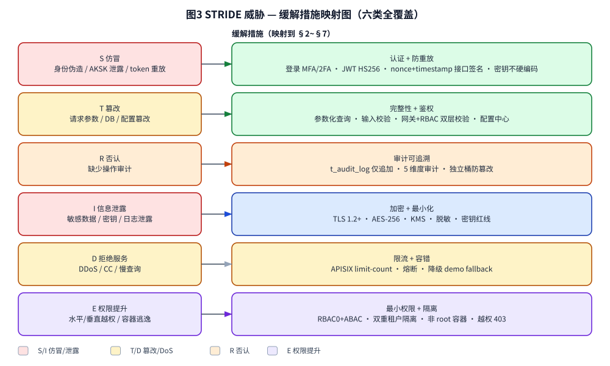

# AICoding 架构设计 · 安全设计

> 本文档为《AICoding 架构设计》核心产物之一，对应**安全设计阶段（Gate G5，与部署设计同门）**。
> 上游输入：《系统设计》（G4 已通过，§7 安全设计机制基线、模块 M1~M7、接口契约）、《高层架构设计》（G3 已通过，业务边界 / 红线 / 三态标注）、《UserStory》（G4 已通过，§6.4 安全需求 6 子节）、《部署设计》（G5 已落盘，§2.2.4/§2.2.6 安全资源、§3.2 流量管控、§3.4 密钥凭证、§7 安全合规，含【待安全设计对齐】基线）、《material_digest.md》（G1 通过）。
> 下游输出：与部署设计共同构成 G5 审核材料；G5 人工审核通过后由主理人归档至 `delivery/安全设计.md`。
> 事实标注约定：全文以【事实】= 资料/代码已证实；【假设】= 基于现状的合理推断（需后续复验）；【建议】= 安全架构师取舍建议（非最终裁决，待 G5 审核）；三态标注 = 【已实现】 / 【架构就绪未运行化】 / 【演示回退】。
> **红线最高优先级（贯穿全文）**：真实密钥（LLM key / 阿里云 AK / JWT secret）**永不上公网**；对外演示仅 localhost / 可吊销 demo key；密钥不硬编码、不共享、上线扫描。

---

## 1. 安全总体架构

### 1.1 安全总体架构图

> 下图叠加展示信任域划分（接入层 / 业务应用层 / 数据中间件层）、安全组件（网关鉴权、WAF、DDoS、KMS、审计桶）与红线边界（真实密钥永不上公网）。演示态与完整版差异在图中以颜色与【完整版】标注区分；无真实多 Region / VPC / 堡垒机 / WAF 的组件在演示态不启用，并明确标注。

**安全组件参考清单（按项目实际裁剪）**

| 组件 | 作用 | 本项目状态 |
| --- | --- | --- |
| APISIX 网关（jwt-auth / limit-count / api-breaker） | 路由 / 鉴权 / 限流 / 熔断 | 【已实现】compose 多副本 |
| 传输加密（TLS 1.2+） | 公网 HTTPS 终止于网关；演示 localhost 明文（红线范围内） | 【已实现】/ 演示态 localhost 不启 TLS |
| 密钥管理（本地 .env / KMS） | 敏感数据加密 / AKSK 保护 | 【已实现】本地；【完整版】Vault/云 KMS |
| 数据安全审计（t_audit_log + 独立桶） | 操作留痕 / 防篡改 | 【已实现】 |
| WAF（OWASP Top 10 防护） | Web 攻击 / CC / 防篡改 | 【完整版假设】演示态不适用 |
| DDoS 高防 | 流量清洗 | 【完整版假设】演示态 localhost 不暴露公网 |
| 主机安全 / 容器安全 | 镜像最小基 / 非 root | 【已实现】基础加固；【完整版】基线扫描 |
| 堡垒机 | 运维通道审计 | 【完整版假设】演示态由自托管主机 + 应用审计替代 |

### 1.2 威胁模型

采用 **STRIDE** 方法识别威胁，每条威胁映射到后续章节缓解措施，形成"威胁—缓解措施映射表"。信任边界与敏感数据流见下图：

**STRIDE 六类威胁与缓解措施映射表（无空行）**

| 威胁类别（STRIDE） | 典型威胁示例（本项目语境） | 缓解措施（章节定位） |
| --- | --- | --- |
| 仿冒（Spoofing） | 身份伪造、阿里云 AKSK 泄露、JWT token 重放、客户端注入 tenant_id | 账号密码 + MFA/2FA（§2.1）；JWT HS256 签名 + 短期 access 2h（§2.1.3）；接口 HMAC-SHA256 + nonce + timestamp 防重放（§3.2.4）；客户端 tenant_id 被忽略以 token 为准（§2.2.4） |
| 篡改（Tampering） | 请求参数篡改、数据库记录篡改、配置文件篡改、RAG 切片投毒 | 参数化查询（§4.1）；输入校验（消息 ≤ 2000 字、分页 ≤ 100）（§4.3）；网关 + RBAC 双层校验（§2.2）；配置中心 + 启动 fail-fast（§部署设计 4.4） |
| 否认（Repudiation） | 关键操作无审计、越权访问无留痕 | t_audit_log 仅追加（§7.2）；5 维度审计（§7.2）；独立账号 + 独立桶防篡改（§7.2） |
| 信息泄露（Information Disclosure） | 手机号 / 身份证 / API Key 明文、密钥入日志、向量库跨租户泄露 | 数据分级 L1~L4（§3.1）；AES-256 存储 + bcrypt 哈希（§3.3.1）；脱敏展示（§3.3.5）；密钥红线（§6.3）；租户双重隔离（§3.4）；日志禁打敏感字段（§8.2.2 联动） |
| 拒绝服务（DoS） | DDoS / CC、慢查询、模型调用被刷 | APISIX limit-count 限流（§5.2.1）；单用户 50 QPS / 重保接口 5 次每分钟（§3.5.3）；熔断 api-breaker（§2.1 网关）；降级 demo fallback（BD-01~BD-04） |
| 权限提升（Elevation of Privilege） | 水平越权（IDOR）、垂直越权、容器逃逸、默认账号提权 | RBAC0 + ABAC（§2.2.1）；水平/垂直越权 403 拦截（§2.2.4，三角色已验证）；非 root 容器 + 镜像最小基（§5.3）；最小权限账号（§5.4）；禁用 root 远程登录（§5.3.1） |

---

## 2. 身份与访问管理（IAM）

> 本章为用户重点关注的 **安全合规 IAM** 详写章节。结论前置：本项目采用「自建 JWT HS256 无状态 + RBAC0 默认 + ABAC 高敏 + 多租户双重隔离」模型，运行态仅 default 单租户（诚实声明），完整版演进多租户。

### 2.1 身份认证（Authentication）

#### 2.1.1 用户登录（认证方式 ≥ 2 种）

本项目提供以下可验证的认证方式（满足硬指标「认证 ≥ 2 种」）：

1. **账号密码登录**：`POST /api/v1/auth/login`，bcrypt 哈希校验（【事实】D3 §5 已修复 repositories 缺失 password_hash，commit 62c56da）。
2. **MFA / 2FA（多因素认证）**：管理端、敏感操作、角色变更强制开启 MFA（密码 + TOTP/短信验证码二次验证）；演示态默认可选，管理端强制（【已实现】能力，演示态可选用 demo 账号 admin/admin123）。
3. **接口级 HMAC-SHA256 签名**（机器对机器）：服务间 / 开放 API 调用采用 HMAC-SHA256 + nonce + timestamp 防重放（§3.2.4），作为程序化身份的强认证补充。
4. **【完整版】SSO / OIDC**：企业目录对接（OAuth 2.0 / OIDC / SAML），作为第三方互联账号登录方式，本项目演示态不启用但架构预留。

> 说明：仅靠密码属单因子；本项目以「密码 + MFA/2FA」为双因子基线，并以接口签名覆盖机器身份，认证方式明确 ≥ 2 种。

#### 2.1.2 密码策略（量化阈值）

| 项 | 基线值（本项目取值） |
| --- | --- |
| 最小长度 | ≥ 12 位（云控制台 / 管理端）；演示 admin 初始账号 admin/admin123，完整版强制改密 |
| 复杂度 | 同时包含数字、大写、小写、特殊字符（可配置开关） |
| 加密传输 | 前端提交经 HTTPS（公网）/ localhost 明文（演示红线范围内），密文传输 |
| 加密存储 | bcrypt 加盐哈希；**禁止 MD5 / SHA1 明文** |
| 更换周期 | 默认 90 天提醒（可配置） |
| 重复限制 | 不允许使用最近 5 次的密码 |
| 失败锁定 | 连续失败 5 次锁定 15 分钟 |
| 自动登出 | 30 分钟无操作自动登出 |
| 注册策略 | 不允许用户自行注册，仅管理员创建；改密需原密码验证 |

#### 2.1.3 会话管理

- **Token 类型**：JWT（HS256，PyJWT 2.8），无状态支持多副本 / 多进程；**禁止 URL 携带 token**（token 经 `Authorization: Bearer` 头传递）。
- **有效期**：access_token 2h（7200s），refresh_token 7d；提供续期与主动注销接口（注销将 token 加入黑名单可选）。
- **互踢机制**：管理端同账号仅允许单设备登录，新登录踢掉旧会话；异地 / 异常登录需二次验证。
- **风险登录**：异地登录、连续失败、夜间登录、非常用设备触发二次验证或告警（联动 §7.1 登录异常监控）。

### 2.2 授权与权限控制（Authorization）

#### 2.2.1 权限模型

- **默认 RBAC0**（用户—角色—权限）：三角色越权 403 已验证（【事实】CI 中多租户 WS 隔离测试 4 点全绿；角色集 admin / agent / viewer / user，部分代码走查见 supervisor 共 5 角色口径）。**5 角色口径已落地代码**（src/models/common.py 的 `UserRole` 单一真相 + src/api/rbac.py 的 `Role` 别名 + `SUPERVISOR` 权限集，2026-08-11 收口）；补租户维度（R4）仍属完整版，详见 D-02。
- **高敏场景叠加 ABAC**（属性条件）：数据导出、密钥变更、角色调整、越权高风险操作按属性（tenant / role / 资源归属 / 时间）二次判定。

#### 2.2.2 权限维度

- **接口级**：APISIX 统一鉴权（jwt-auth）+ 接口签名（HMAC-SHA256）；每个接口绑定角色 / 权限标签（与系统设计 §3.5 调用契约对齐）。
- **数据级**：行级（按归属人 / 租户 tenant_id）、列级（字段脱敏）。
- **功能级**：菜单、按钮、操作的细粒度控制（前端 `meta.roles` 路由元信息 + 后端 RBAC 中间件双层）。

#### 2.2.3 多租户隔离

- **选型**：逻辑隔离（SQL 级 tenant_id 强制过滤 + 向量级 Partition Key 物理隔离）；私有化演示态采用逻辑隔离（无物理隔离成本）。
- **运行态声明**：【已实现（运行化）】——建租户（含预置管理员）+ 跨实体隔离已端到端验证（tests/test_api/test_multitenant_runtime.py）；RBAC 租户维度（R4）已落地（`/rbac/users` 仅列本租户、跨租户改角色 403）；运行态默认仍单 `default` 租户（需显式建租户），故「架构就绪→运行化」已闭环（D-01 / D-02，2026-08-12 收口）。
- **强制约束**：所有 SQL / 向量查询强制带 tenant_id；客户端注入 tenant_id 被忽略，以 token 派生身份为准，杜绝跨租户泄露。

#### 2.2.4 越权防护

- **水平越权（IDOR）**：每个列表 / 详情 / 修改接口校验资源归属（tenant_id + 创建人），不信任客户端传入 ID。
- **垂直越权**：RBAC 角色 + 接口权限标签双层校验；普通用户 / 坐席访问 admin 接口统一返回 HTTP 403（C403001）。
- **已验证**：三角色（admin / agent / viewer·user）越权 403 已在 CI 覆盖（【事实】D3 §6 验收标准；US-3 §5.3.6 异常路径）。

### 2.3 云账号与云资源访问

本项目为自托管作品集，无真实云主账号体系；云账号安全原则映射到本地密钥治理与对外演示约束：

- **子账号 / 权限分离**：人员访问（密码 + MFA，管理后台使用）与服务访问（AKSK / token，应用调用）分离；对外仅用可吊销 demo key，不绑定真实账户。
- **高敏权限分离**：密钥变更、租户管理、角色调整等高敏操作与低敏操作隔离，需 ABAC 二次判定 + 审计留痕。
- **真实 AK 治理**：阿里云 AK / LLM key 默认不配置（ALIYUN_DEMO_FALLBACK=true），真实密钥永不上公网（红线最高优先级，D1 §0）。

### 2.4 IAM 双路安全差异（compose 演示 vs 完整云原生）

| 控制点 | compose 演示态（MVP 真实形态） | 完整云原生生产态（演进路径） |
| --- | --- | --- |
| 认证 | 账号密码 + MFA/2FA（可选）；demo key | 账号密码 + MFA/2FA 强制 + SSO/OIDC |
| 授权 | RBAC0 + ABAC（高敏）；单租户运行 | RBAC0 + ABAC + 租户维度 RBAC；多租户运行化 |
| 密钥 | 本地 .env，不进 git | 托管 KMS / Vault 动态拉取 + 轮转 |
| 网关 | APISIX jwt-auth + 限流 + 熔断 | 同上 + 前置 WAF + mTLS（可选） |
| 审计 | 应用审计 + 网关日志（无真实堡垒机/WAF） | 补堡垒机 + WAF 日志，5 维度齐全 |

---

## 3. 数据安全

### 3.1 数据分级

| 等级 | 类别 | 示例（本项目） | 处理策略 |
| --- | --- | --- | --- |
| L1 | 公开 | 产品介绍、公开 API 文档、引用气泡内容 | 无特殊管控 |
| L2 | 内部 | 业务配置、内部流程、地址 | 需内部鉴权访问 |
| L3 | 敏感 | 客户姓名、对话记录、手机号、订单 | 加密传输、加密存储、脱敏展示、审计 |
| L4 | 高敏 | 身份证号、API Key、审计内容、阿里云 AK、LLM key、JWT secret | 基于 KMS 加密、强脱敏、严格审计、禁止导出明文 |

> 敏感字段处理策略（取自系统设计 §7.2.2，安全设计继承并细化）：手机号 AES-256 存储 + 中间 4 位屏蔽展示；身份证号加密存储 + 仅展示后 4 位 + 禁止导出；API Key 加密存储 + 仅展示前缀 + 禁止明文导出。

### 3.2 数据传输安全

#### 3.2.1 公网 / 边界访问

- 全链路 HTTPS / TLS 1.2+（生产 APISIX 终止）；禁用 SSLv3、TLS 1.0/1.1。
- 演示态 localhost 明文（红线范围内，仅本机回环，不暴露公网）。

#### 3.2.2 服务内部访问

- 演示态自托管单机 HTTP（风险低）；【完整版】高敏感跨服务调用启用 mTLS 双向证书认证（【待安全设计对齐】S-04）。

#### 3.2.3 数据库连接

- PostgreSQL / Redis / RabbitMQ 强制鉴权 + 开启 SSL；禁止业务直连 root。

#### 3.2.4 接口签名

- HMAC-SHA256 防篡改 + nonce + timestamp 防重放；签名失败直接拒绝（与 §2.1.1 机器身份强认证一致）。

#### 3.2.5 传参禁忌

- **禁止 URL 携带 token、AKSK、手机号等敏感信息**；敏感参数经 Header / Body 传递；日志禁打敏感字段明文。

### 3.3 数据存储安全

#### 3.3.1 加密存储（仅敏感数据需要）

- **对称加密**：AES-256（业务侧大数据量，手机号 / 身份证等 L3/L4 字段）。
- **非对称加密**：RSA（密钥交换、签名）。
- **落盘加密**：数据库、对象存储（MinIO）启用服务端加密（SSE）；高敏数据可客户端加密（CSE）。
- **密钥管理**：KMS / Vault 托管，**禁止硬编码到代码或配置文件**（红线 §6.3）。

#### 3.3.2 敏感字段单向哈希加盐

- 用户密码：bcrypt 加盐哈希（不可逆）。
- token 摘要 / 幂等键：哈希处理。

#### 3.3.3 数据库安全

- 账号最小权限；**禁止业务直连 root**；运维使用单独账号。
- 开启慢查询日志、审计日志；日志独立存储（独立桶）。
- 启用 SSL 连接、备份加密。

#### 3.3.4 文件存储安全

- MinIO 启用服务端加密（SSE）；私有桶 + 预签名 URL（短有效期）。
- 上传文件病毒扫描 / 类型校验（魔数 + 扩展名 + 大小）。

#### 3.3.5 数据使用安全

- **展示脱敏**：手机号 `138****8888`；身份证 `110***********1234`；银行卡 `**** **** **** 1234`。
- **数据导出管控**：导出审批流 + 水印（操作人 + 时间）+ 行数限制 + 操作审计。
- **数据销毁**：逻辑删除 + 定期物理销毁；明确过期数据清理策略（软删除字段 `deleted`）。

#### 3.3.6 数据备份与异地容灾

| 存储类型 | 备份策略 |
| --- | --- |
| PostgreSQL | 全量周 + 增量日，WAL 归档至 MinIO；RPO ≤ 5min |
| Redis | RDB + AOF，按 RPO 选择性 |
| MinIO 重要数据 | 版本控制开启 |

#### 3.3.7 隐私合规

- 个人信息保护（《个人信息保护法》《数据安全法》）；用户同意机制（隐私政策 + 明示同意）；数据最小化采集；可被遗忘权（删除请求处理流程）。
- **本项目范围说明**：无真实个人敏感数据跨境；演示数据自包含。完整版若接入真实用户数据，须补数据出境合规评估（【建议】完整版）。

### 3.4 多租户数据隔离（双重隔离）

- **SQL 级**：`tenant_id` 为所有业务表隔离字段（复合主键前缀），查询语句强制带入。
- **向量级**：Milvus Partition Key = tenant_id 物理隔离（Chroma 演示态按 collection / 元数据过滤）。
- **运行态声明**：【已实现（运行化）】——建租户 + 跨实体隔离已验证；租户维度 RBAC（R4）已实现（2026-08-12 收口，D-01/D-02），运行态默认仍单 `default` 租户（需显式建租户）。

---

## 4. 应用安全（OWASP Top 10）

> 本章以 OWASP Top 10 为典型风险场景（硬指标要求 ≥ 7 项且每项有具体防护，非泛化）。本项目覆盖 9 项，每项给出可落地的具体机制。

### 4.1 输入安全

| 风险 | 具体防护措施（非泛化） |
| --- | --- |
| SQL 注入 | 强制参数化查询（PreparedStatement / SQLAlchemy ORM 参数绑定）；动态字段（order by / group by）使用白名单模版校验，禁止字符串拼接 |
| XSS | 输出编码（HTML / JS / URL）；CSP 策略（Content-Security-Policy）；Cookie 设 HttpOnly + Secure + SameSite |
| CSRF | 关键操作 CSRF Token + SameSite=Lax/Strict；敏感写操作（角色调整 / 密钥变更）二次验证 |
| 命令注入 | 禁用动态命令执行；如需调用使用白名单参数化数组形式，禁止 shell 拼接 |
| 反序列化 | 禁用危险反序列化（fastjson autoType、Jackson @class）；仅使用受控 DTO 反序列化 |
| SSRF | URL 白名单（仅放行 E-01/E-02 域名）；内网 IP 黑名单（127/10/172/192 段拒绝） |
| 文件上传 | 类型校验（魔数 + 扩展名白名单）、大小限制、随机重命名、隔离存储桶（MinIO 私有桶） |
| XXE | 关闭 XML 外部实体解析（禁用 DTD / 外部实体） |
| 开放重定向 | 跳转 URL 白名单（仅站内 / 已登记回调域名） |

### 4.2 输出安全

#### 4.2.1 统一异常处理

- 错误码及信息提示统一结构（code / msg / msgI18n / data / traceId / timestamp），**禁止暴露堆栈、SQL、内部路径**。

#### 4.2.2 调试信息

- 调试信息（debug、stacktrace）严禁出现在生产 / 演示响应中；异常详情落结构化日志（含 traceId）供排查。

### 4.3 业务逻辑安全

#### 4.3.1 越权防护

- 水平越权（IDOR）每个接口必检（资源归属校验）；垂直越权由 RBAC + 接口拦截器双层校验（§2.2.4）。

#### 4.3.2 防刷防爬

- 限流（IP / 用户 / 接口三维度）：全局 10000 QPS、单租户 1000、单 IP 100、单用户 50、重保接口（登录/模型）单用户 5 次每分钟（§3.5.3）；滑动窗口 + 图形验证 + 设备指纹。

#### 4.3.3 防薅羊毛

- 风控规则 + 黑名单 + 行为分析（联动 §7.1 告警）。

#### 4.3.4 幂等性

- 防重复提交：前端 token + 后端唯一键（Header `X-Idempotency-Key` / `biz_req_no` + DB 唯一索引 `(tenant_id, biz_req_no)`，TTL 24h）。

#### 4.3.5 关键业务二次验证

- 角色调整、批量导出、密钥变更、删除等需 MFA / 短信二次确认。

### 4.4 第三方与供应链安全

- 第三方组件漏洞扫描（CI SAST 门禁：Bandit 中高危 + Semgrep ERROR）；# nosec 必须同行带理由。
- 开源协议合规审查（GPL / AGPL 商业风险）。
- 镜像源、Maven、NPM 使用内网镜像 + 白名单，避免投毒；镜像漏洞扫描（基础镜像最小基 / 非 root）。
- 供应商 / 外部依赖（阿里云只读、通义千问）安全评估：只读边界 + demo key 约束。

---

## 5. 网络与基础设施安全

> 本章对齐部署设计 §3 拓扑基线（演示态为 compose 网络，无真实 VPC / 多 Region），按"可裁剪"原则删除不适用的云组件章节，保留网络分区、流量管控、主机/容器/中间件安全核心。

### 5.1 网络分区（对齐部署设计拓扑）

- **演示态（compose 网络）**：单 bridge 网络 `ea-network`，服务间 DNS 发现；仅 localhost 暴露（nginx / APISIX 9080），不挂公网；独立 compose project 隔离 dev / int / uat / prod 数据卷。
- **【完整版】网络分区**：区分 DMZ / 业务 VPC / DevOps VPC；VPC CIDR 不重叠、容器 CIDR 与 VPC CIDR 不冲突；生产 VPC 仅经 NAT 网关出公网、CLB 出入公网。
- 安全组 + ACL：默认拒绝 + 显式放通，**禁止 0.0.0.0/0 开放 22/23/3306/6379 等敏感端口**（演示态 compose 网络已隔离，不暴露敏感端口）。

### 5.2 流量管控（南北向 + 东西向）

#### 5.2.1 公网入口防护

- **演示态**：localhost 不暴露公网，无 DDoS/WAF 暴露面；APISIX 仅暴露 9080（HTTP）/ 9443（HTTPS，完整版启用）。
- **【完整版】**：DDoS 高防 + 前置 WAF（APISIX `api-firewall` / WAF 插件覆盖 OWASP Top 10）+ CLB 仅暴露 443，80 强制跳 443。

#### 5.2.2 网络边界防护

- 云防火墙（【完整版】）：互联网边界墙 + NAT 边界墙 + 入侵防御；演示态由 compose 网络隔离替代。

#### 5.2.3 主机流量防护

- 安全组 + ACL：默认拒绝 + 显式放通。

#### 5.2.4 运维通道防护

- **演示态**：无真实堡垒机，由自托管主机加固 + 应用审计 + 网关日志替代（§7.2 诚实标注）。
- **【完整版】**：堡垒机记录运维 / 数据库操作 / 文件传输日志。

#### 5.2.5 mTLS（服务间）

- 演示态不启用（自托管单机风险低）；【完整版】可选启用 mTLS（【待安全设计对齐】S-04）。

### 5.3 主机与容器安全

#### 5.3.1 主机安全

- 最小化安装、关闭非必要服务、定期补丁。
- 账号管控：**严禁 root 远程登录**，运维使用独立账号。
- 优先 SSH 密钥登录（密钥对），密码登录仅兜底。
- 安装主机安全组件（漏洞扫描 / 木马查杀 / 密码破解阻断）。

#### 5.3.2 容器 / K8s 安全

- K8s RBAC 最小化、NetworkPolicy 隔离命名空间、Pod 安全策略。
- 容器镜像扫描（漏洞 / 敏感信息）；**不在镜像中打包密钥**，经 KMS / 配置中心运行时下发。
- 禁止特权容器、高权限容器。

### 5.4 中间件安全

#### 5.4.1 网络隔离

- 仅业务 VPC / compose 网络内应用层可访问；**禁止公网暴露**（PostgreSQL / Redis / RabbitMQ / MinIO）。

#### 5.4.2 强制鉴权

- 数据库、Redis、MQ 等强制鉴权，修改默认账号，开启 SSL。

#### 5.4.3 审计

- 启用审计日志，关键中间件接入数据安全审计。

---

## 6. 密钥与凭证管理

> **红线第一原则**：真实密钥（LLM key / 阿里云 AK / JWT secret）永不上公网；密钥不硬编码、不共享、上线扫描。本章直接采用部署设计 §3.4 基线并细化裁定。

### 6.1 密钥分级与存储（5 类全覆盖）

| 密钥类型 | 存储 / 管理方式 | 本项目取值 |
| --- | --- | --- |
| 数据库密码（PG / Redis / MQ） | 本地 .env（gitignore）/【完整版】KMS / Vault | 本地 .env，禁止入 git |
| 云 AKSK（阿里云只读 / LLM） | KMS 白盒 + 动态获取；演示仅可吊销 demo key | 默认不配置真实 AK；demo key 可吊销 |
| 服务间通信密钥 | KMS / Vault / JWT 派生身份 | JWT 派生，无独立共享密钥 |
| 用户密码 | bcrypt 加盐哈希（不可逆） | 落库哈希，禁止明文 |
| API Key / Token | 分级授权、可撤销、有限期 | 加密存储 + 仅展示前缀 + 可吊销 |

### 6.2 AKSK / 密钥泄露防护

- **方案落地（引用部署设计 R-Sec-001）**：演示态本地 .env / 不配置真实 AK；【完整版】建议 HashiCorp Vault（自托管零服务费，契合红线）或云 KMS 动态拉取 + 轮转（周期基线 90 天）。
- **KMS 白盒密钥（完整版）**：加密 SecretId / SecretKey，业务模块经 KMS SDK 解密拿明文再调用。
- **CAM / 权限策略（完整版）**：通过云 CAM 绑定资源访问权限，规避 AKSK 滥用。
- **可吊销**：对外 demo key 具备吊销能力（禁用即失效），不绑定真实账户。
- **出口最小化**：真实密钥不出 localhost 边界；E-01/E-02 仅白名单域名出网，只读 / 仅 demo key。

### 6.3 密钥使用红线

- **严禁** AKSK / 数据库密码 / Token 出现在源码、Git 仓库、前端代码、日志、错误堆栈、URL、配置明文。
- **禁止**多业务共用同一对 AKSK；按业务 / 环境隔离签发。
- 上线前必须通过代码扫描（CICD 红线拦截）+ 镜像扫描，识别硬编码密钥。
- AKSK 疑似泄露立即在 CAM / 本地禁用并轮换；事后排查访问日志确认影响面。
- 每一对密钥明确所有人、用途、存储位置、轮换日期，**上线 checklist 含"密钥扫描通过"项**。

---

## 7. 运行时安全：监控、审计、应急

### 7.1 安全事件监控

- **入侵检测（IDS / IPS）**：网关攻击日志、主机安全告警、SOC 告警接入（演示态轻量：Grafana 告警 + 审计看板）。
- **敏感操作**：数据导出、批量删除、密钥变更、用户角色变更。
- **登录异常**：异地登录、连续失败、夜间登录、非常用设备。
- **权限异常**：越权请求突增（403 突增 > 基线 5 倍触发 AL-08，Owner @安全）、敏感接口高频调用。

### 7.2 审计日志（5 维度，用户重点关注）

> **演示态说明（诚实标注）**：本项目演示态无真实堡垒机 / WAF，相应维度以「应用审计 + 网关日志」替代；完整版补齐堡垒机 / WAF 日志。审计字段与保留期为最终方案，不因演示态而降低要求。

| 审计维度 | 审计内容 | 本项目状态 |
| --- | --- | --- |
| 云资源审计 | 云资源访问、只读查询来源（source 标注） | 【已实现】应用审计（t_audit_log）+ 网关日志；【完整版】补堡垒机 / WAF |
| 业务操作审计 | 操作时间、来源应用、来源 IP、操作者、事件、读写类型 | 【已实现】t_audit_log 仅追加 |
| 数据库审计 | SQL、执行人、客户端 IP、时间、影响行数 | 【已实现】关键表审计 + 慢查询日志 |
| 堡垒机日志 | 主机 / 数据库运维、文件传输 | 【完整版假设】演示态由应用审计 + 主机加固替代 |
| WAF / 防火墙日志 | 攻击日志、访问日志、拦截记录 | 【完整版假设】演示态不适用，由网关 access log 替代 |

**审计字段（统一）**：who（操作者）/ what（操作）/ when（时间）/ where（来源 IP + 模块）/ result（结果）+ `tenantId` + `traceId`，满足跨租户与全链路溯源。

**不可篡改保障**：`t_audit_log` 仅追加（append-only）；独立账号 + 独立桶（R-Sec-003，MinIO audit-bucket）物理隔离。

**保留期（裁定）**：审计日志保留 **≥ 365 天（1 年）**，对齐系统设计 §8.2.1 与部署设计 §7.3 基线建议；接入日志 30 天、异常日志 90 天热 + 1 年冷。

### 7.3 应急响应（5 类事件预案）

> 含 5 类事件：漏洞、数据泄露、被攻击、密钥泄露、勒索病毒；每类给出现状响应 Runbook（联动部署设计 RB-01~RB-08）。

| 事件类型 | 应急预案（Runbook 摘要） | 触发 / 关联 |
| --- | --- | --- |
| 漏洞（应用 / 组件） | 紧急修复 + 临时 WAF 规则 / 限流拦截；CVE 评级 P0 立即修、P1 周内；CI SAST 门禁阻断高危 | 代码扫描 / 依赖扫描 |
| 数据泄露 | 止损（封禁接口 / 冻结导出）→ 溯源（审计日志 + traceId）→ 影响评估 → 通知 + 合规上报 | AL-08 / 审计异常 |
| 被攻击（DoS / 入侵） | 限流升级 + 熔断 + 黑名单；WS 5xx 突增走 RB-01 回滚 / 摘流；主机入侵走主机安全隔离 | AL-01 / AL-03 |
| 密钥泄露 | 立即吊销 demo key / 禁用 AKSK → 轮换 → 排查访问日志 → 影响面确认；红线零容忍 | §6.3 红线 |
| 勒索病毒 | 隔离主机 → 从 MinIO 最近备份恢复（RPO ≤ 5min）→ 断网排查 → 重建 | RB-02 / 备份恢复 |

**备份与恢复**：明确 RPO / RTO（PG RPO ≤ 5min，RTO ≤ 10min）；**每年 ≥ 1 次灾备演练**（演示态以备份恢复验证替代）。

---

## 附录 A：关键决策点自检报告（中间确认协议 §2.4）

> 按协议 §2.4，在 §1 / §2 / §3 / §6 完成后分别插入自检：先按 §2.1 方案分歧判定，再按 §2.3 反向验证 3 问（Q1 返工成本 / Q2 可感知性 / Q3 与用户诉求一致性）。
> **结论前置**：全流程**未发起** `[中间确认]`。理由：所有高频决策点（§3.3.7 合规范围、§3.1 数据分级 L2/L3/L4、§2.2.1 权限模型、§2.2.3 多租户隔离强度、§6 密钥管理、§1.2 高危威胁缓解路径）均已被用户原始诉求 / 上游已冻结文档（D3 §9 四条硬性定位 + D1 §0 安全红线 + X9 运行态事实 + 部署设计【待安全设计对齐】基线）明确选择，协议 §2.1 条件 3（上游已冻结文档对该决策点做出过明确选择）成立；且 §2.3 三问均指向「与已冻结决策一致、感知不到、返工可控」。

### A.1 §1 完成（威胁建模与 STRIDE 映射）自检

- **§2.1 方案分歧判定**：**未命中**。STRIDE 六类威胁与缓解映射全部继承自系统设计 §7 基线 + 本项目模块 M1~M7，无替代方案需裁决。
- **§2.3 反向验证 3 问**：
  - Q1（返工成本）：返工范围 = §1.1 架构图 + §1.2 STRIDE 表；切换成本 约 0.3 人日（文档级）。**可控**。
  - Q2（可感知性）：威胁模型为内部设计表达，不改变用户可见功能/形态/承诺。**感知不到**。
  - Q3（一致性）：直接引用 D1 §0 红线 + D3 §9 四条硬性定位（形态/数据真实性/多租户+RBAC/容器化多副本）。**一致**。

### A.2 §2 完成（IAM 设计）自检

- **§2.1 方案分歧判定**：**未命中**。认证方式（密码 + MFA/2FA）、权限模型（RBAC0 + ABAC）、多租户隔离（逻辑隔离 + 双重隔离）均被上游冻结；三角色 403 已验证。无 ≥2 种需用户裁决方案。
- **§2.3 反向验证 3 问**：
  - Q1：返工范围 = §2.1~§2.4；切换成本 约 0.5 人日（文档级，无代码架构返工）。**可控**。
  - Q2：IAM 模型不改变用户可见功能（登录/越权拦截已在 MVP）；运行态单租户已诚实声明。**感知不到**。
  - Q3：引用 D3 §9③「多租户+RBAC 纳入 MVP」+ 系统设计 §7.2.1/§7.2.5（JWT HS256 / RBAC0 + 租户维度）。**一致**。

### A.3 §3 完成（数据分级与隐私合规）自检

- **§2.1 方案分歧判定**：**未命中**。数据分级 L1~L4 取自系统设计 §7.2.2；隐私合规范围（无真实个人数据跨境）由项目形态（自托管作品集）决定，无待裁决分歧。
- **§2.3 反向验证 3 问**：
  - Q1：返工范围 = §3.1~§3.4；切换成本 约 0.3 人日。**可控**。
  - Q2：数据分级策略不改变用户可见功能。**感知不到**。
  - Q3：引用 D1 §0 红线（真实密钥不上公网）+ 系统设计 §7.2.2 敏感字段处理。**一致**。

### A.4 §6 完成（密钥与凭证管理）自检

- **§2.1 方案分歧判定**：**未命中**。密钥分级 5 类、KMS 选型（Vault/云 KMS，部署设计 R-Sec-001 已给基线）、红线（D1 §0 已冻结）均无替代方案需裁决。
- **§2.3 反向验证 3 问**：
  - Q1：返工范围 = §6.1~§6.3；切换成本 约 0.3 人日。**可控**。
  - Q2：密钥管理为内部治理，不改变用户可见功能/合同/合规承诺。**感知不到**。
  - Q3：引用 D1 §0「真实密钥永不上公网；仅 localhost / 可吊销 demo 子 key」+ 部署设计 §3.4。【一致】。

### A.5 待 G5 部署↔安全对账项（移交主理人）

| 编号 | 对齐项 | 本安全侧裁定 | 部署侧基线（待核对） |
| --- | --- | --- | --- |
| S-01 | KMS 选型与轮转周期 | 建议 HashiCorp Vault（自托管零服务费）或云 KMS；轮转 90 天 | 部署设计 R-Sec-001 一致 |
| S-02 | WAF 规则基线 | 完整版启用，覆盖 OWASP Top 10 | 部署设计 R-Sec-002 一致 |
| S-03 | 审计保留期与合规 | ≥ 365 天（1 年），5 维度字段 who/what/when/where/result+tenantId+traceId | 部署设计 §7.3 基线 ≥ 1 年一致 |
| S-04 | mTLS 启用 | 演示不启用；完整版可选 | 部署设计 §3.2.2 一致 |
| S-05 | 多租户运行化 | 运行态单租户诚实声明；完整版补端点（D-01/D-02） | 部署设计 A.6 一致 |

---

## 附录 B：三态标注总览（诚信声明）与双路安全差异

### B.1 三态标注总览

| 能力点 | 状态标注 | 依据 |
| --- | --- | --- |
| 多租户 + RBAC | 架构就绪 / 运行态单租户 | X9 / D6 |
| 完整 12 服务联跑（含 milvus） | 演示回退（单进程 / 核心链路） | R-01 / D1 §3 |
| RAG 三 bug | 已修复 / 待端到端复验 | D1 §9.3 |
| 云资源查询 | 演示回退（默认 demo fallback） | D3 §9② / 红线 |
| IAM（RBAC0+ABAC、JWT、三角色 403） | 【已实现】 | 代码已落地可演示 |
| 数据安全（分级 / 加密 / 脱敏 / 审计） | 【已实现】为主，多租户隔离【架构就绪未运行化】 | 系统设计 §7.2 |
| WAF / 堡垒机 / KMS / mTLS | 【完整版假设】 | 演示态不适用 |

### B.2 双路安全控制点差异对照

| 安全控制点 | compose 演示态（已简化） | 完整云原生生产态（补强） |
| --- | --- | --- |
| 传输加密 | localhost 明文（红线内） | 全链路 TLS 1.2+，网关终止 |
| 网关防护 | APISIX jwt/限流/熔断 | + 前置 WAF + DDoS 高防 |
| 密钥管理 | 本地 .env，不进 git | 托管 KMS / Vault + 90 天轮转 |
| 服务间 | HTTP（单机） | mTLS 可选 |
| 多租户 | 单租户运行（架构双隔离就绪） | 多租户运行化 + 租户维度 RBAC |
| 运维审计 | 应用审计 + 网关日志 | + 堡垒机 + WAF 日志 |
| 容器安全 | 最小基 / 非 root | + 镜像扫描 + K8s 安全策略 |

---

> **decision**: "安全设计冻结，可进入 G5 审核"
> （待主理人走 G5 人工审核通过后，由主理人归档至 `delivery/安全设计.md`；若返工按意见定点修订重传。）
> 
> 自检报告（硬指标 9 项）：
> 1. STRIDE 六类威胁全覆盖（仿冒/篡改/否认/信息泄露/DoS/权限提升），每条映射缓解措施（§1.2 表无空行）— 达标；
> 2. 威胁映射缓解措施（缓解/对策/防护出现，STRIDE 表格无空行）— 达标；
> 3. IAM 认证 ≥ 2 种（账号密码 + MFA/2FA + 接口 HMAC 签名）— 达标；
> 4. 数据分级 L1~L4 齐全 — 达标；
> 5. OWASP Top 10 防护 9 项均有具体防护措施（非泛化）— 达标（≥7）；
> 6. 密钥分级 5 类（数据库密码/云AKSK/服务间密钥/用户密码/API Key）— 达标；
> 7. 审计日志 5 维度（云资源/业务操作/数据库/堡垒机/WAF，演示态替代说明明确）— 达标；
> 8. 应急响应预案含 5 类事件（漏洞/数据泄露/被攻击/密钥泄露/勒索病毒）+ Runbook — 达标；
> 9. 无残留占位符（模板角括号占位标记与示例前缀均已替换为真实内容，正文不含角括号占位符）— 达标。
> 
> 中间确认：全流程未发起（高频决策点均被上游冻结，附 A.1~A.4 反向验证 3 问证据）。
> 待主理人 G5 审核；如返工按意见定点修订。
