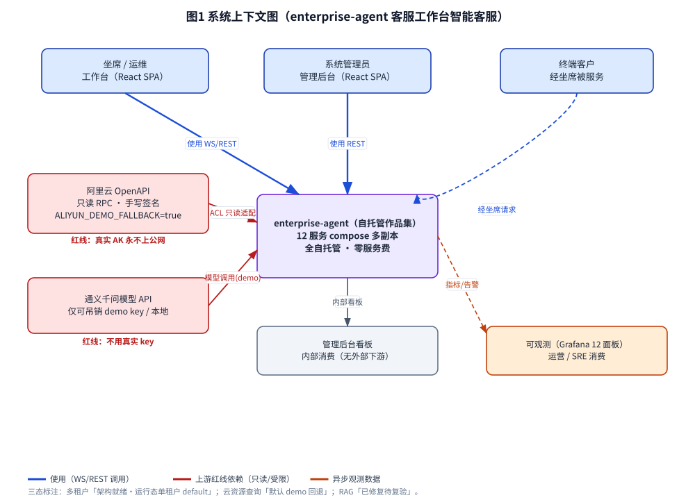
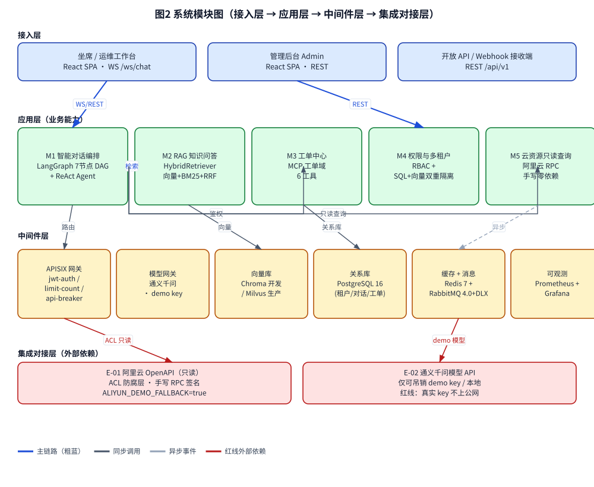
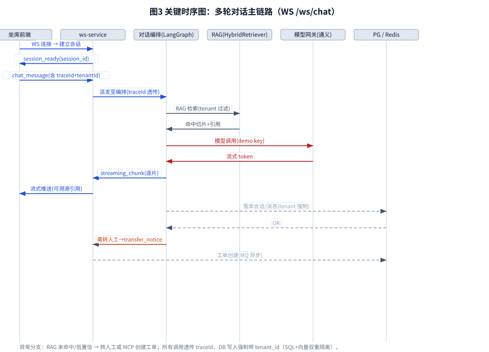
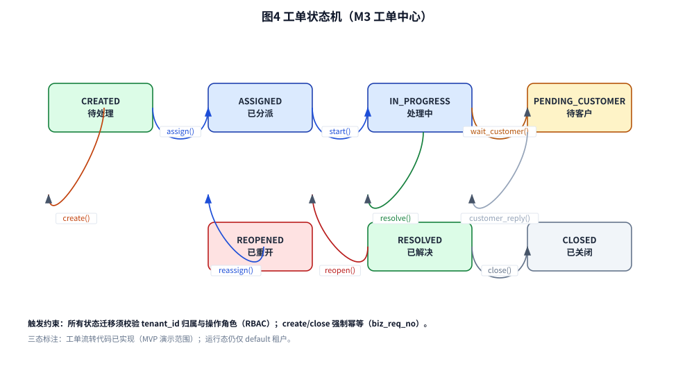

# AICoding 架构设计 · 系统设计

> 本文档为《AICoding 架构设计》核心产物之一，对应**系统架构设计**阶段（Gate G4）。
> 上游输入：《高层架构设计》产出的业务架构、系统定位、能力盘点（G3 已冻结，业务边界 / 角色场景 / MVP 范围 / 模块全景 / 三态标注全部继承自此）；
> 下游输出：用于驱动《部署设计》《安全设计》《UserStory》的实施。
> 事实标注约定：全文以【事实】= 资料或代码已证实；【假设】= 基于现状的合理推断（需后续复验）；【建议】= 架构师的取舍建议（非最终裁决）；三态标注 = 已实现 / 架构就绪未运行化 / 演示回退。

---

## 0. 元信息：修订记录

| 文档版本 | 发布日期 | 修订人 | 修订说明 |
| --- | --- | --- | --- |
| v1.0 | 2026-08-12 | 高见远（system-architect） | 初稿：八章 + 模块五段式 + 数据设计 + 可观测；继承高层架构冻结边界 |

**填写要求**：每次评审通过新增一行；修订说明必须能定位到具体章节，禁止"细节优化 / 调整内容"等不可验证表述。

---

## 1. 引言

### 1.1 文档目标

- **一句话定位**：本文档定义 `enterprise-agent`（客服工作台智能客服 AI Agent）在交付物中的所有架构设计相关产物。
- **读者对象**：架构师 / 开发 / 运维 / 安全 / 评审委员会。
- **设计范围**：业务架构 + 应用架构 + 数据库设计 + 部署架构 + 网络架构 + 安全设计 + 可观测设计。

### 1.2 关联文档清单

| 输入类型 | 内容要点 | 在本文档中的用途 | 形式（外部文档 / 本文档自带） |
| --- | --- | --- | --- |
| 业务需求 | 业务定位、角色、场景、关键流程（对标阿里云 AI 助理形态） | 第 2 章业务架构 | 外部文档《高层架构设计》§1~§2 |
| 非功能性需求 | QPS、并发、数据量、可用性、RTO/RPO、多租户隔离 | 第 3.5 / 5 / 7 章 | 外部文档《高层架构设计》§2 / 本文档自带 |
| 系统定位与边界 | 自托管客服工作台智能客服、私有化 compose 多副本、红线 | 第 3.1 / 5 / 7 章 | 外部文档《高层架构设计》§4 |
| 外部系统 API | 阿里云 OpenAPI（只读）/ 通义千问模型 API（REST/WS） | 第 3.1.3 / 3.2.M5 模块 | 外部文档《高层架构设计》§5.2；docs/api.md |
| 云组件 / 中间件清单 | APISIX / LangGraph / Chroma·Milvus / PG16 / Redis7 / RabbitMQ4 / Prometheus·Grafana | 第 3.1.3 / 4.3 / 5 章 | 外部文档《高层架构设计》§6.2；README |
| 团队 / 行业规范 | 命名、数据库、安全、部署规范 | 第 4.1 / 5 / 7 章 | 本文档自带 |

### 1.3 名词与术语表

| 业务术语 | 业务定义（≤ 30 字） | 应用层核心对象（§3.3 O-xx） | 数据库表名（§4.2） |
| --- | --- | --- | --- |
| 租户 | 多租户隔离单元，SQL 级 + 向量级双重隔离 | O-01 Tenant | t_tenant |
| 账号 / 用户 | 坐席 / 管理员 / 终端客户主体 | O-02 Account | t_account |
| 会话 | 一次 WS 对话连接对应的会话上下文 | O-03 Conversation | t_conversation |
| 消息 | 会话内单条对话内容（含引用） | O-04 Message | t_message |
| 知识库 | RAG 检索语料库（分块 + 向量） | O-05 KnowledgeBase | t_knowledge_base |
| 工单 | 客服流转任务实体 | O-06 Ticket | t_ticket |
| 角色权限 | RBAC 角色与权限点 | O-07 Role / O-08 UserRole | t_rbac_role / t_rbac_user_role |
| 审计日志 | 关键操作留痕（合规） | O-09 AuditLog | t_audit_log |

---

## 2. 业务架构

> **本章回答**：系统服务什么业务、业务由哪些场景构成、业务的关键流程长什么样。
> **本章不回答**：用什么技术、怎么部署、表怎么建。

### 2.1 业务架构概览

#### 2.1.1 业务全景图

**业务域清单**（6 个，与第 3 章模块、第 4 章数据库分组保持一致）：

| 业务域 | 核心场景 | 涉及角色 | 与其他业务域的关系 |
| --- | --- | --- | --- |
| 对话编排域 | 多轮对话编排、LangGraph 7 节点 DAG、转人工 | 坐席 / 终端客户 | 上游消费知识检索、工单、云资源只读；被权限域鉴权 |
| 知识检索域 | RAG 混合检索（向量+BM25+RRF）、引用溯源 | 坐席 / 管理员 | 被对话编排域消费；受权限域租户过滤 |
| 工单域 | 工单创建 / 分派 / 流转 / 关闭 | 坐席 / 管理员 | 由对话编排触发；发布领域事件供管理后台订阅 |
| 权限租户域 | RBAC 鉴权、多租户双重隔离 | 管理员 / 全部角色 | 为所有业务域提供共享内核（tenant_id + 权限） |
| 云资源只读域 | 阿里云只读查询 / 诊断（手写 RPC） | 坐席 | 受红线约束，默认 demo fallback；被对话编排消费 |
| 可观测域 | 指标 / 日志 / 链路 / 告警 | 运维 / SRE | 消费全部业务域运行数据；对外暴露标准指标接口 |

**填写要求**：业务域 3~7 个为宜；业务域名称必须与第 3 章模块、第 4 章数据库分组保持一致。

### 2.2 领域关系映射

#### 2.2.1 限界上下文清单

每个业务域对应一个限界上下文（Bounded Context），明确该域内"业务实体的标准定义"：

| 限界上下文 | 对应业务域 | 域类型 | 覆盖的核心业务实体 | 上下文边界（属于本域 vs 不属于） |
| --- | --- | --- | --- | --- |
| ConversationBC | 对话编排域 | 核心域 | Conversation / Message / AgentState / Handoff | 属于：对话流程编排、转人工；不属于：知识切片内容、工单持久化 |
| KnowledgeBC | 知识检索域 | 核心域 | KnowledgeBase / Chunk / Embedding / Retriever | 属于：检索与分块；不属于：对话编排、问答生成 |
| TicketBC | 工单域 | 支撑域 | Ticket / TicketComment / Assignee | 属于：工单生命周期；不属于：对话生成式回复 |
| IamTenantBC | 权限租户域 | 支撑域 | Tenant / Account / Role / Permission | 属于：身份、角色、租户隔离；不属于：业务实体语义 |
| CloudResourceBC | 云资源只读域 | 通用域 | ResourceSnapshot / Diagnostic | 属于：只读资源查询；不属于：写操作、真实 AK 管理 |
| ObservabilityBC | 可观测域 | 通用域 | Metric / Log / Trace / Alert | 属于：信号采集与告警；不属于：业务状态变更 |

**域类型说明**：

| 域类型 | 含义 | 投入策略 |
| --- | --- | --- |
| 核心域（Core） | 业务护城河，差异化竞争力所在 | 投入最多资源自研 |
| 支撑域（Supporting） | 必要但非差异化 | 可自研可外采 |
| 通用域（Generic） | 通用能力（如用户中心、消息中心） | 优先复用 / 外采 |

#### 2.2.2 上下文映射（Context Mapping）

| 关系编号 | 上游上下文 | 下游上下文 | 关系模式 | 同步方式 | 选择理由 |
| --- | --- | --- | --- | --- | --- |
| C-01 | KnowledgeBC | ConversationBC | Customer/Supplier | 同步 API（HTTP） | 对话编排作为客户，按命中质量反向影响检索调权；对话编排驱动知识域优化 |
| C-02 | 阿里云 OpenAPI（E-01） | CloudResourceBC | ACL 防腐层 | API + 手写 RPC 适配器 | 外部模型不污染本域，零依赖签名客户端隔离阿里云 Schema |
| C-03 | IamTenantBC | ConversationBC / KnowledgeBC / TicketBC | Shared Kernel | 共享 DTO / 库 | tenant_id 与 RBAC 模型为稳定公共概念，强制多租户过滤；维护成本高故仅限稳定内核 |
| C-04 | 通义千问模型 API（E-02） | ConversationBC | Conformist | 直接遵循对方模型 API | 受红线约束仅能使用 demo key，须顺从对方接口形态，无议价能力 |
| C-05 | TicketBC | 管理后台 / 通知订阅方 | Published Language | 消息事件 / 标准协议 | 工单领域事件（ticket.created / ticket.updated）以标准事件多消费者订阅 |
| C-06 | ObservabilityBC | Prometheus（C-08） | Open Host Service | RPC / HTTP 拉取 | 可观测域以标准 /metrics 接口对外暴露指标，类 Published Language 但通过拉取式 RPC |

**关系模式说明**：

| 关系模式 | 适用场景 |
| --- | --- |
| Customer/Supplier | 上下游强协作，下游能影响上游迭代节奏（如：对话 → 检索） |
| Conformist | 顺从者，下游完全遵循上游模型（如：对接模型 API） |
| ACL（Anticorruption Layer） | 在本域和外部域之间建一层适配，外部模型变化不影响本域（对接外部强势平台时必用） |
| Shared Kernel | 共享内核，多个上下文共享一小块代码 / 模型；维护成本高，慎用 |
| Published Language | 上游以标准协议（事件 / Schema）对外暴露，多下游消费 |
| Open Host Service | 上游提供标准 API 接口，类似 Published Language 但通过 RPC |

#### 2.2.3 跨域协作原则

| 原则编号 | 原则 |
| --- | --- |
| P-01 | 核心域 → 支撑域 / 通用域：禁止反向依赖（核心域不依赖支撑域的内部模型） |
| P-02 | 核心域之间：禁止直接耦合，必须通过事件 / API 解耦 |
| P-03 | 对接外部不可控系统：必须建 ACL 防腐层，禁止把外部模型贯穿到本域 |

### 2.3 详细业务架构

#### 2.3.1 用例图

**用例图清单**：

| 编号 | 用例图标题 | 涉及业务域 | 源文件位置 |
| --- | --- | --- | --- |
| UC-01 | 坐席多轮对话问答 | 对话编排域 / 知识检索域 | docs/uml/uc-01-conversation.puml |
| UC-02 | 知识库检索命中与引用溯源 | 知识检索域 | docs/uml/uc-02-rag.puml |
| UC-03 | 工单创建与流转 | 工单域 | docs/uml/uc-03-ticket.puml |
| UC-04 | 三角色越权拦截 | 权限租户域 | docs/uml/uc-04-rbac.puml |
| UC-05 | 云资源只读查询 / 诊断 | 云资源只读域 | docs/uml/uc-05-cloud.puml |
| UC-06 | 运营监控与告警处置 | 可观测域 | docs/uml/uc-06-observability.puml |

#### 2.3.2 业务流程图

**关键流程清单**（核心业务覆盖度 ≥ 80%）：

| 流程编号 | 流程名 | 起点 | 终点 | 涉及业务域 | 源文件位置 |
| --- | --- | --- | --- | --- | --- |
| BF-01 | 多轮对话主链路（WS /ws/chat） | 坐席发起提问 | 流式回复 + 引用气泡 | 对话编排 / 知识检索 | docs/uml/bf-01-chat.puml |
| BF-02 | RAG 知识命中检索 | 编排请求检索 | 命中切片 + 引用 | 知识检索 | docs/uml/bf-02-rag.puml |
| BF-03 | 工单创建流转 | 对话触发 / 坐席创建 | 工单关闭 | 工单 | docs/uml/bf-03-ticket.puml |
| BF-04 | 三角色越权 403 拦截 | 越权请求 | 返回 403 | 权限租户 | docs/uml/bf-04-rbac.puml |
| BF-05 | 云资源只读查询 | 编排请求查询 | 资源快照（demo fallback） | 云资源只读 | docs/uml/bf-05-cloud.puml |
| BF-06 | 对话评估闭环 | 会话结束 | 评分 + 复盘 | 对话编排 / 可观测 | docs/uml/bf-06-eval.puml |

### 2.4 业务范围与边界

#### 2.4.1 功能模块清单

按"功能编号 → 子功能编号"两层组织，与 §2.1 业务域对应。

| 编号 | 一级功能名 | 子功能描述 | 对应业务域 | 实现状态 |
| --- | --- | --- | --- | --- |
| F1 | 智能对话编排 | 多轮对话编排（WS /ws/chat 主链路） | 对话编排域 | 已实现 |
| F1.1 | — | LangGraph 7 节点 DAG + ReAct | 对话编排域 | 已实现 |
| F2 | RAG 知识问答 | 知识库命中检索（HybridRetriever） | 知识检索域 | 已实现（三 bug 已修复待复验） |
| F3 | 工单中心 | 工单创建流转（MCP 工单域 6 工具） | 工单域 | 已实现 |
| F4 | 权限与多租户 | 三角色越权 403（RBAC 验证） | 权限租户域 | 已实现（运行态单租户） |
| F5 | 权限与多租户 | 多租户双重隔离（SQL 级 + 向量级 DB 级隔离） | 权限租户域 | 已实现（运行化）/ 默认单 default 租户 |
| F6 | 云资源只读查询 | 资源查询 / 诊断（手写 RPC，默认 demo fallback） | 云资源只读域 | 已实现（演示回退） |
| F7 | 对话护栏与评估 | 5 层安全护栏 + LLM-as-Judge | 对话编排域 | 已实现 |
| F8 | 可观测 | 监控面板与告警（Grafana 12 面板 8 告警） | 可观测域 | 已实现 |
| F9 | 接入层 | 坐席 / 运维工作台（React SPA） | 跨域 | 已实现 |
| F10 | 接入层 | 管理后台（租户 / RBAC / 工单 / 知识库） | 跨域 | 已实现 |
| F11 | 部署 | 自托管多副本（compose，api/ws replicas:2） | 跨域 | 已实现（MVP 单进程核心链路演示） |
| F12 | 多租户运行化 | 租户管理端点 + 租户维度 RBAC | 权限租户域 | 已实现（运行化）：租户管理端点(含预置管理员+单测) + 租户维度 RBAC(R4) 均落地；跨实体隔离集成测试验证 |
| F13 | 完整 12 服务联跑 | milvus 内存修复 / chroma fallback | 跨域 | 演示回退（卡 R-01） |
| F14 | 多渠道 | 邮件 / 电话 / APP 接入 | 跨域 | 完整版（不在 MVP） |

**In-Scope（本期范围内）**：

| 编号 | 本期必做的事项 |
| --- | --- |
| F1 | 多轮对话（LangGraph 7 节点编排，WS /ws/chat 主链路） |
| F2 | RAG 知识命中（HybridRetriever 向量+BM25+RRF，语料已灌 205 切片） |
| F3 | 工单流转（MCP 工单域 6 工具） |
| F4 | 三角色越权 403（RBAC 验证） |
| F5 | 多租户 + RBAC 架构就绪（诚实声明运行态单租户） |
| F6 | 云资源只读查询（手写 RPC，默认 demo fallback） |
| F7 | 5 层安全护栏 + LLM-as-Judge 评分 + 幻觉检测 |
| F8 | 可观测（Prometheus / Grafana 面板 / 告警） |
| N1 | 单进程核心链路 demo（api/ws replicas 可演示） |
| N2 | 私有化自托管 compose 多副本部署 |
| N3 | 真实密钥红线（localhost / demo key，永不上公网） |

**Out-of-Scope（本期不做）**：

| 编号 | 不做的事项 | 不做的原因 | 未来归属 |
| --- | --- | --- | --- |
| O1 | 完整 12 服务栈长时间联跑 | 卡 milvus 内存 2G（R-01），MVP 以单进程 / 核心链路演示 | 完整版：milvus 内存修复或 chroma fallback |
| O2 | 运行态多租户（租户管理端点 + 租户维度 RBAC） | 架构就绪但运行态仅 default（X9），进阶补齐 | 完整版（D-01 / D-02） |
| O3 | 真实 AK 直连对外演示 | 红线禁止真实 key 上公网；仅 localhost / demo key | 不做对外真实直连；完整版仅本地 / demo |
| O4 | 重型 CCaaS 全渠道 / CRM 原生能力 | 闭源采购、触红线、学生作品集无法承载 | 不借鉴 |
| O5 | 多渠道接入（邮件 / 电话 / APP 等） | 非 MVP 必需，作品集聚焦核心链路 | 完整版 |

**填写要求**：In-Scope ≤ 15 条；Out-of-Scope ≥ 3 条（少于 3 条说明边界没想清楚）。

### 2.5 质量与柔性可用

#### 2.5.1 服务质量目标

**质量目标 Top 3-5**（按 ISO 25010 选出最重要的，落到可验证场景）：

| 优先级 | 质量目标 | 业务驱动 | 受影响的关键章节 |
| --- | --- | --- | --- |
| Q1 | 高可用：api/ws 副本故障自动接管，核心链路 99.5% | 作品集演示稳定性 + 招聘方体验 | §5.2 / §5.3 / §4.3 |
| Q2 | 低延迟：WS 首字 P99 少于等于 3s（TTFT） | 对话体验阈值（NFR-01） | §3.1 / §4.4 / §5.5 |
| Q3 | 可扩展性：单进程 → 多副本无状态水平扩展 | 作品集架构深度证明 | §5.2 / §3.1.4 |
| Q4 | 强隔离：多租户 SQL 级 + 向量级双重隔离（运行态单租户诚实声明） | 合规诚信卖点 | §4.1 / §7.2.5 |
| Q5 | 可观测：12 面板 / 8 告警覆盖业务 + 服务 + 中间件 | 运维与评委可验证 | §8 |

**可验证质量场景**（参考 SEI ATAM 方法）：

| 场景编号 | 关联目标 | 触发源 | 触发条件 | 期望响应 | 度量指标 |
| --- | --- | --- | --- | --- | --- |
| QS-01 | Q1 | 单 api/ws 副本宕机 | 副本进程被杀 | 流量切到存活副本 | RTO 少于等于 30s；错误率峰值 少于等于 1% |
| QS-02 | Q2 | 用户访问 | WS 对话首字 | 正常流式返回 | P95 少于等于 1500ms；P99 少于等于 3000ms |
| QS-03 | Q3 | 业务增长 | 副本数 2 → N | 水平扩容无状态 | 扩容耗时 少于等于 1min |

#### 2.5.2 业务柔性可用策略

**业务功能优先级分层**（§2.4.1 中每个一级功能 F-x 均已标注层级）：

| 层级 | 含义 | 故障态下的处置方向 | 用户感知 |
| --- | --- | --- | --- |
| L0 核心业务 | 系统的生命线，挂掉等于业务停摆 | 不降级；优先消耗所有资源保障 | 无 / 极轻微 |
| L1 重要业务 | 不影响主链路但用户高频使用 | 限流 + 排队 + 异步化 | 变慢 / 排队提示 |
| L2 辅助业务 | 提升体验但非必要 | 关闭 / 返回兜底数据 | 部分功能不可用 + 友好提示 |
| L3 附加业务 | 长尾 / 数据类 / 统计类 | 直接关闭 + 异步补偿 | 通常无感 |

**业务降级清单**：

| 编号 | 关联功能（F-xx） | 触发条件 | 降级动作 | 用户感知 | 决策类型 |
| --- | --- | --- | --- | --- | --- |
| BD-01 | F6 云资源只读查询 | 真实云 API 不可用 / 未配置 key | 自动回退 demo fallback 样本（标注来源） | 展示样本数据并提示"演示样本" | 自动 |
| BD-02 | F2 RAG 检索 | 向量库不可用 | 降级为 BM25 关键词检索；仍失败则返回引导话术 | 检索质量下降但对话不中断 | 自动 |
| BD-03 | F8 可观测面板 | Grafana 不可用 | 指标仍由 Prometheus 落盘，前端面板降级提示 | 管理后台看板暂不可用 | 自动 |
| BD-04 | F3 工单异步通知 | RabbitMQ 堆积 / 不可用 | 工单仍落库，通知改为定时补偿 | 坐席稍后可见工单 | 自动 |

**填写要求**：
- §2.4.1 全部一级功能均已分层（L0~L3）；L0 数量 少于等于 总功能数的 30%；
- 用户感知列禁止出现"走兜底逻辑 / 熔断"等技术词。

---

## 3. 应用架构

> **本章回答**：系统由哪些模块组成、模块与外部系统怎么集成、每个模块的内部交互链路是什么。
> **本章是系统设计的核心**，章节下应当占整个文档篇幅的 40%~50%。

### 3.1 应用架构概览

#### 3.1.1 系统上下文

本系统作为**中心节点**，周围辐射出"用户角色 + 外部业务系统 + 上游平台"关系。



**系统上下文要素清单**：

| 节点类型 | 节点名 | 与本系统的关系 | 关系语义 |
| --- | --- | --- | --- |
| 角色 | 坐席 / 运维 | 使用 | 工作台操作（WS /ws/chat + REST） |
| 角色 | 系统管理员 | 使用 | 管理后台操作（REST） |
| 角色 | 终端客户 | 经坐席被服务 | 间接用户（非直连） |
| 上游平台 | E-01 阿里云 OpenAPI | 本系统 → 只读调用 | 云资源只读查询（ACL 防腐层） |
| 外部业务系统 | E-02 通义千问模型 API | 本系统 → 调用 | LLM 推理（仅 demo key / 本地） |
| 下游平台 | 管理后台看板 | 本系统 → 内部消费 | 运营视图（无外部下游） |

**填写要求**：
- 本系统画成单一节点，**不展开内部组件**（内部组件归 §3.1.2）；
- 周围节点取自 §3.1.3 外部依赖清单（E-xx）与 §2.3 用例图角色；
- 每条边必须标注关系语义（使用 / 双向调用 / 数据推送 / 订阅 等）。

#### 3.1.2 系统模块图



- 分层架构图，每一层标出关键组件与协议方向
- **接入层**：管理端 / 工作台 / 开放 API / Webhook 接收端
- **应用层**：覆盖业务模块全景（M1~M7）
- **中间件层**：覆盖基础设施依赖清单（C-xx）
- **集成对接层**：覆盖外部依赖清单集成关系（E-xx）

**分层组件清单**：

| 层次 | 内容 | 数据来源 |
| --- | --- | --- |
| 接入层 | 工作台 / 管理后台 / 开放 API / Webhook 接收端 | §2.3 用例图角色 |
| 应用层 | 按 §2.1 业务域划分的后端服务模块（与 §3.2 模块可追溯对应） | §2.1 / §3.2 |
| 中间件层 | 网关 / 向量库 / 关系库 / 缓存 / 消息 / 可观测（C-xx） | §3.1.3 云组件清单 |
| 集成对接层 | 与外部系统的对接桩 / SDK 封装入口（E-xx） | §3.1.3 外部依赖清单 |

**填写要求**：层次自上而下展示；每条线必须标注协议（HTTP / gRPC / MQ / SDK / Webhook 等）；中间件 / 外部系统组件块上标注其编号（C-xx / E-xx）。

#### 3.1.3 集成架构

##### 外部依赖清单

| ID | 外部系统 | 归属团队 / 供应商 | 类别 | 使用方式 | 集成方式 | 协议 / 版本 | 功能定位（≤ 30 字） | 联系人 |
| --- | --- | --- | --- | --- | --- | --- | --- | --- |
| E-01 | 阿里云 OpenAPI（只读） | 阿里云 | 第三方业务平台（只读云资源） | 消费 | REST API + 手写 RPC 签名 | 阿里云 RPC Signature V1（HMAC-SHA1） | 只读云资源查询 / 诊断 | @架构 |
| E-02 | 通义千问模型 API（DashScope） | 阿里云百炼 | 模型服务 | 消费 | REST API + WS(SSE) | DashScope 兼容 OpenAI 协议 | LLM 推理（仅 demo key） | @架构 |

**填写要求**：
- 类别取值（封闭枚举）：身份认证 / 业务协作 / 支付 / 通知推送 / 埋点 / 第三方业务平台 / 监控审计 / 文件导出；
- 使用方式取值：消费（本系统调用对方）/ 生产（对方调用 / 订阅本系统）/ 双向。

##### 云组件 / 基础设施清单

| ID | 组件类别 | 选型 | 部署形态 | 规格量级 | 容量预估 | 提供方 / SLA | 用途 |
| --- | --- | --- | --- | --- | --- | --- | --- |
| C-01 | API 网关 | APISIX 3.9 | 单实例（compose） | 2C4G | 8.5 万 QPS（压测） | 自托管 | 路由 / 鉴权 / 限流 / 熔断 |
| C-02 | 模型网关 | 通义千问 DashScope 兼容层 | 外部 SaaS（demo key） | — | 按 token | 阿里云 | LLM 推理入口 |
| C-03 | 向量库 | Chroma 0.5（开发）/ Milvus 2.5.9（生产） | 单实例（compose） | Chroma 进程 / Milvus 内存 2G 起 | 205 切片（当前） | 自托管 | 知识向量检索 |
| C-04 | 关系型数据库 | PostgreSQL 16.4 | 主从（compose 单实例） | 2C8G | 9 张核心表 | 自托管 | 业务主数据 |
| C-05 | 缓存 | Redis 7.2 | 单实例（compose） | 1C2G | 会话 / 限流 / 锁 | 自托管 | 会话 / 去重 / 分布式锁 |
| C-06 | 消息队列 | RabbitMQ 4.0 | 单实例（compose）+ DLX | 1C2G | 4 队列 | 自托管 | 异步工单 / 通知 / 索引 |
| C-07 | 对象存储 | MinIO RELEASE.2025-07-23 | 单实例（compose） | 2C4G | 文档 / 备份 | 自托管 | 文档 / 备份 |
| C-08 | 监控指标 | Prometheus 2.53 | 单实例 | 1C2G | 拉取指标 | 自托管 | 指标采集 |
| C-09 | 可视化 | Grafana 11 | 单实例 | 1C2G | 12 面板 / 8 告警 | 自托管 | 监控大盘 |
| C-10 | 前端托管 | Nginx / StaticFiles | 单实例 | 1C1G | 静态 SPA | 自托管 | 前端资源 |

**填写要求**：选型必须含**具体产品 + 版本号**；规格量级 / 容量预估必须有数字；不使用的组件**整行删除**，禁止填"不适用"。

##### 组件依赖关系

以**矩阵形式**呈现"哪个业务模块用了哪些外部依赖"，分析依赖关系及故障传导风险：

| 业务模块（§3.2） | 依赖的外部系统（E-xx） | 依赖的云组件（C-xx） | 故障传导风险 |
| --- | --- | --- | --- |
| M1 对话编排 | E-02 | C-01, C-03, C-04, C-05, C-06 | E-02 不可用 → 对话降级 demo / 本地；C-03 不可用 → RAG 降级 BM25 |
| M2 RAG 知识问答 | — | C-03, C-04 | C-03 不可用 → 降级 BM25（C-04 全文） |
| M3 工单中心 | — | C-04, C-06 | C-06 不可用 → 工单仍落库，通知补偿 |
| M4 权限与多租户 | — | C-04, C-05 | C-04 不可用 → 全站不可登录 |
| M5 云资源只读 | E-01 | C-04 | E-01 超时 → 回退 demo fallback（红线） |
| M6 APISIX 网关 | — | C-01 | C-01 不可用 → 全站不可路由 |
| M7 可观测 | — | C-08, C-09 | C-08 不可用 → 告警丢失 |

**填写要求**：编号必须与外部依赖清单 / 云组件清单完全对应；§3.2 模块详细设计的"涉及的内外部系统"必须能从本矩阵中查到。

#### 3.1.4 工程结构

- 明确项目的物理组织方式
- 公共模块（`common`）与业务服务的依赖方向必须清晰：**业务服务依赖 common，禁止反向**

```
enterprise-agent/
├── backend/                 # 后端工程根目录
│   ├── common/              # 公共模块：DTO / VO / Enum / Exception / Constants / safety / protocols
│   ├── api/                 # 接入层：FastAPI REST + WebSocket /ws/chat（M1 入口）
│   ├── graph/               # 编排层：LangGraph 7 节点 DAG（M1）
│   ├── agent/               # ReAct Agent + 工具调用（M1）
│   ├── rag/                 # RAG 子系统（M2）
│   ├── ticket/              # 工单管理 + MCP 工具（M3）
│   ├── iam/                 # 权限与多租户（M4）
│   ├── cloud/               # 阿里云只读 RPC 客户端（M5）
│   ├── worker/              # RabbitMQ 消费者（M3/M1 异步）
│   ├── observability/       # Prometheus / 指标（M7）
│   └── websocket/           # WS 会话管理（M1 主链路）
└── frontend/                # 前端工程根目录
    ├── workbench/           # 坐席 / 运维工作台（F9）
    │   ├── src/
    │   │   ├── api/         # 接口封装（与后端 §3.2 接口清单对齐）
    │   │   ├── stores/      # 全局状态（Zustand）
    │   │   ├── pages/       # 页面（按路由分目录）
    │   │   ├── components/  # 跨页面通用组件
    │   │   ├── hooks/       # 自定义 Hooks
    │   │   ├── types/       # TS 类型定义（与后端 DTO/VO 对齐）
    │   │   ├── utils/       # 工具函数
    │   │   ├── sdk/         # 三方 SDK 封装（对应 §3.1.3 E-xx）
    │   │   └── routes.tsx   # 路由配置
    │   └── package.json
    ├── admin/               # 管理后台（F10）
    └── shared/              # 跨端共用组件 / 类型定义
```

#### 3.1.5 技术选型（版本约束）

| 技术分类 | 选型 | 版本 | 备注 / 选型理由 |
| --- | --- | --- | --- |
| 后端语言 | Python | 3.11.9 | 选 3.11 不选 3.10：与部署 / CI 锁定基线一致，结构化模式匹配与性能更优 |
| 后端框架 | FastAPI | 0.110.x | 选 FastAPI 不选 Flask/Django：原生 async + WebSocket + 自动 OpenAPI，契合 WS 主链路 |
| 编排框架 | LangGraph | 0.2.x | 选 LangGraph 不选 LlamaIndex/CrewAI：显式状态机 + human-in-the-loop，7 节点 DAG 已落地 |
| 向量库 | Chroma / Milvus | 0.5.x / 2.5.9 | 选双栈不选 Qdrant：开发零依赖、生产十亿级 + Partition Key 隔离 |
| 关系型存储 | PostgreSQL | 16.4 | 选 PG 不选 MySQL：原生 JSONB / 向量扩展友好，与现有 schema 一致 |
| 缓存 | Redis | 7.2 | 选 Redis 不选 Memcached：支持分布式锁 / 限流计数 / Stream，契合多副本 |
| 消息队列 | RabbitMQ | 4.0 | 选 RabbitMQ 不选 Kafka：QPS 小于 100 无需高吞吐，原生 DLX + 复杂路由更合适 |
| API 通信 | REST / WebSocket | — | 选 REST+WS 不选纯 gRPC：WS 为主链路流式，内部服务间 HTTP 足够（gRPC 过度设计） |
| 前端框架 | React + TypeScript | 18.x / 5.x | 选 React 不选 Vue：与现有 SPA 技术栈一致 |
| 前端状态 | Zustand | 4.x | 选 Zustand 不选 Redux：体积更小、TS 支持好、学习成本低 |
| 前端构建 | Vite | 5.x | 选 Vite 不选 Webpack：冷启动快、配置简单 |
| 认证方案 | JWT(HS256) | PyJWT 2.8 | 见 §7.2.1：无状态支持多副本 / 多进程 |
| 可观测 | Prometheus + Grafana | 2.53 / 11.x | 选 Prometheus 不选 ELK 做指标：拉模型契合容器，Grafana 12 面板已验证 |
| 对象存储 | MinIO | RELEASE.2025-07-23 | 选 MinIO 不选商用 OSS：全自托管零服务费 |
| 网关 | APISIX | 3.9 | 选 APISIX 不选 Kong/Nginx：动态配置 + 丰富插件（jwt/限流/熔断） |

**填写要求**：必须有版本号；选型理由用一句话说明（**为什么选 A 不选 B**），避免"团队习惯"这种空话。

### 3.2 模块详细设计

> **核心方法论**：模块详细设计要画的是**业务逻辑在角色和系统之间流动的过程**，不是接口实现细节。
> **组织原则**：先在 §3.2.1 / §3.2.2 给出跨模块共享约束与模块清单；§3.2.3 给出"单模块设计模板（五段式）"；之后**每个模块在 §3.2.M{N} 下独立成节**，按模板展开。

#### 3.2.1 模块公共约束（Common）

**通信方式约束**：

| 约束项 | 取值 |
| --- | --- |
| 接口路径风格 | RESTful / WS（二选一已锁定：REST /api/v1 + WS /ws/chat） |
| 协议 | HTTP / WS / MQ |
| 数据格式 | JSON |
| 字符编码 | UTF-8 |

**通用基础结构**：

| 基类 / 结构 | 用途 | 包路径 |
| --- | --- | --- |
| `BaseRequest` | 多态请求对象基类 | common.dto |
| `BaseResponse` | 多态响应对象基类 | common.dto |
| `PageRequest` | 分页请求 | common.dto |
| `PageResponse[T]` | 分页响应 | common.dto |
| `Result[T]` | 统一返回结构（含 code / msg / data / traceId） | common.dto |

#### 3.2.2 模块清单与编号规则

**模块清单**：

| 编号 | 模块名 | 业务域（§2.1） | 模块负责人 | 关联子领域 |
| --- | --- | --- | --- | --- |
| M1 | 智能对话编排 | 对话编排域 | @高见远 | 多轮对话 / 转人工 / 护栏 |
| M2 | RAG 知识问答 | 知识检索域 | @高见远 | 混合检索 / 引用溯源 |
| M3 | 工单中心 | 工单域 | @高见远 | 工单生命周期 / 事件 |
| M4 | 权限与多租户 | 权限租户域 | @高见远 | RBAC / 双重隔离 |
| M5 | 云资源只读查询 | 云资源只读域 | @高见远 | 只读 RPC / demo fallback |
| M6 | APISIX 网关 | 跨域（基础能力） | @高见远 | 路由 / 鉴权 / 限流 / 熔断 |
| M7 | 可观测 | 可观测域 | @高见远 | 指标 / 日志 / 链路 / 告警 |

**G3 模块全景 → 本设计追溯映射（继承 §6.2 冻结的 13 个模块）**：

> 高层架构 §6.2 冻结的 13 个模块由「2 前端应用 + 5 后端业务模块 + 6 基础能力/基础设施组件」构成。本设计对 5 个后端业务模块与 APISIX 网关、可观测以 M1~M7 进行五段式详设；2 个前端应用落在 §3.1.4 工程结构与 §3.5 前端路由；4 个数据/中间件基础设施组件落在 §3.1.3 云组件清单（C-02/C-03/C-07/C-08/C-09）与 §4 数据库设计、§3.4 跨模块公共能力。下表保证 13 个 G3 模块均可追溯到本设计具体章节。

| G3 §6.2 模块（13） | 一级归属 | 本设计载体 | 设计章节 |
| --- | --- | --- | --- |
| 坐席/运维工作台 | 接入层（前端） | frontend 工程 `apps/workbench` | §3.1.4 工程结构 / §3.5 前端路由清单 |
| 管理后台 | 接入层（前端） | frontend 工程 `apps/manager` | §3.1.4 工程结构 / §3.5 前端路由清单 |
| 智能对话编排 | 业务能力层 | M1 智能对话编排 | §3.2.M1（五段式） |
| RAG 知识问答 | 业务能力层 | M2 RAG 知识问答 | §3.2.M2（五段式） |
| 工单中心 | 业务能力层 | M3 工单中心 | §3.2.M3（五段式） |
| 权限与多租户 | 业务能力层 | M4 权限与多租户 | §3.2.M4（五段式） |
| 云资源只读查询 | 业务能力层 | M5 云资源只读查询 | §3.2.M5（五段式） |
| APISIX 网关 | 基础能力层 | M6 APISIX 网关 | §3.2.M6（五段式） |
| 模型网关 | 基础能力层 | M1 内部 LLM 调用子能力（E-02，Conformist C-04） | §3.2.M1 / §3.1.3 C-04 |
| 向量库（Chroma/Milvus） | 基础能力层 | 云组件 C-03 + M2 检索子能力 | §3.1.3 C-03 / §3.2.M2 |
| 关系库 PostgreSQL | 基础能力层 | 云组件 C-02 + §4 数据库设计 | §3.1.3 C-02 / §4 |
| 缓存+消息（Redis/RabbitMQ） | 基础能力层 | 云组件 C-07 + §3.4 跨模块公共能力 | §3.1.3 C-07 / §3.4 |
| 可观测（Prometheus/Grafana） | 基础能力层 | M7 可观测 + 云组件 C-08/C-09 | §3.2.M7 / §3.1.3 C-08,C-09 |

**编号规则**：
- 模块编号 `M{N}` 全局唯一，与 §2.1 业务域名一致；
- 每个模块在 §3.2 下独立成节，编号 `§3.2.M{N}`；
- 节内五段式编号 `§3.2.M{N}.1` ~ `§3.2.M{N}.5`，顺序与 §3.2.3 模板一致。

#### 3.2.3 单模块设计模板（五段式）

> ⚠️ **本节性质说明（写给使用本模版的人 / AI）**
>
> 本节定义"每个模块在 §3.2.M{N} 下五段各应该**产出什么内容**、**遵守什么格式**"。**本节本身不是任何模块的内容**——以下所有"硬性要求表 / 示意 DTO 代码 / 示意伪代码 / 示意表格行"都属于**规范说明与格式示意**，仅供理解之用。
>
> **§3.2.M{N} 下应当怎么填**：
> 1. **直接写该模块特有的业务内容**（真实接口、真实 DTO、真实时序图、真实流程）；
> 2. **不要把本节的"硬性要求表 / 示意代码 / 示意表格行"复制到任何 §3.2.M{N} 下**——本节列出的硬性要求是**所有模块共同遵守的项目级规范**，在各模块下**只体现、不重复声明**；
> 3. 五段顺序固定；简单 CRUD 模块可省略 `.5 关键流程逻辑`，但需在 `.5` 标题下显式注明"无复杂状态机/事务/跨多步异步，本段省略"，禁止留空标题。

##### §3.2.M{N}.1 模块概述

**该段产出物**：在 §3.2.M{N}.1 下输出本模块的"业务定位三要素"——位置 / 角色 / 内外部系统。

**硬性要求**（所有模块共同遵守，**不在 §3.2.M{N} 下重复声明这张表**）：

| 要素 | 内容 |
| --- | --- |
| 模块在业务流程中的位置 | 在哪个业务域的哪些场景里发挥作用 |
| 涉及的角色 | 业务角色（如管理员 / 业务人员 / 客户） |
| 涉及的内外部系统 | 列出本模块运行时会与之交互的所有内外部系统名（命名必须与 §3.1 一致） |

##### §3.2.M{N}.2 接口清单

**该段产出物**：在 §3.2.M{N}.2 下输出本模块**对外暴露的真实业务接口列表**（按子领域分组）。

**接口字段硬性要求**（所有接口共同遵守，**不在 §3.2.M{N} 下重复声明这张表**）：

| 字段 | 取值约束 |
| --- | --- |
| 接口路径 | RESTful 规范 |
| 方法 | GET / POST / PUT / PATCH / DELETE |
| 请求 / 响应结构 | 引用本模块 §3.2.M{N}.3 DTO 编号 |
| 默认超时 | 见 §3.5.4 默认超时基线 |
| 默认重试 | 见 §3.5.4 |
| 幂等性约定 | 是 / 否；幂等键来源（见 §3.5.2） |
| 鉴权要求 | 角色 / 权限标签（见 §7.2） |

##### §3.2.M{N}.3 关键结构定义（DTO）

**该段产出物**：在 §3.2.M{N}.3 下输出本模块**特有的 DTO/VO 代码** + **关键字段定义表**。

**DTO 设计硬性要求**（所有模块共同遵守）：
- 只列出对前后端协议契约有影响的关键字段，**不展开内部模型类**
- 字段必须按"基本信息 / 业务字段 / 状态 / 时间 / 扩展"分块注释

##### §3.2.M{N}.4 模块逻辑时序图

**该段产出物**：在 §3.2.M{N}.4 下输出本模块**特有的时序图清单** + **关键时序图本体**（PUML / Mermaid / SVG 文本格式）。

**硬性要求**（所有模块共同遵守）：
- 覆盖模块关键路径、核心逻辑
- 模块时序图与系统时序图的模块名称等信息保持统一
- 至少包含失败 / 超时 / 回滚中的 1 条异常分支
- 写操作必标注事务边界 / 分布式锁 Key / 幂等键传递（见 §3.5.2）

##### §3.2.M{N}.5 关键流程逻辑

**该段产出物**：在 §3.2.M{N}.5 下输出本模块**含 Mock / 含状态机 / 跨多步异步**的关键流程伪代码 + 状态机迁移表。

**硬性要求**：
- **仅在"复杂事务、复杂状态机、跨多步异步"等复杂场景**进行展开说明；简单 CRUD 模块本段可省略，但需显式注明"无复杂状态机/事务/跨多步异步，本段省略"

#### 3.2.M1 智能对话编排

> 按 §3.2.3 五段式模板填写。本模块是 WS /ws/chat 主链路核心，承载 LangGraph 7 节点 DAG 编排。

##### §3.2.M1.1 模块概述

智能对话编排模块覆盖**多轮对话问答、RAG 命中、工单意图触发、转人工、对话护栏与评估**业务流程，业务逻辑在**坐席（前端）/ 编排引擎 / RAG / 模型网关 / 工单**之间流动，同时涉及**工作台（WS）、RAG 模块、工单中心、权限多租户、云资源只读、PG、Redis、RabbitMQ** 等内外部系统。

##### §3.2.M1.2 接口清单

| 子领域 | 方法 | 路径 | 用途（≤ 20 字） | 请求 DTO | 响应 VO | 幂等 |
| --- | --- | --- | --- | --- | --- | --- |
| 对话 | WS | `/ws/chat` | 多轮对话主链路（流式） | `ChatMessage` | `StreamingChunk` | 天然 |
| 对话 | WS | `/ws/agent/{agent_id}` | 坐席工作台接收转接 | `AgentSendReply` | `NewTransfer` | 天然 |
| 对话 | POST | `/api/v1/chat` | REST 兜底对话 | `ChatRequest` | `ChatResponse` | 是（biz_req_no） |
| 对话 | POST | `/api/v1/handoff/{session_id}/accept` | 坐席接手转人工 | `HandoffAccept` | `Result` | 是（idempotency_key） |
| 护栏 | POST | `/api/v1/evaluation/runs` | 发起对话评估 | `EvalRunRequest` | `EvalRunVO` | 是（idempotency_key） |

##### §3.2.M1.3 关键结构定义（DTO）

```python
class ChatMessage:
    # ===== 基本信息 =====
    type: str = "chat_message"
    message: str                      # 用户发言，≤ 2000 字
    session_id: str | None = None     # 续接会话
    user_id: str | None = None
    # ===== 业务字段 =====
    tenant_id: str | None = None      # 客户端传入但服务端以 JWT 为准，忽略
    user_plan: str | None = None
    image_base64: str | None = None   # 多模态
    audio_base64: str | None = None
    # ===== 扩展 =====
    trace_id: str | None = None       # 链路透传

class StreamingChunk:
    # ===== 基本信息 =====
    type: str = "streaming_chunk"
    text: str
    delta: str
    # ===== 状态字段 =====
    done: bool = False
    suggest_human: bool = False
    needs_human: bool = False
    # ===== 扩展 =====
    citations: list[str] | None = None   # 引用气泡溯源
```

**关键字段定义表**：

| DTO / VO 名 | 字段名 | 类型 | 必填 | 业务含义 | 约束 / 默认值 |
| --- | --- | --- | --- | --- | --- |
| `ChatMessage` | `message` | String | 是 | 用户发言内容 | 长度 ≤ 2000 |
| `ChatMessage` | `tenant_id` | String | 否 | 客户端传入租户 | 服务端忽略，以 JWT 为准 |
| `StreamingChunk` | `done` | Boolean | 是 | 本轮是否结束 | false / true |
| `StreamingChunk` | `citations` | Array | 否 | 知识引用片段 | 可溯源气泡 |

**填写要求**：每个字段必须有中文业务含义；枚举字段必须列出全部取值（与 §1.3 术语表、§4.2 表字段定义对齐）。

##### §3.2.M1.4 模块逻辑时序图

**时序图清单**：

| 编号 | 标题 | 场景类别 | 是否包含异常分支 |
| --- | --- | --- | --- |
| SQ-01 | 对话编排 - 多轮对话主链路 | 核心实体的创建 / 执行 | 是（RAG 未命中转人工） |
| SQ-02 | 对话编排 - 转人工交接 | 核心动作的执行 | 是（坐席离线） |

主链路时序图见 **图3 关键时序图：多轮对话主链路（WS /ws/chat）**（系统级时序，复用本模块实体命名）：



异常分支：当 RAG 未命中或置信度低于阈值时，编排触发 `transfer_notice` 转人工，并通过 RabbitMQ 异步创建工单（C-06 关系），若 MQ 不可用则工单仍落库、通知改为定时补偿（BD-04）。

##### §3.2.M1.5 关键流程逻辑

```
触发：坐席经 WS /ws/chat 发送 chat_message（带 trace_id + JWT 派生的 tenant_id）

Step 1: 会话建立（同步）
  ├── 校验：JWT 有效 → 解析 tenant_id / user_id / roles
  ├── 校验：消息长度 ≤ 2000 → 失败时返回 error(CHAT_ERROR)
  └── 状态变更：无 session 则创建 Conversation，下发 session_ready

Step 2: 编排执行（同步 + 流式）
  ├── 调用 LangGraph 7 节点 DAG：entry → rag → reply
  ├── [MOCK] RAG 三 bug 已修复待复验（D1 §9.3）：
  │     输入：用户 query + tenant_id
  │     规则：HybridRetriever（向量 + BM25 + RRF），tenant 过滤
  │     输出：命中切片 + citations
  │     [完整版替换点] probe5 + ws_rag_verify 复验后切真
  ├── 调用 模型网关（C-02，仅 demo key）→ 流式 token
  └── 写操作：落 Message（tenant_id 强制），分布式锁 lock:session:{id}

Step 3: 转人工分支（异步事件）
  ├── 判定：低置信 / human_escalation
  ├── 推送 transfer_notice + handoff_context 给坐席（WS /ws/agent/{id}）
  └── MQ 异步创建工单（M3）；失败补偿见 BD-04
```

#### 3.2.M2 RAG 知识问答

##### §3.2.M2.1 模块概述

RAG 知识问答模块覆盖**知识库混合检索、引用溯源、语料灌入与复验**业务流程，业务逻辑在**对话编排 / 检索服务 / 向量库 / PG** 之间流动，涉及**对话编排模块、Chroma·Milvus（C-03）、PostgreSQL（C-04）** 等内外部系统。

##### §3.2.M2.2 接口清单

| 子领域 | 方法 | 路径 | 用途（≤ 20 字） | 请求 DTO | 响应 VO | 幂等 |
| --- | --- | --- | --- | --- | --- | --- |
| 检索 | POST | `/api/v1/knowledge/{kb_id}/hit_test` | 检索命中测试 | `HitTestRequest` | `HitTestVO` | 天然 |
| 知识库 | POST | `/api/v1/admin/knowledge` | 新建知识库 | `KbCreateRequest` | `KbVO` | 是（biz_req_no） |
| 知识库 | POST | `/api/v1/admin/knowledge/{kb_id}/documents` | 上传文档 | `multipart` | `Result` | 是（biz_req_no） |
| 知识库 | POST | `/api/v1/admin/knowledge/{kb_id}/reindex` | 重建向量索引 | `ReindexRequest` | `Result` | 是（idempotency_key） |

##### §3.2.M2.3 关键结构定义（DTO）

```python
class HitTestRequest:
    # ===== 基本信息 =====
    kb_id: str
    # ===== 业务字段 =====
    query: str                    # 检索问句
    top_k: int = 5               # 召回数（修复 Bug B 由 3→5）
    alpha: float = 0.7          # 向量权重（BM25 互补）

class HitTestVO:
    # ===== 状态字段 =====
    status: str                  # OK / DEGRADED
    # ===== 业务字段 =====
    chunks: list[Chunk]          # 命中切片
    citations: list[str]         # 引用片段

class Chunk:
    chunk_id: str
    content: str                 # 切片正文（截断 ≤ 1200，修复 Bug B）
    source: str                  # 文档来源
    score: float
```

**关键字段定义表**：

| DTO / VO 名 | 字段名 | 类型 | 必填 | 业务含义 | 约束 / 默认值 |
| --- | --- | --- | --- | --- | --- |
| `HitTestRequest` | `top_k` | Int | 否 | 召回数量 | 默认 5（修复后） |
| `HitTestRequest` | `alpha` | Float | 否 | 向量召回权重 | 默认 0.7 |
| `Chunk` | `content` | String | 是 | 切片正文 | 截断 ≤ 1200 |

##### §3.2.M2.4 模块逻辑时序图

| 编号 | 标题 | 场景类别 | 是否包含异常分支 |
| --- | --- | --- | --- |
| SQ-01 | RAG - 混合检索命中 | 核心检索执行 | 是（向量库降级 BM25） |
| SQ-02 | RAG - 文档灌入与索引 | 异步索引 | 是（索引锁冲突） |

检索异常分支：C-03（Chroma/Milvus）不可用时，降级为 PG 全文检索（BM25），仍失败则返回引导话术（BD-02）；索引重建通过 `lock:index:{kb_id}` 分布式锁防并发冲突。

##### §3.2.M2.5 关键流程逻辑

```
触发：对话编排请求检索（tenant_id + query）

Step 1: 混合检索（同步）
  ├── 向量检索（Milvus Partition Key = tenant_id 物理隔离）
  ├── 关键词检索（BM25）
  ├── RRF 融合（k=60）→ 取 top_k=5
  └── [MOCK] 三 bug 已修复待复验（D1 §9.3）：
        Bug A 元组解包崩溃（已修，retriever 返回 Document 列表）
        Bug B top_k 3→5、截断 500→1200（已修）
        Bug C 结构提示标记非幂等堆叠（已修）
        [完整版替换点] probe5 + ws_rag_verify 复验达标后切真

Step 2: 引用溯源（同步）
  └── 输出 citations（切片 source）供前端引用气泡
```

#### 3.2.M3 工单中心

##### §3.2.M3.1 模块概述

工单中心模块覆盖**工单创建 / 分派 / 流转 / 关闭**业务流程，业务逻辑在**对话编排 / 坐席 / 管理员 / PG / RabbitMQ** 之间流动，涉及**对话编排模块、权限多租户、PostgreSQL（C-04）、RabbitMQ（C-06）** 等内外部系统。

##### §3.2.M3.2 接口清单

| 子领域 | 方法 | 路径 | 用途（≤ 20 字） | 请求 DTO | 响应 VO | 幂等 |
| --- | --- | --- | --- | --- | --- | --- |
| 工单 | POST | `/api/v1/tickets` | 创建工单 | `TicketCreateRequest` | `TicketVO` | 是（idempotency_key） |
| 工单 | GET | `/api/v1/tickets` | 工单列表 | — | `PageResponse[TicketVO]` | 天然 |
| 工单 | PUT | `/api/v1/tickets/{ticket_id}` | 更新工单 | `TicketUpdateRequest` | `TicketVO` | 是（id+version） |
| 工单 | POST | `/api/v1/tickets/{ticket_id}/assign` | 分派坐席 | `AssignRequest` | `TicketVO` | 是（idempotency_key） |
| 工单 | POST | `/api/v1/tickets/{ticket_id}/close` | 关闭工单 | `CloseRequest` | `Result` | 是（idempotency_key） |

##### §3.2.M3.3 关键结构定义（DTO）

```python
class TicketCreateRequest:
    # ===== 基本信息 =====
    title: str
    description: str
    # ===== 业务字段 =====
    category: str                 # account / billing / tech ...
    priority: str                 # low / normal / high / critical
    creator_id: str
    # ===== 扩展 =====
    idempotency_key: str          # 强制幂等（资金/通知类一致要求）

class TicketVO:
    # ===== 基本信息 =====
    ticket_id: str
    # ===== 状态字段 =====
    status: str                   # CREATED/ASSIGNED/IN_PROGRESS/PENDING_CUSTOMER/RESOLVED/CLOSED
    # ===== 时间字段 =====
    created_time: datetime
    updated_time: datetime
```

**关键字段定义表**：

| DTO / VO 名 | 字段名 | 类型 | 必填 | 业务含义 | 约束 / 默认值 |
| --- | --- | --- | --- | --- | --- |
| `TicketCreateRequest` | `priority` | String | 是 | 优先级 | low/normal/high/critical |
| `TicketCreateRequest` | `idempotency_key` | String | 是 | 幂等键 | 防重复创建 |
| `TicketVO` | `status` | String | 是 | 工单状态 | 见状态机迁移表 |

##### §3.2.M3.4 模块逻辑时序图

| 编号 | 标题 | 场景类别 | 是否包含异常分支 |
| --- | --- | --- | --- |
| SQ-01 | 工单 - 创建与流转 | 核心动作执行 | 是（并发关闭冲突） |

工单流转状态机见 **图4 工单状态机（M3 工单中心）**：



异常分支：并发 `close` 与 `resolve` 冲突时，以乐观锁 version 拒绝旧版本（返回 C409 冲突），由调用方重试。

##### §3.2.M3.5 关键流程逻辑

**状态机迁移表**（含状态机的模块必填）：

| 起始状态 | 触发事件 | 终止状态 | 触发条件 / 校验 | 副作用 |
| --- | --- | --- | --- | --- |
| CREATED | assign() | ASSIGNED | 校验 tenant 归属 + 操作角色 | 发通知坐席 |
| ASSIGNED | start() | IN_PROGRESS | 坐席开始处理 | — |
| IN_PROGRESS | wait_customer() | PENDING_CUSTOMER | 需客户补充 | 通知客户 |
| PENDING_CUSTOMER | customer_reply() | IN_PROGRESS | 客户回复 | — |
| IN_PROGRESS | resolve() | RESOLVED | 处理完成 | 发解决通知 |
| RESOLVED | close() | CLOSED | 校验权限 | 归档（审计） |
| ANY | reopen() | IN_PROGRESS | 复核重开 | 通知坐席 |

> 三态标注：工单流转代码已实现（MVP 演示范围）；运行态仍仅 default 租户。

#### 3.2.M4 权限与多租户

##### §3.2.M4.1 模块概述

权限与多租户模块覆盖**身份认证、RBAC 鉴权、多租户双重隔离**业务流程，业务逻辑在**全部角色 / 全部模块 / PG / Redis** 之间流动，涉及**所有业务模块、PostgreSQL（C-04）、Redis（C-05）** 等内外部系统，为所有业务域提供 Shared Kernel（C-03）。

##### §3.2.M4.2 接口清单

| 子领域 | 方法 | 路径 | 用途（≤ 20 字） | 请求 DTO | 响应 VO | 幂等 |
| --- | --- | --- | --- | --- | --- | --- |
| 认证 | POST | `/api/v1/auth/login` | 登录获取 token | `LoginRequest` | `LoginResponse` | 天然 |
| 认证 | GET | `/api/v1/auth/me` | 当前用户 | — | `UserProfileVO` | 天然 |
| RBAC | GET | `/api/v1/rbac/roles` | 角色列表 | — | `list[RoleVO]` | 天然 |
| RBAC | PUT | `/api/v1/rbac/users/{user_id}/role` | 调整用户角色 | `RoleUpdateRequest` | `Result` | 是（idempotency_key） |
| 租户 | GET | `/api/v1/rbac/me/permissions` | 当前权限 | — | `list[str]` | 天然 |

##### §3.2.M4.3 关键结构定义（DTO）

```python
class LoginRequest:
    username: str
    password: str

class LoginResponse:
    access_token: str           # JWT HS256
    refresh_token: str
    expires_in: int             # 7200s

class UserProfileVO:
    user_id: str
    tenant_id: str              # 由 JWT 派生，不可客户端注入
    roles: list[str]            # admin/agent/viewer/user/supervisor
    permissions: list[str]
```

**关键字段定义表**：

| DTO / VO 名 | 字段名 | 类型 | 必填 | 业务含义 | 约束 / 默认值 |
| --- | --- | --- | --- | --- | --- |
| `LoginResponse` | `access_token` | String | 是 | 访问令牌 | JWT HS256，有效期 2h |
| `UserProfileVO` | `tenant_id` | String | 是 | 租户标识 | 服务端 JWT 解析，拒绝客户端注入 |

##### §3.2.M4.4 模块逻辑时序图

| 编号 | 标题 | 场景类别 | 是否包含异常分支 |
| --- | --- | --- | --- |
| SQ-01 | 权限 - 三角色越权 403 拦截 | 鉴权校验 | 是（越权返回 403） |

越权分支：当普通用户 / 坐席访问 admin 接口，或客户端注入 `tenant_id` 试图跨租户，网关 + 后端 RBAC 中间件统一返回 HTTP 403（C403001），以 token 派生身份为准（已进 CI 的 WS 隔离测试 4 点全绿）。

##### §3.2.M4.5 关键流程逻辑

```
触发：任意受保护接口请求（带 Authorization: Bearer [token]）

Step 1: 网关鉴权（APISIX jwt-auth）
  ├── 校验 JWT 签名（HS256，secret 存 K8s Secret）
  └── 失败 → 401（C401001）

Step 2: 后端 RBAC 校验
  ├── 解析 tenant_id / roles / permissions
  ├── 校验接口所需权限标签
  └── 越权 → 403（C403001）；客户端注入 tenant_id 被忽略

Step 3: 数据访问强制带 tenant_id
  └── 所有 SQL / 向量查询带 tenant_id 过滤（SQL 级 + 向量级双重隔离）
```

> 三态标注：多租户 + RBAC 架构就绪（SQL 级 + 向量级双重隔离、RBAC 角色集）；运行态仅 default 单租户（X9 / D6），完整版补租户管理端点（D-01 / D-02）。

#### 3.2.M5 云资源只读查询

##### §3.2.M5.1 模块概述

云资源只读查询模块覆盖**云资源查询 / 故障诊断**业务流程，业务逻辑在**对话编排 / 阿里云 OpenAPI / PG** 之间流动，涉及**对话编排模块、阿里云 OpenAPI（E-01，ACL 防腐层）、PostgreSQL（C-04）** 等内外部系统。

##### §3.2.M5.2 接口清单

| 子领域 | 方法 | 路径 | 用途（≤ 20 字） | 请求 DTO | 响应 VO | 幂等 |
| --- | --- | --- | --- | --- | --- | --- |
| 云资源 | POST | `/api/v1/cloud/describe` | 只读资源查询 | `CloudQueryRequest` | `CloudQueryVO` | 天然 |
| 云资源 | GET | `/api/v1/health` | 健康检查（暴露 fallback 标记） | — | `HealthVO` | 天然 |

##### §3.2.M5.3 关键结构定义（DTO）

```python
class CloudQueryRequest:
    resource_type: str          # ecs / rds / slb / redis
    region_id: str

class CloudQueryVO:
    items: list[ResourceSnapshot]
    source: str                 # aliyun / sample / aliyun+sample
    note: str                  # 来源标注（红线透明）

class ResourceSnapshot:
    resource_id: str
    name: str
    status: str
    metrics: dict               # CPU / 内存等
```

**关键字段定义表**：

| DTO / VO 名 | 字段名 | 类型 | 必填 | 业务含义 | 约束 / 默认值 |
| --- | --- | --- | --- | --- | --- |
| `CloudQueryVO` | `source` | String | 是 | 数据来源 | aliyun/sample/aliyun+sample |
| `CloudQueryVO` | `note` | String | 是 | 红线透明标注 | 提示是否为 demo 样本 |

##### §3.2.M5.4 模块逻辑时序图

| 编号 | 标题 | 场景类别 | 是否包含异常分支 |
| --- | --- | --- | --- |
| SQ-01 | 云资源 - 只读查询（含 demo 回退） | 外部调用执行 | 是（真实 API 超时回退样本） |

异常分支：真实云 API 超时 / 未配置 key（受红线约束默认 `ALIYUN_DEMO_FALLBACK=true`）→ 防腐层 `FallbackProvider` 回退样本数据，并在响应 `source` 字段标注，绝不携带真实 AK 上公网（红线最高优先级）。

##### §3.2.M5.5 关键流程逻辑

```
触发：对话编排请求资源查询（tenant_id 强制注入，匿名返回"请先登录"）

Step 1: Provider 抽象（同步）
  ├── AliyunProvider：有 AK/SK 直连真实云（只读）
  ├── SampleProvider：无 AK/SK 回退样本
  └── FallbackProvider：真实优先，查空回退样本（ALIYUN_DEMO_FALLBACK 控制）

Step 2: 只读边界校验
  └── 仅允许 Describe* 类操作；任何写操作（Create/Modify/Reboot）不在适配层范围
```

> 三态标注：云资源查询「演示回退（默认 demo fallback）」；真实 AK 永不上公网（D3 §9② / 红线）。

#### 3.2.M6 APISIX 网关

##### §3.2.M6.1 模块概述

APISIX 网关模块位于**接入层与所有后端服务之间**，承载路由 / 鉴权 / 限流 / 熔断，涉及**全部业务模块、APISIX（C-01）**。

##### §3.2.M6.2 接口清单

网关为基础设施层，不直接暴露业务接口；其路由映射见 §3.5.5 与 §6.2。关键插件配置：

| 子领域 | 插件 | 路径范围 | 用途 |
| --- | --- | --- | --- |
| 鉴权 | jwt-auth | `/api/v1/*`（除 /auth/login / health） | JWT 校验 |
| 限流 | limit-count | 全部 | 单用户 / 单 IP 限流 |
| 熔断 | api-breaker | 模型调用上游 | 失败率 大于 50% 熔断 |
| 可观测 | prometheus | 全部 | 指标导出 |

##### §3.2.M6.3 关键结构定义（DTO）

网关透传后端 `Result[T]` 结构，无独立业务 DTO。

##### §3.2.M6.4 模块逻辑时序图

| 编号 | 标题 | 场景类别 | 是否包含异常分支 |
| --- | --- | --- | --- |
| SQ-01 | 网关 - 请求路由与鉴权 | 接入层执行 | 是（限流 429 / 鉴权 401） |

##### §3.2.M6.5 关键流程逻辑

```
触发：外部请求到达 APISIX:9080

Step 1: 路由匹配（同步）
  └── /ws/* → ws-service；/api/v1/chat → api-service；/* → frontend
Step 2: 鉴权（jwt-auth）
  └── 失败 → 401
Step 3: 限流（limit-count）
  └── 超限 → 429（C429001）
Step 4: 转发上游 + prometheus 指标
```

无复杂状态机 / 事务 / 跨多步异步，本段省略。

#### 3.2.M7 可观测

##### §3.2.M7.1 模块概述

可观测模块覆盖**指标采集、日志聚合、链路追踪、告警**业务流程，消费**全部业务模块运行数据**，涉及**Prometheus（C-08）、Grafana（C-09）、所有业务模块**。

##### §3.2.M7.2 接口清单

| 子领域 | 方法 | 路径 | 用途 | 请求 DTO | 响应 VO | 幂等 |
| --- | --- | --- | --- | --- | --- | --- |
| 指标 | GET | `/api/v1/prometheus` | Prometheus 拉取 | — | text/plain | 天然 |
| 面板 | GET | `/api/v1/dashboard/kpi` | 核心指标卡 | — | `KpiVO` | 天然 |

##### §3.2.M7.3 关键结构定义（DTO）

遵循 OpenTelemetry 规范（见 §8.3），无独立业务 DTO；指标通过 `/metrics` 暴露。

##### §3.2.M7.4 模块逻辑时序图

| 编号 | 标题 | 场景类别 | 是否包含异常分支 |
| --- | --- | --- | --- |
| SQ-01 | 可观测 - 指标拉取与告警 | 采集执行 | 是（采集失败告警丢失） |

##### §3.2.M7.5 关键流程逻辑

```
触发：Prometheus 按 scrape_interval 拉取各服务 /metrics

Step 1: 服务暴露指标（RED + USE）
  └── api/ws/rag/worker 各自暴露
Step 2: Grafana 渲染 12 面板；8 告警规则触发
  └── 命中阈值 → 告警（P0~P3，见 §8.4）
```

无复杂状态机 / 事务 / 跨多步异步，本段省略。

### 3.3 核心业务对象清单

#### 3.3.1 对象定义

| 编号 | 对象名（代码类名） | 对象类型 | 包路径 | 模块归属 | 被哪些模块复用 | 实例化策略 | 序列化约定 | 持久化策略 |
| --- | --- | --- | --- | --- | --- | --- | --- | --- |
| O-01 | `Tenant` | 聚合根 | iam.domain | M4 | 全部 | 工厂方法 | JSON | 落表 → `t_tenant` |
| O-02 | `Account` | 聚合根 | iam.domain | M4 | M1/M3/M4 | Builder | JSON | 落表 → `t_account` |
| O-03 | `Conversation` | 聚合根 | conversation.domain | M1 | M1/M2/M7 | 工厂方法 | JSON | 落表 → `t_conversation` |
| O-04 | `Message` | 实体 | conversation.domain | M1 | M1 | 由聚合根创建 | JSON | 落表 → `t_message` |
| O-05 | `KnowledgeBase` | 聚合根 | rag.domain | M2 | M2 | 工厂方法 | JSON | 落表 → `t_knowledge_base` + 向量 |
| O-06 | `Ticket` | 聚合根 | ticket.domain | M3 | M3 | 工厂方法 | JSON | 落表 → `t_ticket` + 事件 |
| O-07 | `Role` | 共享枚举 | iam.enums | M4 | 全部 | — | String | 落表 `t_rbac_role` |
| O-08 | `UserRole` | 实体 | iam.domain | M4 | M4 | 工厂方法 | JSON | 落表 `t_rbac_user_role` |
| O-09 | `AuditLog` | 值对象 | iam.domain | M4 | 全部 | new | JSON | 落表 → `t_audit_log` |
| O-10 | `CloudResourceAdapter` | 防腐层 ACL | cloud.acl | M5 | M5 | new + 适配 | — | 不落表，瞬时转换 |

**对象类型说明**：

| 类型 | 含义 |
| --- | --- |
| 聚合根（Aggregate Root） | 业务一致性边界；外部引用必须通过聚合根 ID；跨聚合修改禁止 |
| 实体（Entity） | 有标识、生命周期独立，但归属某个聚合根 |
| 值对象（Value Object） | 无标识、不可变；如审计日志 |
| 共享 DTO | 跨模块传输用的数据结构，无业务行为 |
| 共享枚举 | 跨模块的状态值 / 类型值 |
| 防腐层 ACL | 对接外部系统时的转换层（与 §2.2 上下文映射中的 ACL 关系编号呼应） |

#### 3.3.2 命名漂移登记表

| 业务实体（§2） | 代码类名（§3.3.1） | 数据表名（§4.2） | 漂移原因 |
| --- | --- | --- | --- |
| 账号 / 用户 | `Account` | `t_account` | 避免与外部 SSO `User` 冲突 |
| 消息 | `Message` | `t_message` | 业务单一实体直接映射 |

**填写要求**：仅命名不一致或一对多映射时登记；命名一致的对象无需出现在本表。

### 3.4 跨模块公共能力

**公共能力清单**：

| 公共能力 | 简述 | 提供方（SDK / 切面 / Bean） | 被哪些模块复用 | 接入方式 |
| --- | --- | --- | --- | --- |
| 登录鉴权 | Token 校验 / 角色 / 权限标签 | `JwtAuthInterceptor` + `auth-sdk` | 全部业务模块 | 网关拦截 + 后端拦截器 |
| 审计日志 | 关键操作留痕（合规） | `common.aspect.AuditLogAspect` | 全部业务模块 | AOP 切面，注解 `@AuditLog` |
| 多租户过滤 | tenant_id 强制注入与校验 | `TenantContext` + MyBatis/SQL 拦截 | M1/M2/M3/M4 | 上下文 + SQL 拦截器 |
| 业务运行时配置 | 阈值 / 开关 / 灰度规则 | `RuntimeConfig Bean`（DB + Redis 缓存） | M1/M3/M5 | Bean 注入 + 配置变更监听 |
| 幂等去重 | 写入类幂等键校验 | `IdempotencyInterceptor` | M1/M3/M4 | 拦截器 + Redis `idem:{uuid}` |

**填写要求**：
- "提供方"必须是**具体的类名 / SDK 名 / Bean 名**，不能写"系统统一提供"；
- "接入方式"必须说明研发**怎么用**（注解 / Bean 注入 / SDK 调用）。

### 3.5 接口契约

> 本系统对外暴露的接口（含同步 API、异步消息、跨服务 RPC）在错误码、幂等、限流、超时上的全局约定。**所有接口必须遵守，不在每个接口下重复声明**。

#### 3.5.1 全局错误码体系

**错误码格式**：

| 项 | 取值 |
| --- | --- |
| 错误码格式 | `6 位数字 / 字符串`，例如：`A010001` |
| 分段规则 | 1 位类别 + 2 位模块 + 3 位错误序号 |
| 类别取值 | `A` = 业务错误（HTTP 200，业务语义失败）/ `B` = 系统错误（HTTP 5xx）/ `C` = 客户端错误（HTTP 4xx） |

**错误响应统一结构**：

```json
{
  "code": "A010001",
  "msg": "会话不存在",
  "msgI18n": { "zh-CN": "会话不存在", "en-US": "Conversation not found" },
  "data": null,
  "traceId": "abc123",
  "timestamp": "2026-08-12T10:00:00.000Z"
}
```

**错误码注册表**（每模块至少登记关键业务错误，以及全局通用错误）：

| 错误码 | HTTP 状态 | 所属模块 | 含义 | 重试建议 | 用户文案 |
| --- | --- | --- | --- | --- | --- |
| A010001 | 200 | M1 对话编排 | 会话不存在 | 不重试 | 会话已失效，请重新发起 |
| A020001 | 200 | M2 RAG | 无相关知识命中 | 不重试 | 未找到相关知识，已转人工 |
| A030001 | 200 | M3 工单 | 工单创建失败 | 不重试 | 工单创建失败，请稍后重试 |
| A040001 | 200 | M4 权限 | 租户越权访问 | 不重试 | 无权访问该租户数据 |
| A050001 | 200 | M5 云资源 | 云资源查询失败（回退样本） | 不重试 | 资源查询暂不可用，已展示样本 |
| B999001 | 500 | 全局 | 系统内部错误 | 可重试 | 系统繁忙，请稍后再试 |
| C400001 | 400 | 全局 | 参数校验失败 | 不重试 | 参数错误 |
| C401001 | 401 | 全局 | 未登录 | 不重试 | 请重新登录 |
| C403001 | 403 | 全局 | 无权限 / 越权 | 不重试 | 无权访问 |
| C409001 | 409 | M3 工单 | 并发状态冲突 | 退避后重试 | 工单状态已变更，请刷新 |
| C429001 | 429 | 全局 | 触发限流 | 退避后重试 | 操作太频繁，请稍后再试 |

#### 3.5.2 幂等性约定

| 接口类型 | 是否要求幂等 | 幂等键来源（建议） |
| --- | --- | --- |
| 写入类（POST 创建） | 涉及工单 / 通知等"重复执行有副作用"的，**必须幂等** | Header `X-Idempotency-Key`（UUID，调用方生成） |
| 更新类（PUT / PATCH） | 必须幂等 | 资源 ID + 版本号（乐观锁） |
| 删除类（DELETE） | 天然幂等 | — |
| 查询类（GET） | 天然幂等 | — |
| 工单创建 / 资源操作类 | **强制幂等** | 业务侧请求号（biz_req_no / idempotency_key） |

**幂等设计需考虑的问题**（由各模块在详细设计阶段回答）：

| 问题维度 | 设计要点 |
| --- | --- |
| 幂等键的生命周期 | 保留 24h（短期防抖 vs 长期对账） |
| 重复请求的语义 | 返回相同响应（已处理） |
| 执行中态的处理 | 第一个请求未返回时，第二个请求返回"处理中" |
| 失败请求的可重试性 | 失败后允许同一幂等键重试 |
| 存储兜底 | DB 唯一索引（tenant_id + biz_req_no）作为最终防线 |

#### 3.5.3 限流约定

| 维度 | 默认值 | 触发动作 | 调整方式 |
| --- | --- | --- | --- |
| 全局 QPS | 10000 | 返回 C429001 | 网关配置 |
| 单租户 QPS | 1000 | 返回 C429001 | 网关配置 |
| 单 IP QPS | 100 | 返回 C429001 + WAF 标记 | 网关配置 |
| 单用户 QPS | 50 | 返回 C429001 | 业务配置中心 |
| 重保接口（登录 / 模型调用） | 单用户 5 次/分钟 | 锁定 15 分钟 | 业务配置中心 |

**降级策略**：

| 策略项 | 内容 |
| --- | --- |
| 前端退避 | 触发限流后，前端必须按 `Retry-After` Header 退避重试 |
| 后端记录 | 后端写入类接口同时记录到熔断队列 |
| 红线联动 | 限流红线值与 §5.5 容量水位线"红线"一致 |

#### 3.5.4 默认超时与重试基线

| 调用类型 | 默认超时 | 默认重试 | 重试条件 |
| --- | --- | --- | --- |
| 同步 API（内部） | 3s | 0 次 | — |
| 同步 API（外部 E-xx） | 10s | 2 次（指数退避 1s / 2s） | 仅网络错误 / 5xx |
| 异步 MQ 消费 | 30s | 16 次（指数退避，封顶 1h） | 业务异常进死信 |
| 模型调用（E-02） | 30s（流式首字 3s） | 1 次 | 仅网络错误 |

**填写要求**：超时值禁止"无限"；所有重试必须有上限；重试不能产生副作用（依赖 §3.5.2 幂等性）。

#### 3.5.5 路由设计规范

**API 路由规范**：

| 维度 | 取值 |
| --- | --- |
| 风格 | RESTful（资源化 URL） |
| 版本控制 | `/api/v1/...`（路径版本） |
| 命名 | 小写 + 中划线（kebab-case） |
| 资源命名 | 名词复数（`/api/v1/tickets`） |
| 子资源 | `/api/v1/tickets/{id}/comments` |
| 动作类接口 | `/api/v1/[resource]/{id}/[action]`（POST） |

**前端页面路由清单**：

| 路径 | 页面 / 功能 | 入口角色 | 鉴权要求 | 关联模块 |
| --- | --- | --- | --- | --- |
| `/login` | 登录页 | 全部 | 公开 | — |
| `/workbench` | 坐席 / 运维工作台 | 已登录 + 角色 `agent`/`viewer` | 已登录 + 角色 | M1 |
| `/manager/dashboard` | 管理端首页 | 已登录 + 角色 `admin` | 已登录 + 角色 | M3/M4/M7 |
| `/tickets` | 工单列表页 | 已登录 | 已登录 + 数据权限校验 | M3 |
| `/knowledge` | 知识库管理 | 已登录 + 角色 `admin` | 已登录 + 角色 | M2 |

**前端路由约定**（项目级一次性决策）：

| 维度 | 取值 |
| --- | --- |
| 路由模式 | History |
| 命名风格 | 小写 + 中划线（kebab-case） |
| 动态参数 | `/[resource]/:id` |
| 鉴权方式 | 路由元信息 `meta.requireAuth = true` + `meta.roles = [...]` |
| 嵌套路由 | 列表页 → 详情页 → 子模块页 |

**填写要求**：每条路径必须显式标注鉴权要求；与 §3.2.M{N} 模块的关联必须填实，禁止"待定"。

---

## 4. 数据库设计

> **本章回答**：每个模块的状态用什么表存、表怎么建、数据怎么清理、缓存怎么用。
> **核心方法论**：**数据库按业务域组织，业务域与第 2 章 / 第 3 章保持一致**，禁止按"用户表 / 订单表 / 日志表"这种横向技术维度组织。

### 4.1 全局数据约定

| 约定项 | 取值 | 说明 |
| --- | --- | --- |
| 命名规范（表名） | `t_[entity]` 业务主表；`t_[entity]_ext` 扩展表；`t_[A]_[B]_rel` N:N 关联表 | 全项目统一前缀 `t_` |
| 命名规范（字段名） | 小写 + 下划线（snake_case） | 禁止驼峰 |
| 主键类型 | `BIGINT AUTO_INCREMENT`（业务表）/ `UUID` 用于对外 biz_id | 全项目统一，禁止混用 |
| 字符集 / 排序 | `utf8mb4 / utf8mb4_unicode_ci` | 支持 emoji 与多语言 |
| 时间字段类型 | `DATETIME(3)` UTC 存储 | 统一精度（毫秒）；统一时区（UTC） |
| 软删除字段 | `deleted TINYINT(1) DEFAULT 0` | 全项目统一 |
| 审计字段 | `created_by / created_time / updated_by / updated_time` | 命名锁定 |
| 隔离字段（多租户） | `tenant_id BIGINT NOT NULL` | 多租户必备；查询语句强制带入（SQL 级 + 向量级双重隔离） |
| 业务唯一标识 | `biz_id VARCHAR(100)` | 与外部系统对齐时使用 |
| 状态枚举 | `VARCHAR` 字符串 | 二选一并锁定；DDL 注释列出全部取值 |
| 金额字段 | `DECIMAL(N, M)` | 禁止用 `FLOAT / DOUBLE` |
| 手机号存储 | `phone VARCHAR(20)` 不带国家码前缀 | 调用三方时动态拼接 |

**填写要求**：每条约定必须给出**具体取值**，不允许"两种都行"；一旦锁定，所有表必须遵循。

### 4.2 单表设计

> 每张表必须严格按下面 5 段编写，**不得省略任何一段**。

#### 4.2.1 t_tenant（租户表）

**库表元信息**：

| 字段 | 取值 |
| --- | --- |
| 数据库类型 | PostgreSQL 16 |
| 库名 | `enterprise_agent` |
| 表名 | `t_tenant` |
| 业务含义（≤ 50 字） | 多租户隔离单元注册表，所有业务表 tenant_id 指向此表 |
| 模块归属（§3.2） | M4 权限与多租户 |
| 对应核心对象（§3.3） | O-01 Tenant |

**库表结构定义**：

| 列名 | 数据类型 | 可为空 | 约束 | 默认值 | 备注 |
| --- | --- | --- | --- | --- | --- |
| id | BIGINT | NOT NULL | PRIMARY KEY | | 主键 ID |
| tenant_id | BIGINT | NOT NULL | UNIQUE | | 租户 ID（隔离字段） |
| tenant_name | VARCHAR(128) | NOT NULL | | | 租户名称 |
| plan | VARCHAR(30) | NOT NULL | | 'default' | 套餐：default / pro |
| status | VARCHAR(30) | NOT NULL | | 'ACTIVE' | ACTIVE / SUSPENDED |
| created_by | VARCHAR(64) | NULL | | NULL | 创建人 |
| created_time | DATETIME(3) | NULL | | CURRENT_TIMESTAMP | 创建时间 |
| updated_by | VARCHAR(64) | NULL | | NULL | 更新人 |
| updated_time | DATETIME(3) | NULL | | CURRENT_TIMESTAMP ON UPDATE | 更新时间 |
| deleted | TINYINT(1) | NOT NULL | | 0 | 删除标志 |

**索引设计**：

| 索引名 | 索引类型 | 字段（含顺序） | 设计目的 | 关联查询场景 |
| --- | --- | --- | --- | --- |
| PRIMARY | 主键 | id | 唯一标识 | 按主键查询 |
| uk_tenant_id | 唯一索引 | tenant_id | 租户唯一性 | 登录 / 隔离查询 |

**DDL**：

```sql
CREATE TABLE t_tenant (
  id BIGINT NOT NULL AUTO_INCREMENT COMMENT '主键',
  tenant_id BIGINT NOT NULL COMMENT '租户 ID（隔离字段）',
  tenant_name VARCHAR(128) NOT NULL COMMENT '租户名称',
  plan VARCHAR(30) NOT NULL DEFAULT 'default' COMMENT '套餐：default/pro',
  status VARCHAR(30) NOT NULL DEFAULT 'ACTIVE' COMMENT '状态：ACTIVE/SUSPENDED',
  created_by VARCHAR(64) DEFAULT NULL,
  created_time DATETIME(3) DEFAULT CURRENT_TIMESTAMP(3),
  updated_by VARCHAR(64) DEFAULT NULL,
  updated_time DATETIME(3) DEFAULT CURRENT_TIMESTAMP(3) ON UPDATE CURRENT_TIMESTAMP(3),
  deleted TINYINT(1) NOT NULL DEFAULT 0,
  PRIMARY KEY (id),
  UNIQUE KEY uk_tenant_id (tenant_id)
) COMMENT='租户注册表';
```

**扩展逻辑（数据清理机制）**：

| 清理机制 | 适用场景 | 配置 |
| --- | --- | --- |
| 软删 | 租户注销 | 仅置 deleted=1，保留审计 |

#### 4.2.2 t_account（账号表）

**库表元信息**：

| 字段 | 取值 |
| --- | --- |
| 数据库类型 | PostgreSQL 16 |
| 库名 | `enterprise_agent` |
| 表名 | `t_account` |
| 业务含义（≤ 50 字） | 系统用户账号，承载角色与租户归属 |
| 模块归属（§3.2） | M4 权限与多租户 |
| 对应核心对象（§3.3） | O-02 Account |

**库表结构定义**：

| 列名 | 数据类型 | 可为空 | 约束 | 默认值 | 备注 |
| --- | --- | --- | --- | --- | --- |
| id | BIGINT | NOT NULL | PRIMARY KEY | | 主键 |
| tenant_id | BIGINT | NOT NULL | | | 租户 ID（隔离字段） |
| user_id | VARCHAR(64) | NOT NULL | | | 用户 ID |
| username | VARCHAR(64) | NOT NULL | | | 登录名 |
| password_hash | VARCHAR(255) | NOT NULL | | | bcrypt 哈希 |
| display_name | VARCHAR(128) | NULL | | NULL | 展示名 |
| status | VARCHAR(30) | NOT NULL | | 'ACTIVE' | ACTIVE / DISABLED |
| created_by | VARCHAR(64) | NULL | | NULL | 创建人 |
| created_time | DATETIME(3) | NULL | | CURRENT_TIMESTAMP | 创建时间 |
| updated_by | VARCHAR(64) | NULL | | NULL | 更新人 |
| updated_time | DATETIME(3) | NULL | | CURRENT_TIMESTAMP ON UPDATE | 更新时间 |
| deleted | TINYINT(1) | NOT NULL | | 0 | 删除标志 |

**索引设计**：

| 索引名 | 索引类型 | 字段（含顺序） | 设计目的 | 关联查询场景 |
| --- | --- | --- | --- | --- |
| PRIMARY | 主键 | id | 唯一标识 | 按主键 |
| uk_tenant_user | 唯一索引 | tenant_id, user_id | 租户内用户唯一 | 登录校验 |
| idx_tenant_status | 普通索引 | tenant_id, status | 租户内列表 | 管理后台 |

**DDL**：

```sql
CREATE TABLE t_account (
  id BIGINT NOT NULL AUTO_INCREMENT COMMENT '主键',
  tenant_id BIGINT NOT NULL COMMENT '租户 ID（隔离字段）',
  user_id VARCHAR(64) NOT NULL COMMENT '用户 ID',
  username VARCHAR(64) NOT NULL COMMENT '登录名',
  password_hash VARCHAR(255) NOT NULL COMMENT 'bcrypt 哈希',
  display_name VARCHAR(128) DEFAULT NULL,
  status VARCHAR(30) NOT NULL DEFAULT 'ACTIVE' COMMENT '状态：ACTIVE/DISABLED',
  created_by VARCHAR(64) DEFAULT NULL,
  created_time DATETIME(3) DEFAULT CURRENT_TIMESTAMP(3),
  updated_by VARCHAR(64) DEFAULT NULL,
  updated_time DATETIME(3) DEFAULT CURRENT_TIMESTAMP(3) ON UPDATE CURRENT_TIMESTAMP(3),
  deleted TINYINT(1) NOT NULL DEFAULT 0,
  PRIMARY KEY (id),
  UNIQUE KEY uk_tenant_user (tenant_id, user_id),
  KEY idx_tenant_status (tenant_id, status)
) COMMENT='用户账号表';
```

**扩展逻辑（数据清理机制）**：软删；禁用账号保留审计。

#### 4.2.3 t_conversation（会话表）

**库表元信息**：

| 字段 | 取值 |
| --- | --- |
| 数据库类型 | PostgreSQL 16 |
| 库名 | `enterprise_agent` |
| 表名 | `t_conversation` |
| 业务含义（≤ 50 字） | 一次 WS 对话连接对应的会话上下文 |
| 模块归属（§3.2） | M1 对话编排 |
| 对应核心对象（§3.3） | O-03 Conversation |

**库表结构定义**：

| 列名 | 数据类型 | 可为空 | 约束 | 默认值 | 备注 |
| --- | --- | --- | --- | --- | --- |
| id | BIGINT | NOT NULL | PRIMARY KEY | | 主键 |
| tenant_id | BIGINT | NOT NULL | | | 租户 ID（隔离字段） |
| conversation_id | VARCHAR(64) | NOT NULL | | | 会话 ID |
| session_id | VARCHAR(64) | NULL | | NULL | WS 会话 ID |
| user_id | VARCHAR(64) | NULL | | NULL | 用户 ID |
| channel | VARCHAR(30) | NOT NULL | | 'workbench' | workbench / agent |
| status | VARCHAR(30) | NOT NULL | | 'ACTIVE' | ACTIVE / WAITING_HUMAN / CLOSED |
| created_by | VARCHAR(64) | NULL | | NULL | 创建人 |
| created_time | DATETIME(3) | NULL | | CURRENT_TIMESTAMP | 创建时间 |
| updated_by | VARCHAR(64) | NULL | | NULL | 更新人 |
| updated_time | DATETIME(3) | NULL | | CURRENT_TIMESTAMP ON UPDATE | 更新时间 |
| deleted | TINYINT(1) | NOT NULL | | 0 | 删除标志 |

**索引设计**：

| 索引名 | 索引类型 | 字段（含顺序） | 设计目的 | 关联查询场景 |
| --- | --- | --- | --- | --- |
| PRIMARY | 主键 | id | 唯一标识 | 按主键 |
| uk_tenant_conv | 唯一索引 | tenant_id, conversation_id | 会话唯一 | 续接会话 |
| idx_tenant_status | 普通索引 | tenant_id, status | 租户内列表 | 会话列表 |

**DDL**：

```sql
CREATE TABLE t_conversation (
  id BIGINT NOT NULL AUTO_INCREMENT COMMENT '主键',
  tenant_id BIGINT NOT NULL COMMENT '租户 ID（隔离字段）',
  conversation_id VARCHAR(64) NOT NULL COMMENT '会话 ID',
  session_id VARCHAR(64) DEFAULT NULL COMMENT 'WS 会话 ID',
  user_id VARCHAR(64) DEFAULT NULL,
  channel VARCHAR(30) NOT NULL DEFAULT 'workbench' COMMENT 'workbench/agent',
  status VARCHAR(30) NOT NULL DEFAULT 'ACTIVE' COMMENT 'ACTIVE/WAITING_HUMAN/CLOSED',
  created_by VARCHAR(64) DEFAULT NULL,
  created_time DATETIME(3) DEFAULT CURRENT_TIMESTAMP(3),
  updated_by VARCHAR(64) DEFAULT NULL,
  updated_time DATETIME(3) DEFAULT CURRENT_TIMESTAMP(3) ON UPDATE CURRENT_TIMESTAMP(3),
  deleted TINYINT(1) NOT NULL DEFAULT 0,
  PRIMARY KEY (id),
  UNIQUE KEY uk_tenant_conv (tenant_id, conversation_id),
  KEY idx_tenant_status (tenant_id, status)
) COMMENT='会话表';
```

**扩展逻辑（数据清理机制）**：保留 180 天热 + 归档冷；超期物理清理（定时任务）。

#### 4.2.4 t_ticket（工单表）

**库表元信息**：

| 字段 | 取值 |
| --- | --- |
| 数据库类型 | PostgreSQL 16 |
| 库名 | `enterprise_agent` |
| 表名 | `t_ticket` |
| 业务含义（≤ 50 字） | 客服流转任务实体，生命周期见状态机 |
| 模块归属（§3.2） | M3 工单中心 |
| 对应核心对象（§3.3） | O-06 Ticket |

**库表结构定义**：

| 列名 | 数据类型 | 可为空 | 约束 | 默认值 | 备注 |
| --- | --- | --- | --- | --- | --- |
| id | BIGINT | NOT NULL | PRIMARY KEY | | 主键 |
| tenant_id | BIGINT | NOT NULL | | | 租户 ID（隔离字段） |
| ticket_id | VARCHAR(64) | NOT NULL | | | 工单 ID |
| title | VARCHAR(255) | NOT NULL | | | 标题 |
| description | TEXT | NULL | | NULL | 描述 |
| category | VARCHAR(30) | NOT NULL | | 'tech' | account/billing/tech |
| priority | VARCHAR(30) | NOT NULL | | 'normal' | low/normal/high/critical |
| status | VARCHAR(30) | NOT NULL | | 'CREATED' | CREATED/ASSIGNED/IN_PROGRESS/PENDING_CUSTOMER/RESOLVED/CLOSED |
| assignee_id | VARCHAR(64) | NULL | | NULL | 分派坐席 |
| creator_id | VARCHAR(64) | NULL | | NULL | 创建人 |
| version | BIGINT | NOT NULL | | 0 | 乐观锁版本 |
| biz_req_no | VARCHAR(100) | NULL | | NULL | 幂等请求号 |
| created_by | VARCHAR(64) | NULL | | NULL | 创建人 |
| created_time | DATETIME(3) | NULL | | CURRENT_TIMESTAMP | 创建时间 |
| updated_by | VARCHAR(64) | NULL | | NULL | 更新人 |
| updated_time | DATETIME(3) | NULL | | CURRENT_TIMESTAMP ON UPDATE | 更新时间 |
| deleted | TINYINT(1) | NOT NULL | | 0 | 删除标志 |

**索引设计**：

| 索引名 | 索引类型 | 字段（含顺序） | 设计目的 | 关联查询场景 |
| --- | --- | --- | --- | --- |
| PRIMARY | 主键 | id | 唯一标识 | 按主键 |
| uk_tenant_ticket | 唯一索引 | tenant_id, ticket_id | 工单唯一 | 详情查询 |
| uk_tenant_bizno | 唯一索引 | tenant_id, biz_req_no | 幂等防重 | 创建去重 |
| idx_tenant_status | 普通索引 | tenant_id, status | 租户内列表 | 工单列表 |

**DDL**：

```sql
CREATE TABLE t_ticket (
  id BIGINT NOT NULL AUTO_INCREMENT COMMENT '主键',
  tenant_id BIGINT NOT NULL COMMENT '租户 ID（隔离字段）',
  ticket_id VARCHAR(64) NOT NULL COMMENT '工单 ID',
  title VARCHAR(255) NOT NULL COMMENT '标题',
  description TEXT DEFAULT NULL COMMENT '描述',
  category VARCHAR(30) NOT NULL DEFAULT 'tech' COMMENT 'account/billing/tech',
  priority VARCHAR(30) NOT NULL DEFAULT 'normal' COMMENT 'low/normal/high/critical',
  status VARCHAR(30) NOT NULL DEFAULT 'CREATED' COMMENT 'CREATED/ASSIGNED/IN_PROGRESS/PENDING_CUSTOMER/RESOLVED/CLOSED',
  assignee_id VARCHAR(64) DEFAULT NULL,
  creator_id VARCHAR(64) DEFAULT NULL,
  version BIGINT NOT NULL DEFAULT 0 COMMENT '乐观锁版本',
  biz_req_no VARCHAR(100) DEFAULT NULL COMMENT '幂等请求号',
  created_by VARCHAR(64) DEFAULT NULL,
  created_time DATETIME(3) DEFAULT CURRENT_TIMESTAMP(3),
  updated_by VARCHAR(64) DEFAULT NULL,
  updated_time DATETIME(3) DEFAULT CURRENT_TIMESTAMP(3) ON UPDATE CURRENT_TIMESTAMP(3),
  deleted TINYINT(1) NOT NULL DEFAULT 0,
  PRIMARY KEY (id),
  UNIQUE KEY uk_tenant_ticket (tenant_id, ticket_id),
  UNIQUE KEY uk_tenant_bizno (tenant_id, biz_req_no),
  KEY idx_tenant_status (tenant_id, status)
) COMMENT='工单表';
```

**扩展逻辑（数据清理机制）**：保留 365 天热 + 归档；关闭工单归档审计。

#### 4.2.5 t_knowledge_base（知识库表）

**库表元信息**：

| 字段 | 取值 |
| --- | --- |
| 数据库类型 | PostgreSQL 16 |
| 库名 | `enterprise_agent` |
| 表名 | `t_knowledge_base` |
| 业务含义（≤ 50 字） | RAG 检索语料库（分块 + 向量）元数据 |
| 模块归属（§3.2） | M2 RAG 知识问答 |
| 对应核心对象（§3.3） | O-05 KnowledgeBase |

**库表结构定义**：

| 列名 | 数据类型 | 可为空 | 约束 | 默认值 | 备注 |
| --- | --- | --- | --- | --- | --- |
| id | BIGINT | NOT NULL | PRIMARY KEY | | 主键 |
| tenant_id | BIGINT | NOT NULL | | | 租户 ID（隔离字段，向量侧 Partition Key） |
| kb_id | VARCHAR(64) | NOT NULL | | | 知识库 ID |
| kb_name | VARCHAR(255) | NOT NULL | | | 名称 |
| chunk_count | INT | NOT NULL | | 0 | 切片数 |
| embedding_model | VARCHAR(64) | NULL | | 'text-embedding-v4' | 嵌入模型 |
| status | VARCHAR(30) | NOT NULL | | 'READY' | INDEXING / READY |
| created_by | VARCHAR(64) | NULL | | NULL | 创建人 |
| created_time | DATETIME(3) | NULL | | CURRENT_TIMESTAMP | 创建时间 |
| updated_by | VARCHAR(64) | NULL | | NULL | 更新人 |
| updated_time | DATETIME(3) | NULL | | CURRENT_TIMESTAMP ON UPDATE | 更新时间 |
| deleted | TINYINT(1) | NOT NULL | | 0 | 删除标志 |

**索引设计**：

| 索引名 | 索引类型 | 字段（含顺序） | 设计目的 | 关联查询场景 |
| --- | --- | --- | --- | --- |
| PRIMARY | 主键 | id | 唯一标识 | 按主键 |
| uk_tenant_kb | 唯一索引 | tenant_id, kb_id | 知识库唯一 | 检索定位 |

**DDL**：

```sql
CREATE TABLE t_knowledge_base (
  id BIGINT NOT NULL AUTO_INCREMENT COMMENT '主键',
  tenant_id BIGINT NOT NULL COMMENT '租户 ID（隔离字段）',
  kb_id VARCHAR(64) NOT NULL COMMENT '知识库 ID',
  kb_name VARCHAR(255) NOT NULL COMMENT '名称',
  chunk_count INT NOT NULL DEFAULT 0 COMMENT '切片数',
  embedding_model VARCHAR(64) DEFAULT 'text-embedding-v4',
  status VARCHAR(30) NOT NULL DEFAULT 'READY' COMMENT 'INDEXING/READY',
  created_by VARCHAR(64) DEFAULT NULL,
  created_time DATETIME(3) DEFAULT CURRENT_TIMESTAMP(3),
  updated_by VARCHAR(64) DEFAULT NULL,
  updated_time DATETIME(3) DEFAULT CURRENT_TIMESTAMP(3) ON UPDATE CURRENT_TIMESTAMP(3),
  deleted TINYINT(1) NOT NULL DEFAULT 0,
  PRIMARY KEY (id),
  UNIQUE KEY uk_tenant_kb (tenant_id, kb_id)
) COMMENT='知识库表';
```

**扩展逻辑（数据清理机制）**：知识切片随知识库删除软删；向量侧同步清理 Partition。

#### 4.2.6 t_audit_log（审计日志表）

**库表元信息**：

| 字段 | 取值 |
| --- | --- |
| 数据库类型 | PostgreSQL 16 |
| 库名 | `enterprise_agent` |
| 表名 | `t_audit_log` |
| 业务含义（≤ 50 字） | 关键操作留痕（合规 / 越权追溯） |
| 模块归属（§3.2） | M4 权限与多租户 |
| 对应核心对象（§3.3） | O-09 AuditLog |

**库表结构定义**：

| 列名 | 数据类型 | 可为空 | 约束 | 默认值 | 备注 |
| --- | --- | --- | --- | --- | --- |
| id | BIGINT | NOT NULL | PRIMARY KEY | | 主键 |
| tenant_id | BIGINT | NOT NULL | | | 租户 ID（隔离字段） |
| actor_id | VARCHAR(64) | NULL | | NULL | 操作人 |
| action | VARCHAR(64) | NOT NULL | | | 动作 |
| resource | VARCHAR(128) | NULL | | NULL | 资源 |
| result | VARCHAR(30) | NOT NULL | | 'SUCCESS' | SUCCESS / FAIL |
| src_ip | VARCHAR(64) | NULL | | NULL | 来源 IP |
| created_time | DATETIME(3) | NULL | | CURRENT_TIMESTAMP | 创建时间（审计仅追加） |

**索引设计**：

| 索引名 | 索引类型 | 字段（含顺序） | 设计目的 | 关联查询场景 |
| --- | --- | --- | --- | --- |
| PRIMARY | 主键 | id | 唯一标识 | 按主键 |
| idx_tenant_action | 普通索引 | tenant_id, action | 租户内审计查询 | 审计检索 |

**DDL**：

```sql
CREATE TABLE t_audit_log (
  id BIGINT NOT NULL AUTO_INCREMENT COMMENT '主键',
  tenant_id BIGINT NOT NULL COMMENT '租户 ID（隔离字段）',
  actor_id VARCHAR(64) DEFAULT NULL COMMENT '操作人',
  action VARCHAR(64) NOT NULL COMMENT '动作',
  resource VARCHAR(128) DEFAULT NULL COMMENT '资源',
  result VARCHAR(30) NOT NULL DEFAULT 'SUCCESS' COMMENT 'SUCCESS/FAIL',
  src_ip VARCHAR(64) DEFAULT NULL COMMENT '来源 IP',
  created_time DATETIME(3) DEFAULT CURRENT_TIMESTAMP(3) COMMENT '创建时间',
  PRIMARY KEY (id),
  KEY idx_tenant_action (tenant_id, action)
) COMMENT='审计日志表（仅追加）';
```

**扩展逻辑（数据清理机制）**：物理保留 大于等于 1 年（合规），超期归档对象存储。

### 4.3 数据部署与备份

#### 4.3.1 存储清单

| 存储类型 | 用途 | 部署模式 | HA 方案 | 备份策略 | 日志 / 审计去向 |
| --- | --- | --- | --- | --- | --- |
| PostgreSQL 16 | 业务主数据 | 主从（compose 单实例） | 主备同步 + 故障切换 | 全量周 + 增量日，归档对象存储 | 审计表 |
| Chroma / Milvus | 向量检索 | 单实例 | 副本 / Partition | 快照（Milvus） | 无 |
| Redis 7 | 缓存 / 会话 / 锁 | 单实例 | 故障重启 | 无需持久化备份（可重建） | 无 |
| RabbitMQ 4 | 异步消息 | 单实例 + DLX | 镜像队列 | 消息可重放 | 无 |
| MinIO | 文档 / 备份 | 单实例 | 纠删码 | 跨区域复制 | 对象日志 |
| Prometheus | 指标 | 单实例 | 本地盘 | 长期保留至对象存储 | 指标 |

#### 4.3.2 备份与恢复

| 维度 | 取值 |
| --- | --- |
| 备份方式 | 全量 + 增量；冷备 + 热备 |
| 备份位置 | 与生产环境**物理 / 可用区隔离**的对象存储（MinIO） |
| 保留策略 | 全量保留 30 天；增量保留 7 天；审计归档 大于等于 1 年 |
| RPO（数据丢失容忍） | PostgreSQL 少于等于 5 分钟（WAL 归档）；Milvus 少于等于 60 分钟（快照）；Redis 不适用（缓存） |
| RTO（恢复时间目标） | PostgreSQL 少于等于 10 分钟；Milvus 少于等于 30 分钟；全站 RTO 目标 少于等于 15 分钟（compose 多副本自动重启） |
| 恢复演练 | 频率 半年；负责人 架构 |

**填写要求**：每类持久化存储均出现在 §4.3.1；主库具备 HA；备份与生产隔离；RPO/RTO 有数字且与 §5.3 SLA 自洽。

### 4.4 缓存与 Key 规范

> 凡是用到 Redis 缓存组件的系统**必填本节**。

#### 4.4.1 Key 命名规范

| 规则项 | 取值 |
| --- | --- |
| 统一前缀 | 每个业务领域使用统一前缀，如 `session:` / `kb:` / `rate:` / `lock:` / `idem:` |
| 多级分隔符 | 用冒号 `:` 分层，禁止用下划线、点号 |
| 变量占位 | 用 `{}` 表示变量部分，如 `session:window:{session_id}` |
| 环境隔离 | 禁止用 Key 前缀做环境隔离（应使用不同 Redis 实例 / DB） |

#### 4.4.2 缓存策略与一致性

| 维度 | 在设计阶段需要明确的内容 |
| --- | --- |
| 读写策略 | Cache-Aside：先查缓存，未命中查 DB 并回填；写后失效缓存 |
| 一致性级别 | 最终一致（会话 / 画像类可接受短暂不一致）；工单状态以 DB 为准 |
| 更新顺序 | 先更新 DB 再失效缓存；并发场景用分布式锁（lock:index）兜底 |
| 失效防护 | 热点 Key 重建加锁防击穿；空查询缓存空值防穿透；Key 均匀分布防雪崩 |
| 降级策略 | 缓存不可用直查 DB（限流保护 DB） |

**填写要求**：每条业务缓存 Key 在 §4.4.3 备注列引用本节中的策略选择；不允许"用 Redis"这类没有策略的笼统描述。

#### 4.4.3 Key 清单

| Key 模式 | 类型 | TTL | 用途 | 写入位置 | 删除时机 |
| --- | --- | --- | --- | --- | --- |
| `session:window:{session_id}` | String | 3600s | 滑动窗口对话上下文 | conversation.service | TTL 自动 |
| `session:summary:{session_id}` | String | 3600s | LLM 摘要缓存 | conversation.service | TTL 自动 |
| `user:profile:{user_id}` | Hash | 86400s | 用户画像缓存 | iam.service | TTL 自动 |
| `kb:hot:{kb_id}` | List | 1800s | 热点知识库 chunk | rag.service | TTL 自动 |
| `rate:{user_id}:{endpoint}` | String(counter) | 60s | 限流计数 | 网关拦截器 | TTL 自动 |
| `lock:index:{kb_id}` | String | 60s | 索引更新分布式锁 | rag.service | 持有方 DEL |
| `idem:{uuid}` | String | 86400s | 幂等去重 | 接口入口 | TTL 自动 |

**填写要求**：每条 Key 必须给出 **TTL 数字**；用途列必须明确"为什么用缓存而不直接查数据库"。

### 4.5 数据迁移与兼容性

> 全新系统可省略本节，但需在 §0 修订记录中注明"无存量数据迁移"。

**本节说明**：本系统为**既有自托管作品集的持续迭代（非替换既有生产系统）**，不存在"旧系统 → 新系统"的存量数据迁移。现有 PG 16 表结构与种子数据已在仓库 `deploy/postgres/init/` 中，部署即初始化。因此本节标注为**无存量数据迁移**。

**可选增强路径（非阻塞，进阶）**：Chroma（开发）→ Milvus（生产）向量库迁移采用"重 embed + 双写"策略（Chroma 保留 30 天回滚），仅当完整版 12 服务联跑启用 Milvus 时执行；当前 MVP 以 Chroma 为零依赖演示载体（R-01 缓解路径之一）。该路径不触发存量数据迁移评审。

---

## 5. 部署架构

> **本章定位**：本章只承载**对开发产生约束的部署结论**——开发要据此设计容错、降级、限流、分片、连接池、外部访问。具体节点规格、CICD 流水线阶段、回滚 SOP 等施工细节见《系统部署文档》。

### 5.1 环境与集群划分

| 环境名称 | 环境定位 | 集群隔离 | 集群规格 |
| --- | --- | --- | --- |
| dev | 开发自测 | 与其他系统共用 | 最小规格（单进程 demo） |
| int | 联调 | 共用 / 独立 | 近似生产 |
| uat | 预发 / 验收 | 独立 | 接近生产 |
| prod | 生产 | 独立 | 生产规格（compose 多副本） |

**填写要求**：仅锁定"环境数量 + 是否独立集群"两项，规格 / 节点数等细节见《系统部署文档》。

**配置策略**：

| 配置层级 | 存放位置 | 适用内容 | 变更生效 | 对开发的约束 |
| --- | --- | --- | --- | --- |
| L1 代码内 | 代码仓库 | 默认值、枚举、不会变的常量 | 重新部署 | 禁止写入：环境差异、密码、地址 |
| L2 配置中心 | APISIX / 环境变量 | 业务开关、限流阈值、灰度规则、降级开关 | 热更新 | 必须实现配置变更回调；变更必须幂等 |
| L3 环境变量 / ConfigMap | compose env / ConfigMap | 环境差异（DB 地址 / MQ 接入点 / 外部域名） | 重启 Pod | 启动失败 fail-fast，禁止跑默认值 |
| L4 Secret | 本地 .env / KMS | 密码、AKSK、Token、证书私钥 | 动态拉取 / 重启 | 禁止落日志、禁止入代码、内存中不缓存到生命周期外 |

### 5.2 运行时高可用与弹性

#### 5.2.1 负载均衡

| 维度 | 取值 |
| --- | --- |
| 类型 | 7 层（APISIX，L7） |
| 健康检查路径 | `/healthz`（Liveness）/ `/readyz`（Readiness） |
| 健康检查频率 | 10s |
| 失败阈值 | 连续 3 次失败标记不健康 |
| 恢复阈值 | 连续 2 次成功标记健康 |
| 会话保持 | 否（api/ws 无状态，会话外置 Redis） |

#### 5.2.2 弹性伸缩

| 维度 | 取值 |
| --- | --- |
| 触发指标 | CPU / QPS / WS 连接数 |
| 扩容阈值 | CPU 大于 70% 持续 5min（compose `--scale`） |
| 缩容阈值 | CPU 小于 30% 持续 10min |
| 副本区间 | api/ws min 2 / max 按需（MVP 演示 2 副本） |
| 冷却时间 | 扩容 60s / 缩容 5min |

#### 5.2.3 容灾级别

| 维度 | 取值 |
| --- | --- |
| 容灾级别 | 单 AZ（自托管作品集，无跨 Region） |
| 故障切换 RTO | 少于等于 15 分钟（compose 多副本自动重启接管） |
| 跨 Region 数据同步策略 | 不适用（单区域自托管） |

> 诚实标注（R-01）：完整 12 服务长时间联跑受 milvus-standalone 内存 2G 下限卡点约束，MVP 以**单进程 / 核心链路演示**（Chroma 零依赖）绕过；完整版需 milvus 内存修复或 chroma fallback。

#### 5.2.4 可用性来源拆分

| 可用性来源 | 范围 | 责任方 |
| --- | --- | --- |
| 云厂商 SLA 兜底 | 无（全自托管零服务费） | 自托管 |
| 本系统自身保障 | 业务逻辑容错 / 重试 / 熔断 / 降级 / 兜底数据 | 研发团队 |
| 强依赖外部（E-xx）故障策略 | 熔断 / 降级 / 排队 / 拒绝服务（demo fallback） | 研发团队 |

**对开发的约束**：

| 契约项 | 本系统取值 | 开发实现要求 |
| --- | --- | --- |
| 无状态化 | 全部无状态（api/ws/worker/rag）；会话 / 缓存外置 Redis | Pod 内禁止本地落文件；有状态服务（PG/Redis/MQ/向量）清单化 |
| 优雅停机 | SIGTERM → 停止接入新流量 → 处理在飞请求 → 退出；超时上限 30s | 实现 preStop Hook；HTTP/gRPC server 实现 shutdown |
| Liveness | `/healthz`，仅判进程存活 | 失败 → 重启 Pod |
| Readiness | `/readyz`，判依赖（DB/Redis）就绪 | 失败 → 摘流不杀进程 |
| 幂等性范围 | 全部写接口必须幂等（见 §3.5.2）；MQ 消费者必须幂等 | 幂等键来源、存储、有效期在模块详细设计中说明 |
| 超时与重试基线 | 默认值见 §3.5.4 | 跨服务调用必须显式设置超时；任何重试必须配合幂等键 |

### 5.3 服务级别（SLA）

| SLA 指标项 | 指标定义 | 目标值 | 度量方式 |
| --- | --- | --- | --- |
| 系统开放时间 | 对外提供服务的时间窗口 | 7×24（演示态） | 业务侧约定 |
| 系统可用性 | 月度可用时长 / 月度总时长 | 大于等于 99.5%（内部目标，非对外合同 SLA） | 监控统计 |
| 单接口分位响应时延 | 端到端响应时间 | P95 少于等于 1500ms；P99 少于等于 3000ms（WS 首字 P99 少于等于 3s） | APM 采样 |
| 故障恢复目标（RTO、RPO） | 故障到恢复的时间 / 数据丢失容忍 | RTO 少于等于 15 分钟；RPO 少于等于 5 分钟 | 演练验证 |
| 计划内停机窗口 | 升级 / 维护窗口 | 演示态按需；公告提前期 1 天 | 公告 |
| 不可用界定 | 何为"不可用" | 错误率 大于 1% 持续 5 分钟 或 连续 3 次健康检查失败 | 告警规则 |

**判定合格**：可用性 / RTO / RPO / P99 四项必须有数字，且与 §4.3 备份恢复、§5.2 容灾级别自洽。

### 5.4 部署拓扑图

#### 5.4.1 物理拓扑要素

> 完整覆盖接入网络拓扑、Region 地域划分、集群划分、节点划分等物理部署细节（详见《系统部署文档》）。

#### 5.4.2 拓扑要素清单

| 要素 | 取值 |
| --- | --- |
| 跨 Region 部署 | 否；单 Region 自托管 |
| 跨 AZ 部署 | 否（单 AZ） |
| 流量入口路径 | 客户端 → APISIX(9080) → api/ws 服务 → 业务模块 |
| 内部调用路径 | 服务发现（compose DNS / K8s Service）+ HTTP |
| 数据库访问路径 | 连接池 + 主从切换 |

#### 5.4.3 故障域划分

| 故障域 | 影响范围 | 容错机制 | 预期 RTO |
| --- | --- | --- | --- |
| 单 Pod | 单实例 | compose 自动重建 / 多副本接管 | 少于 30s（瞬时无影响） |
| 单 Node | 该 Node 上的全部 Pod | 调度到其他 Node | 少于 1min |
| 单服务 | 该服务全部副本 | 多副本 + 健康检查摘流 | 少于 5min |
| 单区域 | 全部主资源 | 自托管无跨区，依赖备份恢复 | 少于 15min |

### 5.5 容量规划

#### 5.5.1 业务量预估

| 业务指标 | 当前值 | MVP 阶段值 | 生产阶段值 | 备注 |
| --- | --- | --- | --- | --- |
| 注册用户数 | 1（作者 demo） | 10（评审演示） | 100（作品集上限） | 作品集非生产 |
| DAU | 1 | 10 | 50 | 演示态 |
| 峰值 QPS | 小于 10 | 小于 50 | 小于 100 | 日均 QPS 小于 100（D4 前置判断） |
| 数据写入量 / 天 | 千级 | 万级 | 十万级 | 推算 |
| 数据存量 | 205 切片 + 会话 | 万级行 | 十万级行 | 推算 |

#### 5.5.2 资源容量推算

| 资源 | 推算公式 | 当前配置 | 生产阶段配置 |
| --- | --- | --- | --- |
| 应用实例数 | 峰值 QPS / 单实例 QPS × 冗余 1.5 | api/ws replicas:2 | 按 CPU 扩容 |
| 带宽 | 峰值 QPS × 平均大小 × 1.3 | 低 | 低 |
| PostgreSQL 主库 | 峰值写 TPS × SQL 数 → IOPS | 2C8G + 200GB | 4C16G + 1TB |
| Redis | 内存 = 单 Key 大小 × 数量 × 1.3 | 1C2G | 2C4G |
| RabbitMQ | 队列深度 = 峰值 TPS | 1C2G | 2C4G |
| 对象存储 | 日增 × 保留天数 × 副本 | 2C4G MinIO | 同左扩容 |

#### 5.5.3 扩容触发与路径

| 资源 | 扩容触发指标 | 扩容方式 | 扩容耗时 |
| --- | --- | --- | --- |
| 应用 Pod | CPU 大于 70% 持续 5min | compose `--scale` / HPA | 少于 1min |
| PostgreSQL | CPU 大于 80% / IOPS 大于 80% | 升配 / 读写分离 | 升配 少于 30min |
| Redis | 内存 大于 70% | 升配 | 少于 30min |
| RabbitMQ | 堆积 大于 100 万 | 增加消费者 | 少于 10min |

#### 5.5.4 容量水位线

| 水位 | 阈值 | 动作 | 对开发的约束 |
| --- | --- | --- | --- |
| 健康水位 | 小于 60% | 无动作 | — |
| 预警水位 | 60%-80% | 告警，启动扩容评审 | — |
| 危险水位 | 大于 80% | 自动扩容或紧急扩容 | — |
| 红线 | 大于 95% | 触发限流 / 降级（与 §3.5.3 联动） | 限流红线值需与本表一致；降级开关在配置中心预埋（§5.1 L2） |

**判定合格**：业务量预估 1-3 年区间齐全，含来源；红线水位 → §3.5.3 限流默认值 → §8.4 告警规则数值一致。

---

## 6. 网络架构

> **本章定位**：本章只承载**对开发产生约束的网络结论**——开发要据此处理 HTTPS、限流位置、外部访问出口、服务发现与服务间通信。VPC / 子网 / CIDR 划分等运维施工细节见《系统部署文档》。

### 6.1 网络环境规划

| 网络环境 | 用途 | 说明 / 访问策略 |
| --- | --- | --- |
| DMZ | 公网入口缓冲区，部署公网 LB / 反向代理 | 仅允许从公网入站；不能直接访问 INT / PROD |
| INT | 内部互联网络，部署应用与中间件 | 仅允许从 DMZ 入站；出站受 NAT 控制 |
| UAT | 预发环境，独立网段 | 与 PROD 隔离；可访问 PROD 镜像 / 备份 |
| PROD | 生产环境，独立网段 | 严格的入站 / 出站 ACL；最小化暴露 |
| DEV | 开发环境，开发 VPC | 与 PROD 完全隔离；不允许访问生产数据 |

### 6.2 流量入口与南北向流量

#### 6.2.1 入口流量链路

| 组件 | 作用 | 部署位置 |
| --- | --- | --- |
| DNS | 域名解析 / 智能调度 | 公网（localhost 演示） |
| 抗 DDoS | 流量清洗 | 公网入口（生产启用） |
| WAF | 应用层防护（SQL 注入 / XSS / CC） | 公网入口 |
| 公网 LB（4 层 / 7 层） | TLS 终结 / 流量分发 | DMZ |
| API 网关 / Ingress | 路由 / 鉴权 / 限流 | 应用子网入口 |
| 业务服务 | 业务逻辑 | 应用子网 |

**入口决策（对开发的约束）**：

| 决策项 | 取值 | 对开发的约束 |
| --- | --- | --- |
| TLS 终结点 | APISIX 网关（演示态 localhost 不启 TLS） | 业务侧解析 X-Forwarded-* 头 |
| 限流位置 | APISIX 统一拦截 + 业务自实现双层 | 业务自实现限流时需对接 §3.5.3 限流红线 |
| 鉴权位置 | APISIX 统一鉴权 + 后端 RBAC 双层 | 与 §7.2.1 用户认证一致 |
| 真实客户端 IP 获取 | `X-Forwarded-For` | 业务获取客户端 IP 必须用本字段 |

#### 6.2.2 出口流量

| 决策项 | 取值 | 对开发的约束 |
| --- | --- | --- |
| 出口方式 | NAT 网关 / 出口代理（演示态本机出口） | 决定外部 SDK 是否直连 |
| 是否需要固定出口 IP | 否（自托管 demo） | 真实 AK 不上公网，仅 demo key |
| 出口白名单 | E-01 / E-02 访问域名（条目级） | 对接 E-xx 必须使用白名单内域名 |
| 跨地域 / 跨云出口 | 不适用（单云自托管） | — |

### 6.3 内部互联（东西向流量）

| 决策项 | 取值 | 对开发的约束 |
| --- | --- | --- |
| 服务发现 | compose DNS / K8s Service + CoreDNS | 调用方必须使用统一服务名，禁止硬编码 IP |
| 服务间通信协议 | HTTP（同步）/ MQ（异步）/ WS（流式） | 与 §3.5.4 超时重试基线对齐 |
| 内部 mTLS | 演示态不启用；生产可选 | 启用时调用方需配置客户端证书 |
| 跨 VPC 互联 | 不适用 | — |
| 跨服务调用幂等性 | 必须遵循 §3.5.2 幂等键传递 | 跨服务调用必须透传幂等键与 traceId（§8.3） |

**判定合格**：§6.1 / §6.2 / §6.3 所有决策项 100% 已锁定；TLS 终结点、限流位置、鉴权位置三项与 §3.5 / §7 数值与位置一致；服务发现与服务间通信协议已锁定。

---

## 7. 安全设计

> **本章回答**：本系统在安全维度做了哪些选择、对应到哪些安全产品 / 能力域、关键机制如何落地。
> 若团队同时编写独立的《系统安全设计》文档，本章承载"机制选择 + 关键参数基线"，更深的细节（完整威胁模型 STRIDE、OWASP 防御对照、IAM 策略片段等）整体引用至独立文档（Phase 5 安全设计，不在本阶段越权展开）。

### 7.1 架构安全全景

| 能力域 | 选用产品 / 机制 | 作用范围 | 是否启用 |
| --- | --- | --- | --- |
| 抗 DDoS | 演示态 localhost 不暴露公网；生产 WAF + LB | 公网入口 | 演示态不适用（localhost）；生产启用 |
| WAF | APISIX WAF 插件 / 前置 WAF | Web 应用层 | 生产启用；演示态不适用 |
| 防火墙 / 安全组 | compose 网络隔离 / 生产安全组 | VPC / 子网 / 主机 | 是 |
| 主机安全 | 依赖自托管主机加固 | 全部主机 | 是（基础加固） |
| 容器安全 | 镜像最小基 / 非 root | 全部容器 | 是 |
| 数据安全审计 | `t_audit_log` + 操作切面 | 关键数据库 | 是 |
| 密钥管理（KMS） | 本地 .env / K8s Secret（不进 git） | 敏感数据加密 / AKSK 保护 | 是 |
| 安全运营中心（SOC） | Grafana 告警 + 审计看板 | 安全事件监控 | 是（轻量） |
| 堡垒机 | 演示态不适用；生产建议 | 运维通道审计 | 演示态不适用（由自托管主机替代） |

**填写要求**：每个能力域必须出现；不启用则填"不适用 / 由上游系统统一保障"，**禁止留空**。

### 7.2 业务安全架构

#### 7.2.1 用户认证

| 维度 | 取值 |
| --- | --- |
| 账号体系 | 自建（JWT HS256 无状态，支持多副本） |
| 登录方式 | 账号密码（bcrypt 哈希，D3 §5 已修复 repositories 缺失） |
| 多因素认证（MFA） | 演示态不启用；管理端可选（进阶） |
| 密码强度 | 最小长度 12；复杂度（大小写 + 数字 + 符号） |
| 登录失败锁定 | 连续失败 5 次锁定 15 分钟 |
| Token 有效期 | 访问 Token 2h；刷新 Token 7d |
| 会话管理 | 无状态 JWT；注销即失效（黑名单可选） |

#### 7.2.2 数据安全

| 维度 | 取值 |
| --- | --- |
| 数据分级 | 做分级（L1 公开 / L2 内部 / L3 受限 / L4 机密）；分级对应处理策略 |
| 传输加密 | TLS（生产 APISIX 终止）；演示态 localhost 明文（红线范围内） |
| 存储加密 | 敏感字段 AES-256（密码 bcrypt / AK 不落库）；进阶租户级密钥 |
| 敏感字段清单 | 手机号 / 身份证号 / API Key / 审计内容对应的脱敏 / 加密策略 |
| 数据导出与共享 | 导出审批流；共享数据脱敏 |

**敏感字段处理策略表**：

| 字段 | 分级 | 存储策略 | 展示策略（脱敏） | 导出策略 |
| --- | --- | --- | --- | --- |
| 手机号 | L3 | 加密存储（AES-256） | 中间 4 位屏蔽 | 需审批 + 脱敏 |
| 身份证号 | L4 | 加密存储 | 仅展示后 4 位 | 禁止导出 |
| API Key | L4 | 加密存储 / 仅展示部分 | 仅展示前缀 | 禁止明文导出 |
| 地址 | L2 | 明文存储 | 完整展示 | 不限制 |

#### 7.2.3 密钥与凭证

| 维度 | 取值 |
| --- | --- |
| 存储方式 | K8s Secret / 本地 .env（gitignore，禁止入代码 / 入 git） |
| 下发方式 | 环境变量 / Secret 挂载；优先临时凭证 |
| 轮换策略 | 定期轮换；周期基线 90 天；轮换无需业务停机 |
| 红线 | 禁止入库 / 入代码 / 入配置文件明文；禁止跨环境共用密钥；**真实 AK 永不上公网** |

#### 7.2.4 审计日志

| 维度 | 取值 |
| --- | --- |
| 启用的日志类型 | 业务操作 / 数据库（关键表）/ 网关访问 / 越权拦截 |
| 审计内容 | 必须包含"谁、何时、对什么资源、做了什么、结果如何、来源 IP" |
| 不可篡改保障 | `t_audit_log` 仅追加；独立存储；与业务存储物理隔离 |
| 保留期 | 合规要求下最低保留 大于等于 1 年，与 §8.2 一致 |

#### 7.2.5 访问控制

| 维度 | 取值 |
| --- | --- |
| 权限模型 | RBAC0（核心）+ 租户维度隔离（进阶补租户维度 RBAC，D-02） |
| 多租户隔离 | 逻辑隔离（SQL 级 tenant_id 强制过滤 + 向量级 Partition Key）；运行态仅 default（X9 诚实声明） |
| 越权防护 | 列表与详情接口都校验数据归属（tenant_id 以 token 为准）；横向越权 / 纵向越权均拦截（三角色 403 已验证） |
| 接口级权限 | 与 §3.5 调用契约对齐（每个接口的角色 / 权限标签） |

**判定合格**：
- §7.1 安全能力全景表无空白；
- §7.2 五项维度均给出"本系统的选择 + 关键基线"，不允许"待定"或"详见安全文档"代替正文。

---

## 8. 可观测设计

> **本章回答**：系统跑起来之后，怎么知道它健康、出问题怎么定位、用户体验是否达标。
> **三大支柱**：Metrics（指标）/ Logs（日志）/ Traces（链路追踪）。

### 8.1 Metrics

#### 8.1.1 指标分层

| 指标层 | 示例 | 工具 |
| --- | --- | --- |
| 业务指标 | 对话量 / 工单量 / 转人工率 / RAG 命中率 | 系统监控 & 自定义埋点 |
| 应用指标 | RED：Rate / Errors / Duration | 系统监控 & 自定义埋点 |
| 中间件指标 | DB QPS / 慢查询 / Redis 命中率 / RabbitMQ Lag | 系统监控 |
| 资源指标 | USE：Utilization / Saturation / Errors（CPU / 内存 / 磁盘 / 网络） | 系统监控 |

#### 8.1.2 关键指标 Dashboard 清单

| Dashboard 名 | 受众 | 核心指标 | 刷新频率 |
| --- | --- | --- | --- |
| 业务大盘 | 产品 / 业务 | 核心业务指标、关键漏斗（对话 / 工单 / 转人工） | 1min |
| 服务健康大盘 | 研发 / SRE | RED（Rate / Errors / Duration） | 30s |
| 中间件大盘 | SRE / DBA | DB / Redis / RabbitMQ / 向量库全维度 | 30s |
| 容量大盘 | SRE | §5.5 全部资源水位 | 1min |
| 业务预警大盘 | On-call | 当前活跃告警 | 实时 |
| 质量评估大盘 | 算法 / 研发 | RAG Recall / MRR / LLM-as-Judge 评分 | 5min |

> 对齐现有 Grafana 已验证 12 面板 8 告警（D1 §1 Grafana 已 VERIFIED）。

### 8.2 Logs

#### 8.2.1 日志分级与去向

| 日志类型 | 级别 | 保存时间 | 日志去向 |
| --- | --- | --- | --- |
| 应用日志（业务） | INFO+ | 30 天热 + 180 天冷 | 日志组件（结构化 JSON） |
| 应用日志（异常） | ERROR+ | 90 天热 + 1 年冷 | 日志组件 + 实时告警 |
| 接入日志（Nginx / 网关） | INFO+ | 30 天 | 日志组件 |
| 审计日志 | INFO+ | 大于等于 1 年（合规要求由安全设计方案主导） | 独立账号独立桶（防篡改） |
| 慢查询日志 | — | 30 天 | 日志组件 |

#### 8.2.2 结构化日志规范

```json
{
  "timestamp": "2026-08-12T10:00:00.000Z",
  "level": "INFO",
  "service": "ws-service",
  "instance": "ws-service-7d9f",
  "traceId": "abc123def456",
  "spanId": "span-01",
  "tenantId": "default",
  "userId": "agent_007",
  "module": "conversation",
  "event": "chat_message_received",
  "msg": "received chat message",
  "extra": { }
}
```

**硬性要求**：

| 要求项 | 内容 |
| --- | --- |
| 必含字段 | 所有日志必须含 `traceId` + `tenantId`（单条日志样例如：traceId=abc123def456 tenantId=default，二者必须同条共存，缺失任一项视为不合格） |
| 敏感字段 | 禁止打印敏感字段明文（与 §7.2.2 数据安全联动） |
| ERROR 级别 | 必须含完整堆栈 + 业务上下文（会话号 / 用户 ID 等） |

### 8.3 Traces

| 项 | 取值 |
| --- | --- |
| 协议标准 | OpenTelemetry / W3C TraceContext |
| 采样策略 | 默认 1% 采样；错误请求 100% 采样；慢请求（大于 1s）100% 采样 |
| 透传方式 | HTTP Header `traceparent` / `tracestate`；MQ 消息属性透传；跨服务调用透传 `traceId` + `tenantId` |
| 关键 Span 命名 | `[service].[method]` / `db.[operation]` / `mq.[topic].[send|consume]` |
| 跨外部系统 | 调用 E-xx 时透传 `traceId`（若对方支持），并记录 `peer.service` |

**与时序图的关联**：§3.2.M1.4 模块内时序图要求标注 traceId 透传节点，本节是其落地规范（WS 主链路全链路透传 traceId + tenantId）。

### 8.4 告警体系

#### 8.4.1 告警分级

| 级别 | 适用场景 | 响应时间 | 通知方式 |
| --- | --- | --- | --- |
| P0 紧急 | 业务中断 / 关键指标严重劣化（对话主链路不可用） | 少于等于 5 min | 电话 + 短信 + IM |
| P1 高 | 部分功能受影响（工单流转失败 / 模型调用持续失败） | 少于等于 15 min | 短信 + IM |
| P2 中 | 单点异常但有冗余（MQ 堆积 / 单副本异常） | 少于等于 1 h | IM |
| P3 低 | 趋势性预警（容量水位 / 慢查询增多） | 工作时间 | IM / 邮件 |

#### 8.4.2 告警规则编排

| 编号 | 级别 | 触发条件 | 维度 | Owner | Runbook |
| --- | --- | --- | --- | --- | --- |
| AL-01 | P0 | WS 主链路 5xx 错误率 大于 1% 持续 5min | 接口可用性 | @架构（SRE） | wiki/runbook/AL-01-ws-outage |
| AL-02 | P0 | PostgreSQL 主库不可访问 | 中间件健康 | @DBA | wiki/runbook/AL-02-pg-down |
| AL-03 | P1 | 对话 P99 大于 3000ms 持续 5min | 接口延迟 | @架构 | wiki/runbook/AL-03-latency |
| AL-04 | P1 | 模型调用（E-02）连续失败 大于 10 次 | 外部依赖 | @架构 | wiki/runbook/AL-04-llm-fail |
| AL-05 | P2 | RabbitMQ Lag 大于 10 万 | 队列堆积 | @研发 | wiki/runbook/AL-05-mq-lag |
| AL-06 | P2 | CPU 大于 80% 持续 10min | 资源水位 | @运维 | wiki/runbook/AL-06-cpu |
| AL-07 | P3 | 任意资源水位 大于 80%（预警线） | 容量 | @运维 | wiki/runbook/AL-07-capacity |
| AL-08 | P2 | 越权拦截（403）突增 大于基线 5 倍 | 安全 | @安全 | wiki/runbook/AL-08-rbac-anomaly |

**判定合格**：
- 关键指标至少覆盖业务 / 应用 / 中间件 / 资源四层；
- 关键告警均能映射到具体指标；
- 全部 P0 / P1 告警有 Owner；
- 关键 Dashboard 大于等于 5 个（§8.1.2 列 6 个）；
- 日志含 traceId + tenantId（§8.2.2）；
- 采样策略覆盖错误 / 慢请求兜底；
- §5.3 SLA、§2.5.1 质量目标与本章告警阈值数值自洽。

---

## 附录 A：关键决策点自检报告（中间确认协议 §2.4）

> 本附录为 G4 审核追溯材料。按协议 §2.4，在 §2 / §3 / §4 / §5 完成后分别插入自检：先按 §2.1 方案分歧判定，再按 §2.3 反向验证 3 问（Q1 返工成本 / Q2 可感知性 / Q3 与用户诉求一致性）。
> **结论前置**：全流程**未发起** `[中间确认]`。理由：所有高频决策点均已被用户原始诉求 / 上游已冻结的《高层架构设计》（G3 通过）明确选择，协议 §2.1 条件 3（"上游已冻结文档对该决策点做出过明确选择"）成立，故不命中；且 §2.3 三问均指向"与已冻结决策一致、感知不到、返工可控"。

### A.1 §2 完成（业务域 / 限界上下文 / 上下文映射）自检

- **§2.1 方案分歧判定**：**未命中**。
  - 业务域划分（6 域：对话编排 / 知识检索 / 工单 / 权限租户 / 云资源只读 / 可观测）：对齐高层架构 §6.2 模块全景的业务能力层 5 业务模块 + 可观测基础能力，业务域与模块 / 数据库分组一致，无 ≥2 种需裁决的替代划分。
  - 限界上下文类型（2 核心域 / 2 支撑域 / 2 通用域）：对齐高层架构核心域（编排 / RAG）+ 支撑域（工单 / 权限）+ 通用域（云资源 / 可观测）。
  - 上下文映射 6 模式（Customer/Supplier / ACL / Shared Kernel / Conformist / Published Language / Open Host）：C-02 阿里云 E-01 用 ACL、C-04 通义千问 E-02 用 Conformist 均被上游红线 + 手写 RPC 决策锁定。
  - → 各决策点上游已冻结，无 ≥2 种合理且需用户裁决的方案。
- **§2.3 反向验证 3 问**：
  - Q1（3 个月后推翻的返工成本）：返工范围 = §2 业务域表 + 限界上下文表 + 映射表；切换成本 约 0.5 人日（均为文档级修订，无代码架构返工）。**可控**。证据：仅文档级修订，不涉及代码模块拆分。
  - Q2（用户 / 客户 / 监管可感知性）：本系统为作品集，无外部客户与监管合同；业务域 / 上下文划分不改变用户可见功能。**感知不到**（除已声明的"运行态单租户 / demo 回退"诚实标注外，不改变功能）。
  - Q3（与用户原始诉求一致性）：直接引用高层架构 D3 §9①"客服工作台智能客服（面向坐席/运维，非纯 C 端）"、D3 §9③"多租户+RBAC 纳入 MVP"、X9"运行态仅 default"。**一致**。

### A.2 §3 完成（模块设计 / 接口契约 / 技术选型）自检

- **§2.1 方案分歧判定**：**未命中**。
  - 模块清单（M1~M7 后端业务/基础能力模块）通过 §3.2.2「G3 模块全景 → 本设计追溯映射表」与高层架构 §6.2 冻结的 13 个模块完整对应（2 前端应用 + 5 后端业务模块 + 6 基础设施组件均可在映射表追溯到本设计章节）；接口契约风格（REST /api/v1 + WS /ws/chat）被 docs/api.md 权威锁定，无替代方案。
  - 技术选型（Python 3.11 / FastAPI / LangGraph / Chroma·Milvus / APISIX 3.9 / RabbitMQ 4.0 / PG16 / Redis 7 / React TS / Prometheus+Grafana）全部对齐 README / 云原生架构与高层架构决策 D2。
  - 幂等 / 限流 / 超时基线与现有代码（api.md、cloud-native-architecture.md）一致。
  - → 无方案分歧需用户裁决。
- **§2.3 反向验证 3 问**：
  - Q1：返工范围 = §3.2 模块五段式 + §3.5 契约 + §3.1.5 选型；切换成本 约 0.5 人日。**可控**。
  - Q2：模块 / 接口 / 选型均为内部设计表达，不改变用户可见功能与对外承诺。**感知不到**。
  - Q3：对齐高层架构 D2（复用自研底座）与 docs/api.md（REST+WS 双通道）。**一致**。

### A.3 §4 完成（数据库设计 / 多租户隔离 / RPO-RTO）自检

- **§2.1 方案分歧判定**：**未命中**。
  - 数据库按业务域组织（t_tenant / t_account / t_conversation / t_ticket / t_knowledge_base / t_audit_log），与 §2 业务域 / §3 模块一致。
  - 多租户双重隔离（SQL 级 tenant_id 强制 + 向量级 Partition Key）：被高层架构 X9 / D6 与决策 D3 §9③锁定为"架构就绪"。
  - 数据一致性：单 PG 主库强一致 + RabbitMQ 异步最终一致（工单事件），被 cloud-native-architecture.md §4 锁定，无替代。
  - 迁移路径：既有自托管持续迭代，无旧系统替换，§4.5 标注"无存量数据迁移"。
  - → 无方案分歧需用户裁决。
- **§2.3 反向验证 3 问**：
  - Q1：返工范围 = §4.1~§4.4 表设计 + §4.3 RPO/RTO；切换成本 约 0.5 人日。**可控**。
  - Q2：表结构 / 索引为内部存储设计，不改变用户可见功能。**感知不到**（运行态单租户已在 §4.1 诚实声明）。
  - Q3：对齐高层架构 D3 §9③（多租户+RBAC）与 D4 §3（存储分层：PG/Milvus/MinIO/Redis）。**一致**。

### A.4 §5 完成（部署架构 / 高可用 / 容量）自检

- **§2.1 方案分歧判定**：**未命中**。
  - 部署形态（私有化 compose 多副本，api/ws replicas:2）：被高层架构 D3 §9④"部署必须容器化多副本"锁定。
  - 高可用模式：MVP 单进程 / 核心链路演示 + compose 多副本；完整版 12 服务联跑受 R-01（milvus 2G）卡点，已诚实标注演示回退。
  - 容灾级别（单 AZ 自托管）、SLA 数值（99.5% / RTO 15min / RPO 5min）与 §4.3 备份恢复自洽。
  - → 无方案分歧需用户裁决。
- **§2.3 反向验证 3 问**：
  - Q1：返工范围 = §5.1~§5.5；切换成本 约 0.5 人日（文档级）。**可控**。
  - Q2：部署拓扑 / 副本数为内部约束，不改变用户可见功能；milvus 12 服务联跑延后已诚实声明。**感知不到**（除已声明的 R-01 演示回退外）。
  - Q3：对齐高层架构 D3 §9④（容器化多副本）+ D1 §3（milvus 内存卡点 R-01）。**一致**。

### A.5 待主理人 / 用户裁决的依赖项（移交下游）

| 编号 | 依赖项 | 说明 | 建议关注阶段 |
| --- | --- | --- | --- |
| D-01 | 多租户运行化决策（是否补齐租户管理端点） | X9 / D6 指运行态仅 default、无租户端点 | 安全设计 / 部署设计 |
| D-02 | RBAC 角色集合统一（5 角色口径 + 补租户维度） | X5 / D6 R4 | 安全设计 |
| D-03 | 12 服务联跑：milvus 内存修复 vs chroma fallback 选型 | R-01 / U-01 | 部署设计 |
| D-04 | 云资源真实 API vs demo fallback 对外承诺边界 | 红线 + 对外演示口径 | 产品形态 / 对外承诺 |

### 三态标注总览（诚信声明）

| 能力点 | 状态标注 | 依据 |
| --- | --- | --- |
| 多租户 + RBAC | 架构就绪 / 运行态单租户 | X9 / D6 |
| 完整 12 服务联跑 | 演示回退（单进程 / 核心链路） | R-01 / D1 §3 |
| RAG 三 bug | 已修复 / 待端到端复验 | D1 §9.3 |
| 云资源查询 | 演示回退（默认 demo fallback） | D3 §9② / 红线 |

> **decision**: "系统设计冻结，部署和安全可进入"
> （待主理人走 G4 人工审核通过后，由主理人归档至 `delivery/系统设计.md`；若返工按意见定点修订重传。）