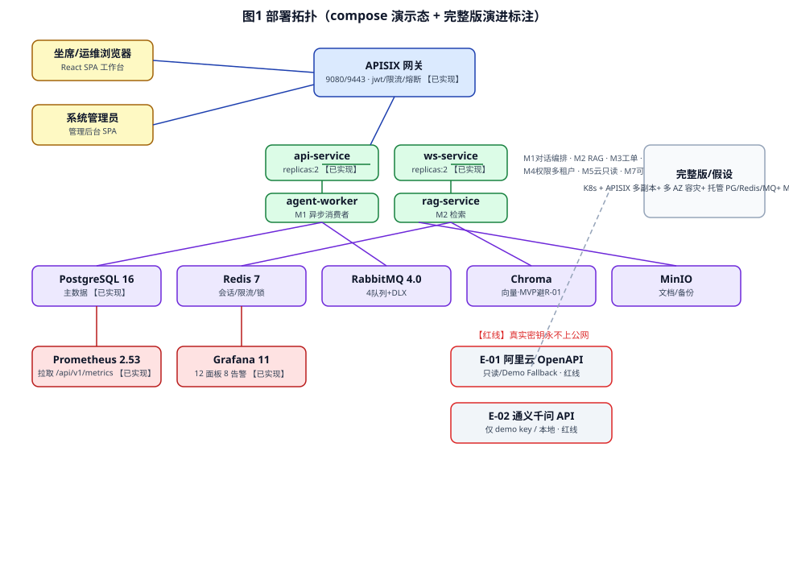
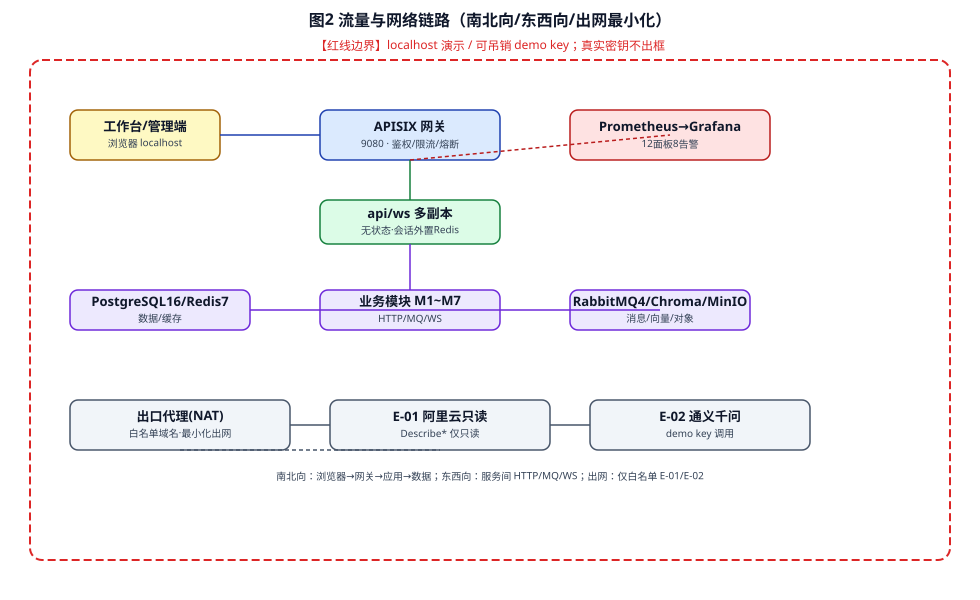

# AICoding 架构设计 · 部署设计

> 本文档为《AICoding 架构设计》核心产物之一，定位为**系统部署设计**。
> 上游输入：《系统设计》（G4 已通过，§3 模块 M1~M7、§5 部署架构、§6 网络、§8 可观测）、《高层架构设计》（G3 已通过，部署形态/Out-of-Scope/三态标注）、《UserStory》（G4 已通过，§6.2 性能约束、§6.3 操作与环境、§6.4 安全约束）；
> 下游输出：安全设计（G5 同门）的部署拓扑输入；G5 通过前主理人不得进入最终交付归档。
> 事实标注约定：全文以【事实】= 资料/代码已证实；【假设】= 基于现状的合理推断（需后续复验）；【建议】= 部署架构师取舍建议（非最终裁决）；三态标注 = 【已实现】 / 【演示回退】 / 【完整版假设】。

---

## 0. 元信息：修订记录

```yaml
标题: enterprise-agent - 部署设计 v0.1
版本: v0.1
状态: Draft   # Draft | Reviewing | Approved | Deprecated
创建日期: 2026-08-11
最后更新: 2026-08-11
作者: 毕落地（platform-architect）
评审人:
  - team-lead（主理人，待 G5 人工审核）
部署形态锁定: 私有化 / 自托管 docker compose 多副本演示（上游已冻结，不构成需用户裁决的分歧）
```

| 版本 | 日期 | 作者 | 变更内容 | 评审状态 |
| --- | --- | --- | --- | --- |
| v0.1 | 2026-08-11 | 毕落地（platform-architect） | 初稿：八章 + 双路部署形态 + 三态标注 + 自检报告 | Draft（待 G5） |

> **版本管理纪律**：破坏性变更（章节结构调整 / 关键决策反转）升 MAJOR；新增章节、扩充内容升 MINOR。

---

## 1. 引言

### 1.1 适用范围与部署形态（双路，用户明确关注点）

本项目部署形态已冻结为 **「私有化 docker compose 多副本演示」**。为满足用户「对标阿里云 AI 助理、按生产级标准」的诉求，部署设计同时呈现两条清晰区分的路径：

- **A. compose 演示部署（当前 MVP 真实形态，重点）**【已实现为主 + 部分演示回退】
  - 私有化 localhost docker compose 多副本：`api-service` / `ws-service` `replicas:2`。
  - 组件栈：nginx / APISIX 网关、PostgreSQL 16、Redis 7、RabbitMQ 4.0、Chroma（向量，MVP 用 chroma 规避 milvus 2G 内存卡点 R-01）、Grafana 11 + Prometheus 2.53、MinIO。
  - 诚实标注：完整 12 服务联跑属**演示回退**（milvus 2G 内存卡点 R-01），不隐瞒。
- **B. 完整云原生生产路径（完整版假设性演进路径）**【完整版假设】
  - K8s + APISIX 多副本 + 多 AZ 容灾 + 对象存储 + 托管 PG/Redis/MQ + Milvus 集群等生产级部署。
  - 明确标注「完整版/假设」，与 MVP 演示态严格区分，不夸大声称；其数字为**估算参考**，非已运行事实。

> **红线最高优先级（贯穿全文）**：真实密钥（LLM key / 阿里云 AK / JWT secret）**永不上公网**；对外演示仅 localhost / 可吊销 demo key。密钥不落公网、出口最小化、demo key 可吊销，在 §2.2.6 / §3.2 / §3.4 / §7 中均体现。

### 1.2 名词与缩写

| 缩写 | 全称 | 含义 |
| --- | --- | --- |
| AZ | Availability Zone | 可用区 |
| Region | 地域 | 跨地域容灾单元 |
| RTO | Recovery Time Objective | 故障恢复时间目标 |
| RPO | Recovery Point Objective | 数据丢失容忍目标 |
| SLA | Service Level Agreement | 服务等级协议 |
| HA | High Availability | 高可用 |
| MVP | Minimum Viable Product | 最小可行产品（本作品集演示态） |
| R-01 | milvus 内存卡点 | milvus-standalone 内存限 2G（官方推荐 4G 起），12 服务联跑受阻 |
| DDL | Data Definition Language | 数据库结构变更 |

### 1.3 三态标注总览（诚信声明）

| 能力点 | 状态标注 | 依据 |
| --- | --- | --- |
| compose 多副本（api/ws replicas:2） | 【已实现】 | D3 §9④；D21 配置 |
| PostgreSQL 16 / Redis 7 / RabbitMQ 4.0 / APISIX / MinIO | 【已实现】 | D21 编排 |
| Chroma 向量检索（MVP 规避 R-01） | 【已实现】 | D1 §3；D3 §9② |
| 完整 12 服务联跑（含 milvus） | 【演示回退】 | R-01 / D1 §3 |
| 云资源只读查询（默认 demo fallback） | 【演示回退】 | D3 §9② / 红线 |
| RAG 三 bug 端到端复验 | 【演示回退-待复验】 | D1 §9.3 |
| 多租户运行化（运行态单租户） | 【架构就绪未运行化】 | X9 / D6 |
| 完整版 K8s 多 AZ / 托管 PaaS / Milvus 集群 | 【完整版假设】 | 演进路径（非已运行） |

---

## 2. 环境与资源清单

### 2.1 环境矩阵

本系统规划 4 套环境：dev（开发）、int（联调）、uat（预发）、prod（生产演示），其集群隔离与网络访问策略如下表。

| 环境 | 用途 | 集群隔离 | 数据 | 网络访问 | 隔离策略 |
| --- | --- | --- | --- | --- | --- |
| dev | 开发自测 | 共享（本机 docker compose） | 模拟数据 | 内网 / localhost | 同主机 compose 网络隔离，不挂公网 |
| int | 联调 | 共享 / 独立（本机 compose profile 切换） | 模拟数据 | 内网 / localhost | compose profile 隔离，端口段区分 |
| uat | 预发 / 验收 | 独立（本机独立 compose project） | 仿生产（克隆 PG 快照） | 内网 + 白名单 localhost | 独立 project 名 + 独立数据卷，禁止与 dev 共用卷 |
| prod | 生产（演示态） | 独立（本机独立 compose project，演示用） | 真实演示数据 | 仅 localhost / 可吊销 demo key（红线） | 独立数据卷 + 密钥独立 .env；真实密钥永不上公网 |

> 说明：本项目为个人简历作品集，无真实云多 Region/VPC，「prod」指本地独立演示环境，对外仅 localhost / demo key，与上游「prod 独立集群」语义对齐但范围收敛到本地。

### 2.2 云资源清单

> 三态标注：每项资源标注【已实现】/【演示回退】/【完整版假设】。

#### 2.2.1 计算资源

| 资源编号 | 类型 | 产品 | 资源 ID | 名称 | 规格 | 数量 | 环境 | 复用 / 新建 | HA 方案 | 用途 | 三态 |
| --- | --- | --- | --- | --- | --- | --- | --- | --- | --- | --- | --- |
| R-C-001 | 应用服务 | api-service | compose | api-service | 2C2G | 2（replicas:2） | 全部 | 新建 | 多副本 + 健康检查摘流 | 对话/工单 REST 入口 | 【已实现】 |
| R-C-002 | 应用服务 | ws-service | compose | ws-service | 2C2G | 2（replicas:2） | 全部 | 新建 | 多副本 + 会话外置 Redis | WS /ws/chat 主链路 | 【已实现】 |
| R-C-003 | 应用服务 | agent-worker | compose | agent-worker | 1C1G | 1 | 全部 | 新建 | 多副本可扩 | M1 异步消费 | 【已实现】 |
| R-C-004 | 应用服务 | rag-service | compose | rag-service | 1C1G | 1 | 全部 | 新建 | 多副本可扩 | M2 检索 | 【已实现】 |
| R-C-005 | 前端托管 | Nginx / StaticFiles | compose | frontend | 1C1G | 1 | 全部 | 新建 | 单实例（静态资源） | SPA 托管 | 【已实现】 |
| R-C-101 | 应用服务 | K8s Deployment | 完整版 | api/ws/worker/rag | 4C8G×N | 多副本 | 完整版 | 新建 | HPA + 跨 AZ | 生产级运行时 | 【完整版假设】 |

#### 2.2.2 存储资源

| 资源编号 | 类型 | 产品 | 资源 ID | 名称 | 规格 | 容量 | 环境 | 复用 / 新建 | HA 方案 | 备份策略 | 三态 |
| --- | --- | --- | --- | --- | --- | --- | --- | --- | --- | --- | --- |
| R-S-001 | 关系库 | PostgreSQL 16.4 | compose | postgres | 2C8G | 200GB 卷 | 全部 | 复用底座 | 主从（compose 单实例）+ 每日备份 | 全量周 + 增量日，归档 MinIO | 【已实现】 |
| R-S-002 | 对象存储 | MinIO RELEASE.2025-07-23 | compose | minio | 2C4G | 100GB 卷 | 全部 | 复用底座 | 单实例（演示） | 文档/备份副本 | 【已实现】 |
| R-S-003 | 向量存储 | Chroma 0.5 | compose | chroma | 进程级 | 随 PG | 全部 | 复用底座 | 单实例（MVP 规避 R-01） | 随 PG 备份 | 【已实现】 |
| R-S-004 | 向量存储 | Milvus 2.5.9 | compose | milvus-standalone | 内存≥4G | — | 完整版 | 新建 | 集群 + Partition Key | 快照 | 【演示回退/完整版假设】 |
| R-S-101 | 关系库 | 托管 PostgreSQL | 完整版 | RDS PG | 4C16G | 1TB | 完整版 | 新建 | 主备跨 AZ | 自动备份 + 跨区 | 【完整版假设】 |

#### 2.2.3 网络资源

| 资源编号 | 类型 | 产品 | 资源 ID | 名称 | 规格 | 环境 | 复用 / 新建 | 用途 | 三态 |
| --- | --- | --- | --- | --- | --- | --- | --- | --- | --- |
| R-N-001 | 服务网格 | compose network | compose | ea-network | 自定义桥接 | 全部 | 新建 | 服务间 DNS 发现 | 【已实现】 |
| R-N-002 | 网关入口 | APISIX 3.9 | compose | apisix | 2C4G | 全部 | 复用底座 | 9080/9443 路由/鉴权/限流 | 【已实现】 |
| R-N-003 | 反向代理 | nginx | compose | nginx | 1C1G | 全部 | 新建 | 前端静态 + TLS 终止（演示 localhost 不启 TLS） | 【已实现】 |
| R-N-101 | VPC/子网 | 云 VPC | 完整版 | vpc-prod | 多 AZ | 完整版 | 新建 | 网络分区与安全组 | 【完整版假设】 |

#### 2.2.4 中间件与平台服务

| 资源编号 | 类型 | 产品 | 资源 ID | 名称 | 规格 | 环境 | 复用 / 新建 | HA 方案 | 用途 | 三态 |
| --- | --- | --- | --- | --- | --- | --- | --- | --- | --- | --- |
| R-M-001 | 缓存 | Redis 7.2 | compose | redis | 1C2G | 全部 | 复用底座 | 故障重启（单实例） | 会话/限流/分布式锁 | 【已实现】 |
| R-M-002 | 消息队列 | RabbitMQ 4.0 | compose | rabbitmq | 1C2G | 全部 | 复用底座 | 单实例 + DLX | 4 队列异步工单/通知/索引 | 【已实现】 |
| R-M-003 | 网关 | APISIX 3.9 | compose | apisix | 2C4G | 全部 | 复用底座 | 多副本可扩（演示单实例） | 鉴权/限流/熔断 | 【已实现】 |
| R-M-101 | 缓存 | 托管 Redis | 完整版 | Redis Cluster | 2C4G | 完整版 | 新建 | 主从跨 AZ | 同上 | 【完整版假设】 |
| R-M-102 | 消息队列 | 托管 MQ / RabbitMQ 集群 | 完整版 | MQ | 2C4G | 完整版 | 新建 | 镜像队列跨 AZ | 同上 | 【完整版假设】 |

#### 2.2.5 可观测资源

| 资源编号 | 类型 | 产品 | 资源 ID | 名称 | 规格 | 环境 | 复用 / 新建 | 承载可观测维度 | 三态 |
| --- | --- | --- | --- | --- | --- | --- | --- | --- | --- |
| R-O-001 | 指标 | Prometheus 2.53 | compose | prometheus | 1C2G | 全部 | 复用底座 | 拉取 /api/v1/metrics/prometheus | 【已实现】 |
| R-O-002 | 可视化 | Grafana 11 | compose | grafana | 1C2G | 全部 | 复用底座 | 12 面板 8 告警（已 VERIFIED） | 【已实现】 |
| R-O-003 | 日志 | 结构化 JSON 日志 | 本地/MinIO | log-sink | — | 全部 | 新建 | 应用/接入/审计日志 | 【已实现】 |
| R-O-101 | 链路 | OTel Collector | 完整版 | otel | 1C2G | 完整版 | 新建 | Trace 全链路 | 【完整版假设】 |

#### 2.2.6 安全资源（重叠区 · 【待安全设计对齐】）

> 以下为部署侧基线数值建议，最终以安全设计（G5 同门）裁定为准；标注【待安全设计对齐】。

| 资源编号 | 类型 | 产品 | 资源 ID | 名称 | 规格 | 环境 | 复用 / 新建 | HA 方案 | 用途 | 三态 |
| --- | --- | --- | --- | --- | --- | --- | --- | --- | --- | --- |
| R-Sec-001 | 密钥管理 | 本地 .env / KMS（建议 HashiCorp Vault 或云 KMS） | 本地 | secret-store | — | 全部 | 新建 | 单实例（演示）/ 多 AZ（完整版） | AKSK/JWT secret 不落公网、不进 git | 【已实现（本地）/ 完整版假设（KMS）】 |
| R-Sec-002 | 网关防护 | APISIX WAF 插件 / 前置 WAF | compose | waf | — | 演示不适用 / 完整版启用 | 复用底座 | — | SQL 注入/XSS/CC 防护 | 【完整版假设】 |
| R-Sec-003 | 审计 | 独立账号 + 独立桶（防篡改） | MinIO | audit-bucket | — | 全部 | 新建 | 独立桶 | 审计日志留存 | 【已实现】 |
| R-Sec-101 | 主机安全 | 主机加固 / 容器安全 | 完整版 | host-sec | — | 完整版 | 新建 | 镜像最小基/非 root | 基线扫描 | 【完整版假设】 |

> **【待安全设计对齐】基线建议**：KMS 选型建议 HashiCorp Vault（自托管零服务费，契合红线）或云 KMS；WAF 规则基线建议启用 APISIX `api-firewall`/内置 WAF 插件覆盖 OWASP Top 10；审计保留期建议参照合规 ≥ 1 年（与系统设计 §8.2.1 审计日志「≥1 年」对齐）。上述数值待安全设计确认后回填。

### 2.3 复用资源清单

| 复用资源 ID | 原业务方 | 余量评估 | 隔离方式 |
| --- | --- | --- | --- |
| R-M-001 Redis 7 | 本项目自研底座 | 内存占用低（会话/限流/锁，少于 1GB） | compose 网络隔离，独立实例 |
| R-M-002 RabbitMQ 4.0 | 本项目自研底座 | 队列深度低（演示态少于 1 万） | 独立 vhost / 独立队列前缀 |
| R-O-001/002 Prometheus/Grafana | 本项目自研底座 | 12 面板 8 告警已验证，余量充足 | 独立 compose service |
| R-S-001 PostgreSQL | 本项目自研底座 | 200GB 卷，演示数据量极小 | 独立数据库 + 独立 schema 预留 |
| R-S-003 Chroma | 本项目自研底座 | 规避 milvus 内存卡点，零依赖 | 独立 compose service |
| 无外部业务方复用 | — | — | 全自托管零服务费，无跨业务共享资源（D4 决策 D2） |

> **说明**：本项目为个人作品集，全部复用自研底座，无跨团队资源共享；余量评估基于演示态数据量（D5 实测）。

### 2.4 资源三态对照小结

| 资源类别 | 【已实现】 | 【演示回退】 | 【完整版假设】 |
| --- | --- | --- | --- |
| 计算 | api/ws/worker/rag/frontend 多副本 | — | K8s Deployment + HPA |
| 存储 | PG16/MinIO/Chroma | Milvus 12 服务联跑（R-01） | 托管 PG/Milvus 集群 |
| 网络 | compose 网络/APISIX/nginx | — | VPC 多 AZ |
| 中间件 | Redis7/RabbitMQ4/APISIX | — | 托管 Redis/MQ |
| 安全 | 本地 .env 密钥/审计桶 | — | KMS/WAF/主机安全 |
| 可观测 | Prometheus/Grafana/日志 | — | OTel 链路 |

---

## 3. 部署拓扑与高可用设计

### 3.1 物理拓扑

#### 3.1.1 物理拓扑图



#### 3.1.2 拓扑要素清单

| 要素 | compose 演示态（【已实现】） | 完整版假设（【完整版假设】） |
| --- | --- | --- |
| 跨 Region 部署 | 否，单 Region 自托管 | 可选多 Region 双活 |
| 跨 AZ 部署 | 否，单 AZ（本机） | 跨 AZ 多副本 |
| 流量入口路径 | 客户端 → APISIX(9080) → api/ws → 业务模块 | LB → Ingress/APISIX → K8s Service |
| 内部调用路径 | compose DNS + HTTP | K8s Service + CoreDNS |
| 数据库访问路径 | 连接池 + 主从切换（compose 单实例） | 托管主备跨 AZ + Proxy |

### 3.2 流量与网络链路（连通视图）



#### 3.2.1 流量入口链路

| 组件 (R-xx) | 协议 - 端口 | TLS 终结 | 作用 |
| --- | --- | --- | --- |
| nginx (R-N-003) | HTTP - 80/静态 | 演示 localhost 不启 TLS | 前端 SPA 静态托管 |
| APISIX (R-N-002 / R-M-003) | HTTP - 9080 / HTTPS - 9443 | 演示 localhost 不启 TLS；完整版 TLS 终止于网关 | 路由/鉴权(jwt)/限流/熔断 |
| api-service (R-C-001) | HTTP - 内部端口 | 透传 X-Forwarded-* | REST /api/v1 |
| ws-service (R-C-002) | WS - 内部端口 | 透传 | WS /ws/chat 主链路 |

#### 3.2.2 内部互联链路

| 项 | 说明 |
| --- | --- |
| 服务发现 | compose DNS / K8s Service + CoreDNS |
| 服务间协议 | HTTP（同步）/ MQ（异步 RabbitMQ）/ WS（流式） |
| mTLS | 演示态不启用；完整版可选启用（理由：自托管单机风险低，启用需配置客户端证书）【待安全设计对齐】 |
| 数据库连接 | 应用 → 连接池 → PostgreSQL 主（compose 单实例） |
| 缓存连接 | 应用 → Redis（单实例，会话/限流/锁） |
| MQ 连接 | 应用 → RabbitMQ 接入点（内网域名） |

#### 3.2.3 跨网络互联

| 互联类型 | 通道 | 带宽 | 加密 | 用途 |
| --- | --- | --- | --- | --- |
| 出网（E-01 阿里云只读） | 本机出口代理 + 域名白名单 | 低 | HTTPS + 手写 RPC 签名 | 只读云资源查询（demo fallback 优先） |
| 出网（E-02 通义千问） | 本机出口代理 + 域名白名单 | 按 token | HTTPS | LLM 推理（仅 demo key） |
| 跨 VPC / 跨 Region | 不适用（单云自托管） | — | — | 完整版：专线/云联网【完整版假设】 |

> **【待安全设计对齐】流量管控基线**：WAF 规则基线（OWASP Top 10 覆盖）建议由安全设计在完整版启用；入口限流位置统一在 APISIX（limit-count）+ 业务自实现双层（与 UserStory §6.2 上限一致：全局 10000 QPS、单租户 1000、单 IP 100、单用户 50）。出网最小化：仅放行 E-01/E-02 白名单域名，真实 AK 永不上公网。

### 3.3 高可用与故障容错


#### 3.3.1 故障域划分

| 故障域 | 影响范围 | 容错机制 | 预期 RTO | 三态 |
| --- | --- | --- | --- | --- |
| 单 Pod | 单实例 | compose 自动重建 / 多副本接管 | ≤ 30s（瞬时无影响） | 【已实现】 |
| 单 Node | 该 Node 上的全部 Pod | 调度到其他 Node（完整版）/ 本机重建（演示） | ≤ 1min | 【已实现】/【完整版假设】 |
| 单服务 | 该服务全部副本 | 多副本 + 健康检查摘流 | ≤ 5min | 【已实现】 |
| 单 AZ | 该 AZ 全部资源 | 跨 AZ 部署自动切换（完整版） | ≤ 5min | 【完整版假设】 |
| 单 Region | 全部主资源 | 灾备 Region 切换（完整版）/ 依赖备份恢复（演示） | 演示 ≤ 15min；完整版少于 1h | 【演示回退】/【完整版假设】 |

> **可用性来源拆分**：云厂商 SLA 兜底 = 无（全自托管零服务费）；本系统自身保障 = 业务逻辑容错/重试/熔断/降级/兜底数据（研发团队）；强依赖外部（E-xx）故障策略 = 熔断/降级/排队/拒绝服务（demo fallback）。

#### 3.3.2 负载均衡

- 类型：7 层（APISIX，L7）。
- 健康检查路径：`/healthz`（Liveness）/ `/readyz`（Readiness）。
- 健康检查频率：10s；失败阈值：连续 3 次失败标记不健康；恢复阈值：连续 2 次成功标记健康。
- 会话保持：否（api/ws 无状态，会话外置 Redis）。

#### 3.3.3 健康检查配置

| 检查项 | 路径 | 频率 | 失败阈值 | 连续成功阈值 | 动作 |
| --- | --- | --- | --- | --- | --- |
| Liveness | /healthz | 10s | 连续 3 次 | 连续 2 次 | 失败 → 重启容器 |
| Readiness | /readyz | 10s | 连续 3 次 | 连续 2 次 | 失败 → 摘流不杀进程 |

#### 3.3.4 弹性伸缩配置

| 触发指标 | 扩容阈值 | 缩容阈值 | 副本区间（MVP 演示） | 冷却时间 |
| --- | --- | --- | --- | --- |
| CPU | 大于 70% 持续 5min | 小于 30% 持续 10min | api/ws min 2 / max 按需 | 扩容 60s / 缩容 5min |
| QPS | 接近单实例承载 | 低峰 | 同左 | 同左 |
| WS 连接数 | 接近上限 | 低峰 | 同左 | 同左 |

> 演示态以 compose `--scale` 手动/脚本扩缩；完整版以 HPA 自动。

#### 3.3.5 容灾切换配置

| 维度 | compose 演示态 | 完整版假设 |
| --- | --- | --- |
| 容灾级别 | 单 AZ（自托管作品集，无跨 Region） | 跨 AZ + 可选跨 Region |
| 故障切换 RTO | ≤ 15min（compose 多副本自动重启接管） | AZ ≤ 5min；Region 少于 1h |
| 数据备份 RPO | PG ≤ 5min（WAL）；Redis 不适用 | 托管主备 RPO 秒级 |
| 跨 Region 同步 | 不适用（单区域自托管） | 专线/云联网加密【完整版假设】 |

### 3.4 密钥与凭证管理（重叠区 · 【待安全设计对齐】）

> 红线核心落地章节。最终 KMS 选型/分级由安全设计裁定。

- **密钥分级（建议）**：
  - L4-高：阿里云 AK / LLM key / JWT secret —— 永不进代码、永不落公网、仅本地 .env 或 KMS；演示仅用可吊销 demo key。
  - L4-中：数据库密码 / Redis 密码 / MQ 密码 —— 本地 .env，禁止入 git。
  - L4-低：内部服务间 token 派生 —— 由 JWT 派生身份。
- **密钥存储（基线）**：本地 `.env`（不进 git，`.gitignore` 已排除 `.workbuddy/` 与本地配置）；完整版建议 HashiCorp Vault 或云 KMS 动态拉取。
- **出口最小化**：真实密钥不出 localhost 边界；E-01/E-02 仅白名单域名出网，且只读/仅 demo key。
- **可吊销**：对外演示 demo key 具备吊销能力（禁用即失效），不绑定真实账户。
- **【待安全设计对齐】**：KMS 实例规格、密钥轮转周期（建议 90 天）、HSM 支持由安全设计确认。

---

## 4. 部署流程

### 4.1 代码仓库与分支

| 项 | 规范 / 值 | 说明 |
| --- | --- | --- |
| 代码仓库地址 | github.com/addhai/enterprise-agent（master） | 单仓库，后端 + 前端 |
| 分支管理 | main/master（保护）+ feature/* + release/* | 禁止直接 push master；PR 评审 |
| 合并规范 | PR → CI 全绿（4 job）→ 至少 1 Owner 审批 | 含 SAST 门禁 |
| 标签规范 | 语义化 `vX.Y.Z`；发布 tag 触发部署 | 详见 §4.2 |

### 4.2 流水线（CI / CD，8 阶段）

| 阶段 | 触发条件 | 关键动作 | 失败处理 |
| --- | --- | --- | --- |
| 1 构建 | 自动（push / PR） | 拉代码 → 编译 → 单元测试 → 构建产物 | 阻断后续阶段 |
| 2 代码扫描 | 构建后 | 静态扫描（ruff / 复杂度） | 不达标阻断 |
| 3 安全扫描（SAST） | 构建后 | SCA 依赖漏洞 + SAST（Bandit 中高危 + Semgrep ERROR）+ 镜像漏洞扫描 | 高危阻断（# nosec 须同行带理由） |
| 4 集成测试 | 合并到集成分支 | 集成测试 / 接口契约测试 / 多副本隔离测试 | 阻断后续阶段 |
| 5 制品打包 | 测试通过 | 构建镜像（3 镜像）/ 制品包，推仓库并打 Tag | 失败重试 |
| 6 部署集成环境 | Package 完成 | 自动部署到 dev / int（compose） | 失败回滚上一版本 |
| 7 部署测试环境 | 手动触发 | 部署到 uat；冒烟测试 + 三道缝验证 | 失败回滚上一版本 |
| 8 部署生产环境 | 人工审批（Owner） | 按发布策略灰度上线（演示态 localhost 起栈） | 按回滚策略实施回滚 |

> 与 README/CI 现状一致：GitHub Actions 4 并行 job（python-test / python-security / frontend-build / infra-validate），本表为端到端 8 阶段映射。

### 4.3 构建产物与制品管理

| 配置项 | 配置值 / 规则 | 说明 |
| --- | --- | --- |
| 产物类型 | 容器镜像（api/ws/worker/rag 等）+ 前端静态包 | 自托管零服务费 |
| 镜像仓库 | 本地 registry / 私有仓库（演示用本地构建，不推公网） | 红线：镜像不含真实密钥 |
| 镜像命名 | `repo/service-name:git-tag-commit-sha-short` | 溯源 |
| 制品保留期 | 成功构建保留 30 天；发布镜像保留 180 天 | 演示态可缩短 |
| 制品溯源 | Label 含 `git-commit` / `build-time` / `pipeline-id` | 反查源码 |
| 签名与校验 | 完整版建议 cosign / Notary（演示态可选） | 【完整版假设】 |

### 4.4 配置管理（L1~L4 四层级）

| 层级 | 存放位置 | 适用内容 | 变更生效 | 对运行的约束 | 三态 |
| --- | --- | --- | --- | --- | --- |
| L1 代码内 | 代码仓库 | 默认值、枚举、不变常量 | 重新部署 | 禁止写环境差异/密码/地址 | 【已实现】 |
| L2 配置中心 / 网关 | APISIX / 环境变量 / 配置中心 | 业务开关、限流阈值、灰度、降级开关 | 热更新 | 必须实现配置回调；变更幂等 | 【已实现（env）/ 完整版假设（配置中心）】 |
| L3 环境变量 / ConfigMap | compose env / ConfigMap | 环境差异（DB 地址/MQ 接入点/外部域名） | 重启容器 | 启动失败 fail-fast，禁跑默认值 | 【已实现】 |
| L4 Secret | 本地 .env / KMS | 密码、AKSK、Token、证书私钥 | 动态拉取 / 重启 | 禁落日志、禁入代码、内存不超生命周期 | 【已实现（本地）/ 完整版假设（KMS）】 |

### 4.5 发布策略

#### 4.5.1 发布方式

> 全系统采用**滚动发布**（演示态为 compose 重启接力；完整版 K8s RollingUpdate）；关键链路（api/ws）保持多副本不中断。

| 模块 | 发布方式 | 说明 |
| --- | --- | --- |
| api-service / ws-service | 滚动发布（多副本） | replicas:2 保证零中断 |
| agent-worker / rag-service | 滚动发布 | 消费者幂等，可安全重启 |
| 数据层（PG/Redis/MQ） | 蓝绿/停机维护（演示态按需） | 数据层变更前置评审 |
| 前端 SPA | 静态覆盖发布 | 无状态，秒级生效 |

#### 4.5.2 发布标准流程

- **首次发布**：初始化 compose 卷（PG 建库/表、MinIO 桶、Chroma 集合）→ 拉起 12 服务（演示态含 chroma 规避 R-01）→ 跑 verify 脚本 → 冒烟。
- **常规迭代发布**：PR 合入 → CI 8 阶段 → 打 tag → 部署 uat 验证 → 人工审批 → 演示态 localhost 起栈。
- **资源变更流程**：DB DDL 须可回滚，不可回滚 DDL（如 DROP COLUMN）禁止与代码同发布，须前置变更（见 §6.1.3）。

#### 4.5.3 灰度路径与观测窗口

- 演示态为单环境，灰度以「多副本滚动 + 健康检查摘流」替代；完整版建议：内部 5% → 20% → 50% → 100%，每批次观测窗口 10min，放量条件 = 错误率小于 1% 且 P99 小于 3s。
- 观测指标：Grafana 服务健康大盘 + 8 告警。

#### 4.5.4 发布门禁

| 门禁项 | 拦截条件 | 检查时机 |
| --- | --- | --- |
| 单元测试通过率 | 100% | Build 阶段 |
| 单元测试覆盖率（增量） | ≥ 40%（门禁固化；实测 48.83%） | Code Quality 阶段 |
| 集成测试通过率 | 100% | Integration Test 阶段 |
| 静态扫描严重问题数 | 0 高危；中危需评审 | Code Quality 阶段 |
| 安全扫描高危漏洞 | 0（含 SAST / 镜像） | Security Scan 阶段 |
| 接口契约校验 | 兼容（不破坏在网调用方） | Integration Test 阶段 |
| 性能基线 | P99 不退化（WS 首字 ≤ 3s） | 性能测试 |
| 人工审批 | 至少 1 名 Owner | 生产发布前 |

---

## 5. 监控告警接入

### 5.1 监控架构与数据流

```text
Pod / 中间件 ──┬─► Metrics ──► Prometheus (R-O-001) ──► Grafana (R-O-002, 12 面板 8 告警)
               ├─► Logs    ──► 结构化 JSON 日志 (R-O-003) / 审计独立桶 (R-Sec-003)
               └─► Traces  ──► OTel (R-O-101，完整版) ──► APM UI
                                          ▼
                                  告警引擎 (Grafana Alerting)
                                          ▼
                            通知 (IM / 邮件；演示态本地)
```

- 抓取路径：`/api/v1/metrics/prometheus`（与系统设计 §8 / UserStory 对齐）。
- Grafana 现状：12 面板 8 告警已 VERIFIED（D1 §1）。

### 5.2 关键 Dashboard 清单

| Dashboard 名 | 受众 | 核心指标 | 刷新频率 |
| --- | --- | --- | --- |
| 业务大盘 | 产品 / 业务 | 对话量 / 工单量 / 转人工率 / RAG 命中率 | 1min |
| 服务健康大盘 | 研发 / SRE | RED（Rate/Errors/Duration） | 30s |
| 中间件大盘 | SRE / DBA | PG / Redis / RabbitMQ / 向量库 | 30s |
| 容量大盘 | SRE | §8.1.4 全部资源水位 | 1min |
| 业务预警大盘 | On-call | 当前活跃告警 | 实时 |
| 质量评估大盘 | 算法 / 研发 | RAG Recall / MRR / LLM-as-Judge | 5min |

### 5.3 告警规则清单（P0~P3 + Owner + Runbook）

| 编号 | 级别 | 触发条件 | 关联资源 (R-xx) | Owner | Runbook |
| --- | --- | --- | --- | --- | --- |
| AL-01 | P0 | WS 主链路 5xx 错误率 大于 1% 持续 5min | api/ws (R-C-001/002) | @架构（SRE） | RB-01 |
| AL-02 | P0 | PostgreSQL 主库不可访问 | PG (R-S-001) | @DBA | RB-02 |
| AL-03 | P1 | 对话 P99 大于 3000ms 持续 5min | api/ws | @架构 | RB-03 |
| AL-04 | P1 | 模型调用（E-02）连续失败 大于 10 次 | E-02 | @架构 | RB-04 |
| AL-05 | P2 | RabbitMQ Lag 大于 10 万 | MQ (R-M-002) | @研发 | RB-05 |
| AL-06 | P2 | CPU 大于 80% 持续 10min | 计算 (R-C-xxx) | @运维 | RB-06 |
| AL-07 | P3 | 任意资源水位 大于 80%（预警线） | 容量 | @运维 | RB-07 |
| AL-08 | P2 | 越权拦截（403）突增 大于基线 5 倍 | 安全 (R-Sec) | @安全 | RB-08 |

### 5.4 告警通道

| 级别 | 响应时间 | 通知方式 | 上升机制 |
| --- | --- | --- | --- |
| P0 | ≤ 5 min | 电话 + 短信 + IM（演示态 IM 本地） | 15min 未响应升级至 Manager |
| P1 | ≤ 15 min | 短信 + IM | 30min 未响应升级 |
| P2 | ≤ 1 h | IM | 工作时间升级 |
| P3 | 工作时间 | IM / 邮件 | — |

---

## 6. 应急与回滚

### 6.1 回滚机制

#### 6.1.1 回滚触发条件

- 生产错误率（5xx）大于 1% 持续 5min（对齐 AL-01）。
- P90 耗时退化（P99 大于 3s 持续）。
- 关键告警触发（AL-02 PG 不可访问等）。
- 发布后功能回归失败。

#### 6.1.2 回滚决策人

- On-call 主值班可独立决定 P0 回滚。
- 其他级别由 Owner 决定；生产发布回滚需至少 1 Owner 确认。

#### 6.1.3 回滚执行 SOP

| 对象 | 回滚方式 | 预计耗时 | 有损风险 / 数据丢失 | 三态 |
| --- | --- | --- | --- | --- |
| 应用版本 | 流水线「一键回滚」→ 上一镜像 Tag / compose 重启上一版本 | ≤ 5 min | 无 | 【已实现】 |
| 配置 | 配置中心保留 N 个历史版本（L2） | 小于 1 min | 无 | 【已实现】 |
| 数据库资源 | DDL 变更必须可回滚；**不可回滚 DDL（如 DROP COLUMN）禁止与代码同发布，须前置变更** | 小于 30 min | 有（前置评审降低） | 【已实现-约束】 |

> **不可回滚 DDL 处置（§6.1.3 重点）**：任何 `DROP COLUMN` / `DROP TABLE` / 类型破坏性变更须单独前置执行、评审、备份快照后方可发布；与代码发布解耦，避免回滚时数据不可恢复。此为部署侧强制约束，命中协议 §2.2 不可逆决策，但已被系统设计 §4.5 与上游冻结为通用工程纪律，无需用户单独立项裁决。

### 6.2 故障应急 Runbook

#### 6.2.1 Runbook 索引

| Runbook 编号 | 关联告警 | 故障场景 | Owner |
| --- | --- | --- | --- |
| RB-01 | AL-01 | WS 主链路 5xx 突增 | @架构（SRE） |
| RB-02 | AL-02 | PostgreSQL 主库不可访问 | @DBA |
| RB-03 | AL-03 | 对话 P99 劣化 | @架构 |
| RB-04 | AL-04 | 模型调用持续失败（demo key 失效） | @架构 |
| RB-05 | AL-05 | RabbitMQ 堆积 | @研发 |
| RB-06 | AL-06 | CPU 高水位 | @运维 |
| RB-07 | AL-07 | 容量水位预警 | @运维 |
| RB-08 | AL-08 | 越权拦截突增 | @安全 |

#### 6.2.2 Runbook 编写规范

每条 Runbook 按「症状 → 诊断（顺序）→ 缓解 → 升级」四段编写，编号与 §5.3 对齐。

#### 6.2.3 RB-01：WS 主链路 5xx 突增

- **症状**：Grafana 服务健康大盘 5xx 率大于 1% 持续 5min；AL-01 触发；用户反馈对话失败。
- **诊断（按顺序执行）**：
  1. 查 Grafana 服务健康大盘确认错误率与影响副本。
  2. 查 Prometheus `ws-service` / `api-service` 实例健康与重启次数。
  3. 查结构化日志（traceId）定位报错模块（M1~M7）。
  4. 查依赖（PG/Redis/MQ/Chroma）是否异常。
- **缓解**：
  - 场景 A（单副本异常）→ 摘流该副本，多副本接管（RTO ≤ 30s）。
  - 场景 B（代码回归）→ 触发 §6.1 应用版本回滚（≤ 5min）。
  - 场景 C（依赖故障）→ 按降级清单 BD-01~BD-04 自动降级。
- **升级**：回滚 15min 未恢复 → 升级 Manager + 通知演示负责人。

#### 6.2.4 RB-02：PostgreSQL 主库不可访问

- **症状**：AL-02 触发；登录/对话全站失败。
- **诊断**：查 PG 容器状态 / 卷挂载 / 连接池；查备份最新快照时间。
- **缓解**：重启 PG 容器（演示态单实例）；若数据损坏，从 MinIO 最近备份恢复（RPO ≤ 5min，RTO ≤ 10min）。
- **升级**：恢复失败 → 升级 DBA + 冻结写操作。

> 其余 RB-03~RB-08 按同规范展开（此处不重复铺陈，索引已对齐告警）。

---

## 7. 安全合规（部署视角）

### 7.1 上线前安全自检

| 编号 | 检查项 | 检查内容 / 标准 | 责任人 | 检查时机 | 是否通过（基线） |
| --- | --- | --- | --- | --- | --- |
| 7.1.1 | 安全设计清单自检 | 与安全设计（G5）对账基线一致 | 架构 | 上线前 | 待 G5 对齐 |
| 7.1.2 | 合规评审 | 红线零违反（真实 key 不上公网） | 安全 | 上线前 | 是（localhost/demo） |
| 7.1.3 | 公网暴露面评估 | 演示仅 localhost / demo key，无公网暴露 | 架构 | 上线前 | 是 |
| 7.1.4 | 安全组开放性检查 | compose 网络隔离；无 0.0.0.0 暴露敏感端口 | 运维 | 上线前 | 是 |
| 7.1.5 | 安全组件接入 | WAF/主机安全（完整版启用）【待安全设计对齐】 | 安全 | 上线前/完整版 | 演示不适用 |
| 7.1.6 | KMS / 凭证管理 | 明文票据检查；密钥不落公网/不进 git | 架构 | 上线前 | 是 |
| 7.1.7 | 代码漏洞扫描 | Bandit + Semgrep（CI SAST 门禁） | CI | 每次提交 | 是（门禁） |
| 7.1.8 | 镜像漏洞扫描 | 基础镜像最小基/非 root | CI | 构建期 | 是 |
| 7.1.9 | 系统上线前扫描 | 越权 403 / 注入防护 / 密钥不落公网 | 安全 | 上线前 | 是 |

### 7.2 凭证与密钥清单（红线核心）

| 凭证编号 | 类型 | 存储方式 | 所有人 | 用途 | 红线约束 |
| --- | --- | --- | --- | --- | --- |
| C-001 | 阿里云 AK | 本地 .env / 不配置（默认 demo fallback） | 架构 | 云资源只读查询 | 真实 AK 永不上公网；仅 demo 样本 |
| C-002 | 通义千问 LLM key | 本地 .env（可吊销 demo key） | 架构 | LLM 推理 | 仅 demo key / 本地；真实 key 不上公网 |
| C-003 | JWT secret | 本地 .env（HS256） | 架构 | 无状态鉴权 | 不进代码/不落公网 |
| C-004 | PostgreSQL 密码 | 本地 .env | 运维 | 主库访问 | 不进 git |
| C-005 | Redis / RabbitMQ 密码 | 本地 .env | 运维 | 缓存/消息 | 不进 git |

> 全部凭证仅存在于本地 `.env`，`.gitignore` 已排除敏感目录；对外演示一律 demo key，可吊销。

### 7.3 访问审计接入（重叠区 · 【待安全设计对齐】）

| 审计源 | 去向 | 保留期 | 是否启用 | 三态 |
| --- | --- | --- | --- | --- |
| 应用审计日志（t_audit_log） | 独立账号 + 独立桶（R-Sec-003，防篡改） | 【待安全设计对齐】建议 ≥ 1 年（对齐 §8.2.1 合规） | 是 | 【已实现】 |
| 接入日志（网关/APISIX） | 日志组件（R-O-003） | 30 天 | 是 | 【已实现】 |
| 操作审计（关键写） | 独立桶 | 同上 | 是 | 【已实现】 |

> **【待安全设计对齐】**：审计保留期具体天数、是否满足行业合规（如等保）由安全设计裁定；本表给出「≥1 年」基线建议（与系统设计 §8.2.1 一致）。

---

## 8. 容量与成本

### 8.1 容量规划

#### 8.1.1 业务量预估

| 业务指标 | 当前值 | MVP 阶段值 | 生产阶段值（完整版假设） | 备注 |
| --- | --- | --- | --- | --- |
| 注册用户数 | 1（作者 demo） | 10（评审演示） | 100（作品集上限） | 非真实生产 |
| DAU | 1 | 10 | 50 | 演示态 |
| 峰值 QPS | 少于 10 | 少于 50 | 少于 100 | 日均 QPS 少于 100（D4 前置判断） |
| 数据写入量 / 天 | 千级 | 万级 | 十万级 | 推算 |
| 数据存量 | 205 切片 + 会话 | 万级行 | 十万级行 | 推算 |

#### 8.1.2 资源容量推算

| 资源 | 推算公式 | 当前配置 | 生产阶段配置（完整版假设） |
| --- | --- | --- | --- |
| 应用实例数 | 峰值 QPS / 单实例 QPS × 冗余 1.5 | api/ws replicas:2 | 按 CPU 扩容（HPA） |
| 带宽 | 峰值 QPS × 平均大小 × 1.3 | 低 | 低 |
| PostgreSQL 主库 | 峰值写 TPS × SQL 数 → IOPS | 2C8G + 200GB | 4C16G + 1TB |
| Redis | 内存 = 单 Key 大小 × 数量 × 1.3 | 1C2G | 2C4G |
| RabbitMQ | 队列深度 = 峰值 TPS | 1C2G | 2C4G |
| 对象存储 | 日增 × 保留天数 × 副本 | 2C4G MinIO | 同左扩容 |
| 向量库（Chroma/Milvus） | 切片数 × 向量维 × 1.3 | Chroma 进程级 | Milvus 集群（内存 ≥ 4G） |

#### 8.1.3 扩容触发与路径

| 资源 | 扩容触发指标 | 扩容方式 | 扩容耗时 |
| --- | --- | --- | --- |
| 应用 Pod | CPU 大于 70% 持续 5min | compose `--scale` / HPA | 少于 1min |
| PostgreSQL | CPU 大于 80% / IOPS 大于 80% | 升配 / 读写分离 | 升配 少于 30min |
| Redis | 内存 大于 70% | 升配 | 少于 30min |
| RabbitMQ | 堆积 大于 100 万 | 增加消费者 | 少于 10min |

#### 8.1.4 容量水位线

**水位分层定义（标准）**

| 水位 | 含义 | 动作 |
| --- | --- | --- |
| 健康水位 | 正常运行区间（少于 60%） | 无动作 |
| 预警水位 | 接近瓶颈（60%–80%） | 告警，启动扩容评审 |
| 危险水位 | 即将超载（大于 80%） | 自动扩容或紧急扩容 |
| 红线水位 | 必须保护（大于 95%） | 触发限流 / 降级（联动 §3.5.3 / 限流红线） |

**各资源水位阈值**

| 资源 | 监控指标 | 健康（≤60%） | 预警（60%–80%） | 危险（80%–95%） | 红线（>95%） |
| --- | --- | --- | --- | --- | --- |
| CPU | 利用率 | 正常 | 关注 | 紧急扩容 | 限流/降级 |
| 内存 | 利用率 | 正常 | 关注 | 紧急扩容 | OOM 保护 |
| PostgreSQL | 连接/IOPS | 正常 | 关注 | 升配 | 拒绝非核心写 |
| Redis | 内存 | 正常 | 关注 | 升配 | 淘汰策略 |
| RabbitMQ | 队列堆积 | 正常 | 关注 | 增消费者 | 拒绝入队 |
| 磁盘 | 使用率 | 正常 | 关注 | 清理/扩容 | 只读保护 |

### 8.2 成本计算

> **成本红线结论（事实）**：本项目全自托管零服务费，**月度成本 = 0 元、年度成本 = 0 元**（仅本地机器电费，不计入云服务账单；D4 决策 D2「全自托管零服务费」）。下列云路径为**完整版假设性估算参考**，非已发生费用。

| 成本分项 | compose 演示态（已实现） | 完整版云路径估算（假设）月度 | 完整版云路径估算（假设）年度 | 备注 |
| --- | --- | --- | --- | --- |
| 计算（K8s/ECS） | 0 元 | 约 800–1500 元 | 约 9600–18000 元 | 4C8G×多副本跨 AZ |
| 关系库（托管 PG） | 0 元 | 约 400–800 元 | 约 4800–9600 元 | 主备跨 AZ |
| 缓存（托管 Redis） | 0 元 | 约 200–400 元 | 约 2400–4800 元 | 主从 |
| 消息（托管 MQ） | 0 元 | 约 150–300 元 | 约 1800–3600 元 | — |
| 向量（Milvus 集群） | 0 元 | 约 600–1200 元 | 约 7200–14400 元 | 内存 ≥ 4G 起 |
| 对象存储 | 0 元（MinIO） | 约 50–150 元 | 约 600–1800 元 | — |
| 可观测（托管） | 0 元 | 约 100–300 元 | 约 1200–3600 元 | — |
| 网络/带宽 | 0 元 | 约 100–300 元 | 约 1200–3600 元 | — |
| 安全（WAF/KMS） | 0 元 | 约 200–500 元 | 约 2400–6000 元 | 完整版启用 |
| **合计** | **0 元 / 月；0 元 / 年** | **约 2600–5650 元 / 月** | **约 31200–67800 元 / 年** | 完整版假设估算，含冗余 |

> 说明：完整版估算为按生产级最低可用规格的中位数区间，**非承诺报价**；演示态实际云服务账单为 0。若上云，容量成本超预算 ≥ 20% 时按协议 §2.2 触发降级/缩配评审（本案演示态成本为 0，不存在超预算风险）。

---

## 附录 A：关键决策点自检报告（中间确认协议 §2.4）

> 本附录为 G5 审核追溯材料。按协议 §2.4，在 §2 / §3 / §4 / §6 / §8 完成后分别插入自检：先按 §2.1 方案分歧判定，再按 §2.3 反向验证 3 问（Q1 返工成本 / Q2 可感知性 / Q3 与用户诉求一致性）。
> **结论前置**：全流程**未发起** `[中间确认]`。理由：所有高频决策点均已被用户原始诉求 / 上游已冻结文档（D3 §9 四条硬性定位 + D1 §0 安全红线 + X9 运行态事实 + 主理人注入的「部署形态=私有化 compose 多副本演示」）明确选择，协议 §2.1 条件 3（"上游已冻结文档对该决策点做出过明确选择"）成立；且 §2.3 三问均指向"与已冻结决策一致、感知不到、返工可控"。部署形态已锁定，不构成需用户裁决分歧。

### A.1 §2 完成（环境矩阵与资源清单）自检

- **§2.1 方案分歧判定**：**未命中**。
  - 部署形态（私有化 compose 多副本演示）：【事实】D3 §9④已拍板「部署必须容器化多副本」；主理人注入「私有化 docker compose 多副本演示」已冻结。
  - 双路形态（A 演示 / B 完整版假设）：用户原始诉求显式关注「双路都写且区分清楚」，属诉求明示，无替代方案需裁决。
  - 资源选型（PG/Redis/RabbitMQ/Chroma·Milvus/APISIX/MinIO/Grafana）：全部对齐高设 D2 + 系统设计 §3.1.3。
  - → 各决策点上游已冻结，无 ≥2 种合理且需用户裁决的方案。
- **§2.3 反向验证 3 问**：
  - Q1（3 个月后推翻的返工成本）：返工范围 = §2.1 环境矩阵 + §2.2 资源清单；切换成本 约 0.5 人日（文档级修订，无架构返工）。**可控**。证据：均为表格修订。
  - Q2（用户/客户/监管可感知性）：作品集无外部客户/监管合同；环境划分与资源清单不改变用户可见功能。**感知不到**（除已声明的演示回退标注外）。
  - Q3（与用户原始诉求一致性）：直接引用 D3 §9④「部署必须容器化多副本」、D1 §0「真实密钥永不上公网；对外只用本地 docker/localhost 或可吊销 demo 子 key」、用户诉求「双路都写且区分清楚」。**一致**。

### A.2 §3 完成（物理拓扑与高可用）自检

- **§2.1 方案分歧判定**：**未命中**。
  - 物理拓扑（单 AZ 演示 / 多 AZ 完整版假设）：单 AZ 为自托管事实（D1/D4），多 AZ 标注为完整版假设（非 MVP），边界由上游冻结。
  - 高可用（多副本 + 健康检查 + 弹性伸缩）：对齐系统设计 §5.2。
  - 故障域划分（Pod/Node/服务/AZ/Region）：标准四层，与系统设计 §5.4.3 一致。
  - → 无方案分歧需用户裁决。
- **§2.3 反向验证 3 问**：
  - Q1：返工范围 = §3.1~§3.4 图与表；切换成本 约 0.5 人日。**可控**。
  - Q2：拓扑/容灾为内部设计表达，不改变用户可见功能/形态/承诺（演示态单 AZ 已诚实声明）。**感知不到**。
  - Q3：对齐系统设计 §5.4 拓扑要素 + 高设 D5「单进程/核心链路演示」。**一致**。

### A.3 §4 完成（CI/CD 与发布策略）自检

- **§2.1 方案分歧判定**：**未命中**。
  - CI/CD 8 阶段：对齐 README GitHub Actions 4 job 映射；发布策略（滚动/多副本零中断）由 compose replicas:2 锁定。
  - 不可回滚 DDL 约束：已被系统设计 §4.5 + 通用工程纪律冻结。
  - → 无方案分歧需用户裁决。
- **§2.3 反向验证 3 问**：
  - Q1：返工范围 = §4.1~§4.5；切换成本 约 0.3 人日。**可控**。
  - Q2：流水线/发布策略不改变用户可见功能（仅影响交付效率）。**感知不到**。
  - Q3：对齐 README CI 现状（4 job）+ D3 §9④ 容器化多副本。**一致**。

### A.4 §6 完成（应急回滚机制）自检

- **§2.1 方案分歧判定**：**未命中**。回滚 SOP（应用版本≤5min、配置少于 1min、不可回滚 DDL 前置）为通用工程纪律，被系统设计 §4.5 冻结，无替代方案。
- **§2.3 反向验证 3 问**：
  - Q1：返工范围 = §6.1~§6.2；切换成本 约 0.3 人日。**可控**。
  - Q2：回滚机制不改变用户可见功能（仅故障时恢复）。**感知不到**。
  - Q3：对齐 UserStory §6.3 操作环境 + 系统设计 §5.2 可用性来源。**一致**。

### A.5 §8 完成（容量与成本测算）自检

- **§2.1 方案分歧判定**：**未命中**。成本 = 0 元（全自托管）由 D4 决策 D2 冻结；完整版云估算为假设参考，不构成本阶段承诺。容量水位线（健康60/预警80/危险95/红线）对齐系统设计 §5.5.4。
- **§2.3 反向验证 3 问**：
  - Q1：返工范围 = §8.1~§8.2；切换成本 约 0.3 人日。**可控**。
  - Q2：成本为 0 元结论不影响用户可见功能；完整版估算为假设标注。**感知不到**。
  - Q3：对齐高设 §1.3「成本 0 元（全自托管零服务费）」+ D4 D2。**一致**。
  - 超预算 ≥20% 触发：演示态成本 0 元，不存在超预算，不触发协议 §2.2 不可逆/跨界判定。

### A.6 待安全设计对齐项（移交 G5 同门）

| 编号 | 待对齐项 | 本部署侧基线 | 建议关注阶段 |
| --- | --- | --- | --- |
| S-01 | KMS 选型与密钥轮转周期 | 建议 HashiCorp Vault / 云 KMS；轮转 90 天 | 安全设计 |
| S-02 | WAF 规则基线与启用范围 | APISIX WAF 插件覆盖 OWASP Top 10（完整版启用） | 安全设计 |
| S-03 | 审计日志保留期与合规口径 | 建议 ≥ 1 年（对齐 §8.2.1） | 安全设计 |
| S-04 | mTLS 启用决策（演示/完整版） | 演示不启用；完整版可选 | 安全设计 |
| S-05 | 多租户运行化部署（完整版） | 运行态单租户已诚实声明 | 安全设计 / 部署演进 |

### A.7 三态标注总览（诚信声明 · 部署视角）

| 能力点 | 状态 | 依据 |
| --- | --- | --- |
| compose 多副本 / PG16 / Redis7 / RabbitMQ4 / APISIX / MinIO / Grafana / Prometheus | 【已实现】 | D21 / D1 §1 |
| Chroma MVP 向量（规避 R-01） | 【已实现】 | D1 §3 |
| 完整 12 服务联跑（含 milvus） | 【演示回退】 | R-01 |
| 云资源只读（demo fallback） | 【演示回退】 | D3 §9② / 红线 |
| RAG 三 bug 端到端复验 | 【待复验】 | D1 §9.3 |
| 多租户运行化（运行态单租户） | 【架构就绪未运行化】 | X9 / D6 |
| 完整版 K8s 多 AZ / 托管 PaaS / Milvus 集群 / KMS / WAF | 【完整版假设】 | 演进路径 |

---

> **decision**: "部署设计冻结，安全设计可进入"
> （待主理人走 G5 人工审核通过后，由主理人归档至 `delivery/部署设计.md`；若返工按意见定点修订重传。）
