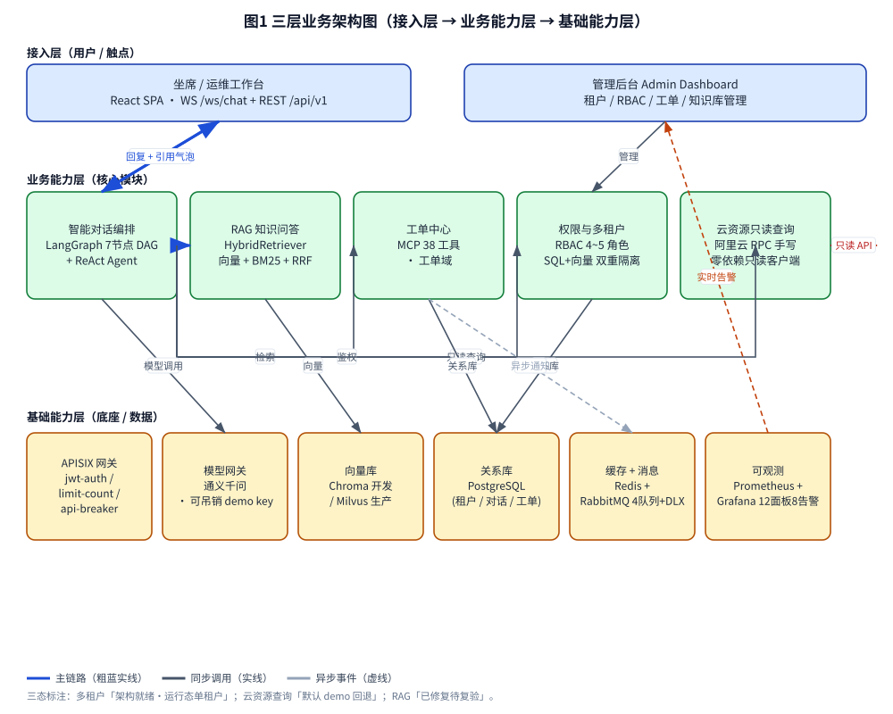
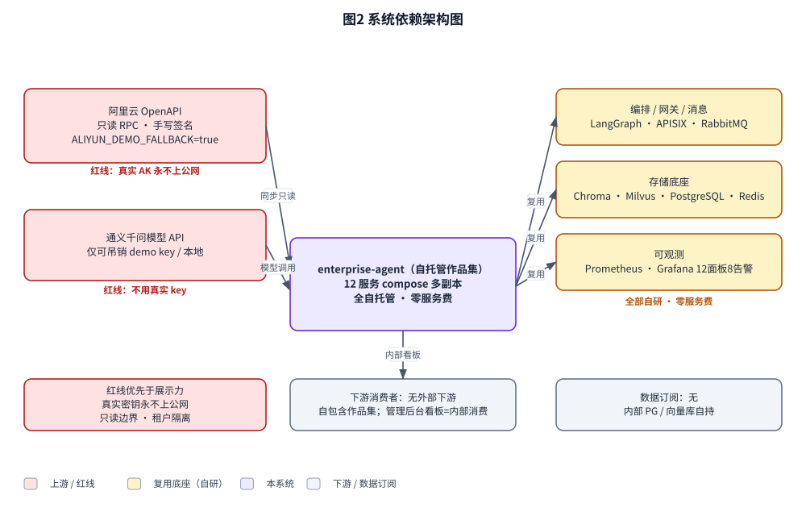
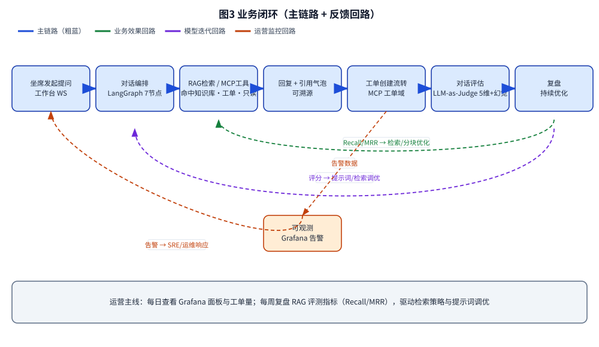

# AICoding 架构设计 · 高层架构设计

> 本文档为《AICoding 架构设计》核心产物之一，对应**高层架构设计**阶段（Gate G3）。
> 上游输入：业务原始诉求 + 行业调研结论（`research_report.md`，G2 通过）+ 现有架构知识库（`material_digest.md`，G1 通过）；
> 下游输出：驱动《系统设计》《部署设计》《安全设计》《UserStory》四份文档的撰写。
> **事实标注约定**：全文以【事实】= 资料/代码已证实；【假设】= 基于现状的合理推断（需后续复验确认）；【建议】= 业务架构师的取舍建议（非最终裁决，待 G3 审核）。

---

## 0. 元信息：修订记录

```yaml
标题: enterprise-agent - 高层架构设计 v0.1
版本: v0.1
状态: Draft   # Draft | Reviewing | Approved | Deprecated
创建日期: 2026-08-11
最后更新: 2026-08-11
作者: 许边界（business-architect）
评审人:
  - team-lead（主理人，待 G3 人工审核）

关联文档:
  上游输入:
    - 业务原始诉求: 对标「阿里云 AI 助理」智能客服系统，按生产级标准开发（个人简历作品集）
    - 行业调研报告: C:\Users\hai\enterprise-agent\.workbuddy\output\research_report.md
    - 现有架构知识库: C:\Users\hai\enterprise-agent\.workbuddy\output\material_digest.md
  下游产出:
    - 系统设计: AICoding架构设计-2-系统设计.md
    - 部署设计: AICoding架构设计-3-部署设计.md
    - 安全设计: AICoding架构设计-4-安全设计.md
    - UserStory: AICoding架构设计-5-UserStory.md
```

| 版本 | 日期 | 作者 | 变更内容 | 评审状态 |
| --- | --- | --- | --- | --- |
| v0.1 | 2026-08-11 | 许边界（business-architect） | 初稿：六章 + 附录，含三态边界标注与自检报告 | Draft（待 G3） |

> **版本管理纪律**：破坏性变更（章节结构调整 / 关键决策反转）升 MAJOR；新增章节、扩充内容升 MINOR。

---

## 1. 需求概要

### 1.1 需求概要说明

**业务现状**：项目为个人简历作品集（用户 hai/拾一，大三 AI 应用开发方向），非团队生产系统；对标「阿里云 AI 助理」智能客服形态（FastAPI + LangGraph + RAG + MCP + React），按生产级标准开发。当前为单仓库 `github.com/addhai/enterprise-agent`（master），22 份资料已盘点（G1），两条活跃任务线（三道缝验证、RAG 真实文档灌入）进行中，存在已知卡点（milvus 内存、RAG 三 bug 待复验）。

**触发事件**：用户启动 AICoding 架构专家团，要求"先读 HANDOFF.md，基于项目背景和资料方案分析项目现状"，交付五份架构文档；本高层架构设计为上游边界基线。

**系统定位一句话**：本系统是面向**坐席/运维**的客服工作台智能客服 AI Agent（非纯 C 端），以"可演示、架构完整、工程深度"为作品集核心卖点，对外演示严守"真实密钥永不上公网"红线。

### 1.2 关键决策摘要

| 编号 | 决策类别 | 决策内容 | 关联章节 |
| --- | --- | --- | --- |
| D1 | 范围决策 | 本期仅覆盖客服工作台智能客服核心链路（多轮对话 + RAG 命中 + 工单流转 + 三角色越权 403 + 多租户架构就绪 + 云资源只读查询）；多渠道、完整 12 服务长时间联跑不在 MVP | §6.1 需求边界 |
| D2 | 技术选型决策 | 复用已有自研底座（LangGraph / APISIX / RabbitMQ / Chroma·Milvus / PostgreSQL / Redis / Prometheus·Grafana），不采购重型 SaaS（Genesys/Salesforce 否决） | §3.2 / §4.2 |
| D3 | MVP / 完整版边界 | MVP = 多轮对话 + RAG 命中 + 工单流转 + 三角色越权 403 + 多租户架构就绪（诚实声明运行态单租户）；完整 12 服务联跑 / 多渠道 / 运行态多租户延后至完整版 | §4.3 |
| D4 | 复用 vs 新建 | 全部复用自研底座；仅"租户管理端点 + 租户维度 RBAC"需新建（进阶，D-01/D-02） | §5.2 |
| D5 | 部署形态 | 私有化 / 自托管 compose 多副本（D3 §9④已拍板）；红线约束下仅 localhost / 可吊销 demo key 对外演示 | §5.2 / 部署设计 |

**硬指标**：5 条（≥ 3 条，≤ 5 条）；每条决策已映射到正文具体章节。

### 1.3 价值主张

| 价值维度 | 量化目标 | 度量指标 | 当前值 | 目标值 | 截止时间 |
| --- | --- | --- | --- | --- | --- |
| 工程深度（作品集价值） | 展示生产级 AI 工程能力点数量 | 已落地可证明能力点（编排 / 混合检索 / MCP / 双重隔离 / 护栏 / 可观测） | 6 类 | 6 类（对外演示可证明） | MVP 上线 |
| 合规诚信（作品集价值） | "演示口径 vs 运行态"差异诚实声明覆盖率 | 三态标注项 / 需声明项 | 0 | 100%（4 项差异全声明） | MVP 上线 |
| 成本（技术/成本价值） | 系统运行成本 | 自托管月服务费 | 0 元 | 0 元（全自托管零服务费，D4） | 持续 |
| 体验（演示价值） | 单进程全链路 demo 可跑通率 | 核心链路端到端成功率 | 语料已灌、检索层已证好（D1 §9.7） | 100%（RAG 复验后） | MVP 上线 |

**硬指标**：业务价值 ≥ 2 条（工程深度、合规诚信）+ 技术/成本价值 ≥ 1 条（成本），共 4 条，均含可量化目标，无"提升/优化"类模糊词。

---

## 2. 需求分析 & 痛点解构

### 2.1 核心角色关注点

本系统核心角色关注点（甲方决策者、最终用户 A/B、受影响方终端客户与运维）如下，逐角色业务身份与 Top1 关心点见下表：

| 角色 | 业务身份 | 主要操作 | Top1 关心点 | 来源 |
| --- | --- | --- | --- | --- |
| 甲方决策者（招聘方 / 面试官） | 作品集评审方 | 审阅项目、面试深挖 | 工程深度与架构完整性的**可证明性**（能否经得起追问，而非规模） | D3 §1.1 / D5 |
| 最终用户 A（客服坐席 / 运维） | 工作台使用者 | 对话问答、工单、云资源查询 | 多轮对话**命中知识库**、工单顺畅流转、操作高效 | D3 §9① / D2 |
| 最终用户 B（系统管理员） | 管理后台使用者 | 租户 / RBAC / 知识库 / 工单管理 | 权限隔离正确（越权拦截）、配置可控 | D3 FR-22~25 / D6 |
| 受影响方：终端客户 | 经坐席被服务的用户 | 经坐席获得问答 / 工单 | 问题被准确解决、等待时间短 | D3 §1.3 |
| 受影响方：运维 / SRE | 可观测消费方 | 监控、告警响应 | 系统可用性与告警及时性 | D2 可观测 / D1 §1 Grafana |

甲方决策者与受影响方（终端客户、运维）的角色关注点差异，是 MVP 边界诚实声明的依据。

**硬指标**：5 类（≥ 3 类）；覆盖甲方决策者、最终用户（A/B）、受影响方（终端客户 / 运维）各至少一行；每行有具体 Top1 关心点（无"使用方便"类笼统表述）。

### 2.2 核心痛点

| 编号 | 痛点描述 | 现象 / 数据 | 影响角色 | 影响程度 | 优先级 |
| --- | --- | --- | --- | --- | --- |
| P1-1 | 对话未真正命中知识库（RAG 链路历史 bug 导致转人工） | 【事实】Bug A `for doc, _ in results` 元组解包崩溃被吞→转人工（D1 §9.2 头号根因）；检索层经 probe4 实测含"2025-12-31 下线 / 410 Gone"原文（D1 §9.2），但三 bug 已修**未端到端复验**（D1 §9.3），存在"答不上来"风险 | 坐席 / 终端客户 | 高（核心能力不达标，面试被识破） | P1 |
| P1-2 | 真实密钥红线被违反风险（安全 / 合规） | 【事实】若演示需求压倒红线、挂公网携带真实 key / 真实 AK，即触发安全合规事故（D1 §0 红线；R-05 严重程度=高） | 全体 / 合规 | 高（红线最高优先级） | P1 |
| P2-1 | 多租户仅 default 运行态，简历/文档若声称"多租户已运行"夸大 | 【事实】运行态仅 default 单租户、工单 API 硬编码 default、无租户管理端点（D6 R2/R3）；X9 冲突确认 | 甲方决策者（诚信） | 中（作品集可信度） | P2 |
| P2-2 | 完整 12 服务栈联跑受阻 | 【事实】milvus-standalone 内存限 2G（官方推荐 4G 起），启动约 3 分钟后 /healthz 持续 HTTP 500（D1 §3，R-01） | 演示 / 运维 | 中（全栈演示闭环） | P2 |
| P3-1 | 文档口径滞后于代码实测 | 【事实】D2/D5/D12 验证清单滞后于 D1 实测（X4）；若据旧文档做边界判断会误判 | 架构 / 下游 | 中（冻结偏差） | P3 |

**优先级标准**：P1 = 直接影响业务核心流程或合规底线，不解决无法上线；P2 = 影响体验/运营效率或诚信风险，可在 MVP 后迭代；P3 = 长尾/文档类问题。

**硬指标**：每条痛点有"现象/数据"佐证；P1 ≥ 1 条（P1-1、P1-2 共 2 条）且 §2.3 均有对应目标。

### 2.3 期待目标

| 编号 | 目标描述 | 对齐痛点 | 度量指标 | 当前值 | 目标值 | 截止时间 |
| --- | --- | --- | --- | --- | --- | --- |
| V1 | RAG 端到端命中达标（复验后对话含文档专属事实） | P1-1 | RAG 评测 Recall / MRR（D5 基准 0.6528 / 0.8333） | 检索层已证好，三 bug 待复验 | 复验通过（probe5 + ws_rag_verify，Recall ≥ 0.65） | MVP 上线 |
| V2 | 安全红线零违反（演示仅 localhost / demo key） | P1-2 | 真实 key 上公网次数 | 红线已定（D1 §0） | 0 | 持续 |
| V3 | "演示 vs 运行态"差异 100% 诚实声明 | P2-1 | 三态标注项覆盖率 | 0 | 100%（4 项差异全声明） | MVP 上线 |
| V4 | 单进程核心链路 demo 可跑通（绕开 milvus 卡点） | P2-2 | 核心链路端到端成功率 | 语料已灌 / 检索证好（D1 §9.7） | 100%（MVP 以单进程/核心链路演示） | MVP 上线 |
| V5 | 文档与代码单一事实源对齐 | P3-1 | 滞后文档回填率 | X4 滞后 | 100% 回填（以 D1 + 代码为准） | 完整版 |

**硬指标**：每条目标有数字 + 对齐 ≥ 1 条痛点；P1 痛点（P1-1/P1-2）均有对应 V 级目标（V1/V2）。

### 2.4 基线复用

| 复用类别 | 现有能力 | 复用方式 | 来源系统 | 备注 |
| --- | --- | --- | --- | --- |
| 对话编排 | LangGraph 7 节点 DAG + ReAct Agent | 进程内直接调用 | 本项目 | 已采用（D2/D5） |
| RAG 检索 | HybridRetriever（向量 + BM25 + RRF） | 直接复用 | 本项目 | 已落地，【建议】补 rerank + 调权（research §3.4.5） |
| API 网关 | APISIX（jwt-auth / limit-count / api-breaker） | 本地部署复用 | 本项目 | 已落地（D4 §6） |
| 消息队列 | RabbitMQ 4 队列 + DLX | 本地部署复用 | 本项目 | 已部署，D1 修复拓扑幂等声明 |
| 向量库 | Chroma（开发）/ Milvus（生产）双栈 | 直接复用 | 本项目 | 【事实】关注 milvus 内存下限（R-01） |
| 关系库 | PostgreSQL 16 | 本地部署复用 | 本项目 | 租户/对话/工单/画像表 |
| 缓存 | Redis 7 | 本地部署复用 | 本项目 | 会话/缓存/限流/分布式锁 |
| 可观测 | Prometheus + Grafana（12 面板 8 告警） | 本地部署复用 | 本项目 | 【事实】Grafana 已实跑 VERIFIED（12/18 面板出数，D1 §1） |
| 云资源只读 | 阿里云 RPC Signature V1 手写零依赖只读客户端 | 直接复用 | 本项目 | 默认 `ALIYUN_DEMO_FALLBACK=true`（红线） |
| 模型 | 通义千问（可吊销 demo key） | API 调用 | 阿里云百炼 | 仅 demo key / 本地（红线） |

**硬指标**：先盘点再决定新建；上表全部为复用，凡列"功能缺口"的能力（§2.5）均已确认基线无法覆盖。

### 2.5 功能缺口

| 阶段 | 功能缺口 | 必要性 | 优先级 | 对齐目标 |
| --- | --- | --- | --- | --- |
| 对话中 | RAG 端到端复验能力（已修三 bug 待复验） | 必须 | MVP | V1 |
| 对话中 | 三角色越权 403 验证（RBAC 角色口径统一） | 必须 | MVP | V3 |
| 工单中 | 工单创建流转（代码已实现，需纳入 MVP 演示） | 必须 | MVP | V4 |
| 运营 | 多租户运行化（租户管理端点） | 重要 | 完整版（进阶） | V3 |
| 运营 | 租户维度 RBAC 补齐（D6 R4） | 重要 | 完整版（进阶） | V3 |
| 进阶 | 完整 12 服务联跑（milvus 内存修复 / chroma fallback） | 重要 | 完整版 | V4 |
| 进阶 | 多渠道接入（邮件/电话/APP） | 可选 | 完整版 | 体验 |

**硬指标**：每条缺口对齐 §2.3 至少一条目标；MVP 缺口（RAG 复验、越权 403、工单流转）在 §6.3 功能清单中均标记 MVP ✅。

---

## 3. 行业调研

### 3.1 行业标杆系统分析

| 标杆系统 | 厂商 / 来源 | 场景覆盖 | 技术亮点 | 商业模式 | 适用度 |
| --- | --- | --- | --- | --- | --- |
| 阿里云百炼 + 通义晓蜜 | Alibaba Cloud（SaaS 头部） | 企业级智能客服、RAG 知识问答、Agent 工具调用、工单流转 | Assistants API、可视化智能体构建、MCP 协议、多模态 | 订阅制 + 按 token（含免费额度） | 高（范式对标） |
| Dify | LangGenius（开源） | LLM 应用开发、RAG 知识库、智能客服、Agent 工作流 | 可视化工作流、RAG 混合检索+重排、50+ 工具、多租户、SSO/RBAC | 开源（Apache-2.0 兼容）+ 企业版 | 高（工程实现） |
| Rasa | Rasa（开源） | 对话式 AI、客服助理、语音 IVR、多 Agent 编排 | CALM（LLM 原生对话管理）、on-prem/air-gapped、RBAC/SSO、OpenTelemetry | 开源根 + Rasa Pro 订阅 | 中（部分借鉴） |
| enterprise-agent（自研） | 本项目（自研作品集） | 智能客服 AI Agent、RAG、MCP 38 工具、多租户+RBAC、云原生可观测 | LangGraph 7 节点 DAG、HybridRetriever、APISIX、RabbitMQ、手写阿里云 RPC 只读客户端 | 自研（零服务费，全自托管） | 高（目标态自身） |
| 重型闭源 CCaaS（Genesys / Salesforce） | Genesys / Salesforce（SaaS） | 大规模联络中心、语音+数字全渠道、CRM 原生 | 预测路由、WEM、语音分析、Einstein AI、全渠道编排 | 按席位订阅（$25~$330/用户/月） | 低（否决） |

**硬指标**：5 家（≥ 3 家）；含头部 SaaS（阿里云百炼）+ 开源代表（Dify/Rasa）+ 自研代表（本项目）。

### 3.2 方案对标及优先级打分

**对比矩阵**（每行权重之和 = 1.00；得分 1~5，5 = 完美契合）：

| 评估维度 | 权重 | 阿里云 | Dify | Rasa | 自研 | 重型 CCaaS |
| --- | --- | --- | --- | --- | --- | --- |
| 场景契合度 | 0.30 | 5 | 4 | 3 | 5 | 2 |
| 技术成熟度 | 0.20 | 5 | 5 | 5 | 3 | 5 |
| 集成难度（反向） | 0.15 | 2 | 4 | 3 | 4 | 1 |
| 成本（反向） | 0.15 | 3 | 5 | 4 | 4 | 1 |
| 合规可控性（反向） | 0.20 | 2 | 5 | 5 | 5 | 2 |
| **加权总分** | **1.00** | **3.65** | **4.55** | **3.95** | **4.30** | **2.30** |

**结论摘要**：
- **优先借鉴**：阿里云百炼 + 通义晓蜜（范式对标，评分 3.65，场景契合 5/5）——多轮对话、RAG、工具/MCP 调用、工单流转、权限隔离、多渠道的"企业级智能客服工作台"范式首要对标；工程以"范式参考"而非"直接复用"（受闭源 SaaS 与红线约束）。
- **优先借鉴**：Dify（工程实现，评分 4.55，全场最高）——开源可自托管、混合检索+重排、多租户、企业 SSO/RBAC，契合"自托管零服务费 + 红线"目标。
- **部分借鉴**：Rasa（评分 3.95）——CALM 对话状态管理、"对话/业务规则分离"、on-prem 数据主权、RBAC/SSO 可借鉴；偏语音/意图、RAG 非核心，不全盘对齐。
- **部分借鉴（对照基线）**：enterprise-agent 自研（评分 4.30）——架构已就绪；需补齐 RBAC 租户维度、RAG 端到端复验、多租户运行化。
- **不借鉴（否决）**：重型闭源 CCaaS（评分 2.30）——需真实采购、闭源全托管、与"自托管零服务费 + 真实密钥不上公网"目标直接冲突，学生作品集无法承载。

**硬指标**：5 维度对比矩阵，权重和 = 1.00；结论含优先 / 部分 / 不借鉴三层。

### 3.3 完整报告参考

- 完整报告链接：`C:\Users\hai\enterprise-agent\.workbuddy\output\research_report.md`
- 调研工具：`tech-research-advisor`（5 家标杆 + 5 维加权矩阵 + 6 大技术域评分 + X1~X9 差距映射 + 5 风险 4 待确认）
- 调研日期：2026-08-11
- 调研归档：`material_digest.md`（G1 通过）→ `research_report.md`（G2 通过）

---

## 4. 方案决策

### 4.1 价值定位澄清

```
对外价值（客户侧）: 面向坐席/运维的客服工作台智能客服，缩短问题处理路径，提升知识命中率与工单流转效率，降低终端客户等待。
对内价值（运营侧）: 以最小运维成本（全自托管零服务费）呈现生产级 AI 工程能力（编排/混合检索/MCP/双重隔离/护栏/可观测），运营侧可观测、可审计、可复现。
差异化价值        : 手写阿里云 RPC 签名零依赖只读客户端 + SQL 级+向量级双重租户隔离 + 多副本一致性自动化证据 + 真实云 API 适配层（demo 回退），工程深度可证明而非规模取胜。
```

**与产品矩阵的关系**：本系统是个人作品集内的"客服工作台智能客服"核心，与上游阿里云只读 API / 模型 demo key、下游（无外部下游，管理后台看板内部消费）形成完整业务闭环（见 §5.2 / §5.3）。

### 4.2 系统定位澄清

| 维度 | 内容 |
| --- | --- |
| 系统名称 | enterprise-agent（客服工作台智能客服 AI Agent） |
| 系统类型 | 已有系统扩展（作品集持续迭代，非从零新建） |
| 部署形态 | 私有化 / 自托管（compose 多副本；【事实】D3 §9④已拍板"部署必须容器化多副本"） |
| 多租户 | 架构就绪（SQL 级 + 向量级双重隔离、RBAC），【事实】运行态仅 default 单租户（X9 / D6）——诚实标注「架构就绪未运行化」 |
| 服务对象 | 坐席 / 运维（工作台）、管理员（管理后台）；非纯 C 端（【事实】D3 §9①） |
| 上游依赖 | 阿里云 OpenAPI（只读 RPC，demo fallback）、通义千问模型 API（demo key）（详见 §5.2） |
| 下游消费者 | 无外部下游（自包含作品集）；管理后台看板为内部消费 |
| 边界（不做） | 不做重型 CCaaS 全渠道/CRM；真实 AK 直连对外演示不做（红线）；完整 12 服务长时间联跑为进阶非 MVP |

### 4.3 MVP 与完整版决策

| 阶段 | 时间窗 | 范围（功能编号） | 架构差异点 | 退出标准 | 不做（延后） |
| --- | --- | --- | --- | --- | --- |
| MVP | W1 ~ W4（作品集迭代） | F1 多轮对话、F2 RAG 命中、F3 工单流转、F4 三角色越权 403、F5 多租户架构就绪、F6 云资源只读查询（demo fallback）、F7 护栏+LLM-as-Judge、F8 可观测 | 单进程 / 核心链路演示（api/ws replicas 可演示）；RAG 用已灌 KB（205 切片）；真实云 API 默认 demo fallback；多副本架构就绪但 MVP 以核心链路为主 | 跑通核心场景（对话命中 + 工单流转 + 越权 403）+ 三态诚实声明 + RAG 复验通过（V1） | F13 运行态多租户、F14 12 服务联跑、F15 多渠道、真实 AK 直连 |
| 完整版 | W5+ | + F13 运行态多租户（租户管理端点 + 租户维度 RBAC）、F14 12 服务联跑（milvus 内存修复 / chroma fallback）、F15 多渠道 | 12 服务 compose 全联跑 + 多副本一致；运行态多租户；真实 AK 仅本地 / demo | 12 服务长时间联跑稳定 + 多租户运行化 + 多渠道（可选） | — |

**演进纪律**（重要）：
- ✅ MVP 架构骨架是完整版的子集（compose 多副本已就绪），不允许 MVP 上线后推倒重来。
- ✅ MVP 中可 Mock 的能力（真实三方接口，以 `ALIYUN_DEMO_FALLBACK=true` 回退）在完整版替换计划为"本地 / demo key 真实调用"。
- ❌ 禁止：MVP 为赶工引入完整版无法继承的临时架构（如临时单库 → 完整版分库分表）。

---

## 5. 业务架构设计

### 5.1 业务架构图

> 三层结构：**接入层（用户/触点）→ 业务能力层（核心模块）→ 基础能力层（底座/数据）**。实线 = 同步调用；虚线 = 异步事件；粗蓝线 = 主链路。三态标注见 §6.1。



### 5.2 系统依赖架构

> 基于系统定位，明确上下游模块清单及交互方式（同步 / 异步 / 数据订阅）。

| 依赖类型 | 系统 / 模块 | 提供方 | 依赖能力 | 接入方式 | 同步/异步 | 关键约束 |
| --- | --- | --- | --- | --- | --- | --- |
| 上游 | 阿里云 OpenAPI | 阿里云 | 只读云资源查询 / 诊断 | HTTPS / REST（手写 RPC Signature V1） | 同步 | 只读边界；`ALIYUN_DEMO_FALLBACK=true`；**真实 AK 永不上公网（红线）** |
| 上游 | 通义千问模型 API | 阿里云百炼 | LLM 推理 | HTTPS / REST（WS/SSE） | 同步 | **仅可吊销 demo key / 本地**；真实 key 不上公网（红线） |
| 复用底座 | LangGraph | 本项目 | 对话编排 | 进程内调用 | 同步 | 已采用 7 节点 DAG |
| 复用底座 | APISIX | 本项目/部署 | 网关鉴权 | 本地 | 同步 | jwt-auth / limit-count / api-breaker |
| 复用底座 | RabbitMQ | 本项目/部署 | 异步工单 / 通知 | MQ | 异步 | 4 队列 + DLX（D1 修复拓扑） |
| 复用底座 | Chroma / Milvus | 本项目 | 向量检索 | 本地 | 同步 | 【事实】关注 milvus 内存下限（R-01） |
| 复用底座 | PostgreSQL | 本项目 | 持久化 | 本地 | 同步 | PG 16 |
| 复用底座 | Redis | 本项目 | 缓存 / 限流 / 锁 | 本地 | 同步/异步 | — |
| 复用底座 | Prometheus / Grafana | 本项目 | 可观测 | 本地（拉） | 异步 | 12 面板 8 告警（Grafana 已 VERIFIED） |
| 下游消费者 | 管理后台看板 | 内部 | 运营视图 | WS / REST | 同步 | 内部消费（无外部下游） |
| 数据订阅 | 无 | — | — | — | — | 内部 PG / 向量库自持 |

**硬指标**：每条依赖明确"接入方式 + 同步/异步 + 关键约束"；P1-1（RAG 命中）依赖来源 = HybridRetriever / 向量库（自研）；P1-2（红线）依赖来源 = 阿里云只读 API（只读/手写签名/demo fallback）+ 模型 demo key，均已覆盖。



### 5.3 业务闭环

> 业务全链路的闭环路径，标注关键环节、关键反馈回路与运营主线。

**业务主链路**（端到端）：

```
坐席发起提问（工作台 WS）
  → 对话编排（LangGraph 7 节点）
  → RAG 检索命中 / MCP 工具调用（工单创建、云资源只读查询）
  → 回复 + 引用气泡（可溯源）
  → 工单创建流转
  → 对话评估（LLM-as-Judge 5 维评分 + 幻觉检测）
  → 复盘（持续优化）
```

**关键反馈回路**：

| 回路 | 触发点 | 反馈对象 | 反馈机制 | 价值 |
| --- | --- | --- | --- | --- |
| 业务效果回路 | 对话评估完结 | RAG 检索 / 分块策略 | RAG 评测 Recall / MRR（复验后 T+ 复盘） | 优化检索与 chunk 策略 |
| 运营监控回路 | 指标异常 / Grafana 告警 | SRE / 运维（管理后台） | 实时告警 | 快速响应、保障可用性 |
| 模型迭代回路 | LLM-as-Judge 评分 | 对话编排 / 提示词 | 周度调优 | 提升准确率、降低幻觉 |

**运营主线**：每日查看 Grafana 面板与工单量；每周复盘 RAG 评测指标（Recall / MRR），驱动检索策略与提示词调优。



---

## 6. 产品需求及原型

### 6.1 需求边界

**In-Scope**（本期必做，≤ 15 条）：

```
F1. 多轮对话（LangGraph 7 节点编排，WS /ws/chat 主链路）
F2. RAG 知识命中（HybridRetriever 向量+BM25+RRF，语料已灌 205 切片）
F3. 工单创建流转（MCP 工单域 6 工具）
F4. 三角色越权 403（RBAC 验证）
F5. 多租户 + RBAC 架构就绪（诚实声明运行态单租户）
F6. 云资源只读查询 / 诊断（手写 RPC，默认 demo fallback）
F7. 5 层安全护栏 + LLM-as-Judge 评分 + 幻觉检测
F8. 可观测（Prometheus / Grafana 面板 / 告警）
N1. 单进程核心链路 demo（api/ws replicas 可演示）
N2. 私有化自托管 compose 多副本部署
N3. 真实密钥红线（localhost / demo key，永不上公网）
```

**Out-of-Scope（部署与运行态类，本期不做）**：
| 编号 | 不做的事 | 原因 | 后续计划 |
| --- | --- | --- | --- |
| O1 | 完整 12 服务栈长时间联跑 | 【事实】卡 milvus 内存 2G（R-01），MVP 以单进程/核心链路演示 | 完整版：milvus 内存修复或 chroma fallback |
| O4 | 运行态多租户（租户管理端点 + 租户维度 RBAC） | 【事实】架构就绪但运行态仅 default（X9/D6），进阶补齐 | 完整版（D-01/D-02） |

**Out-of-Scope（范围与合规类，本期不做）**：
| 编号 | 不做的事 | 原因 | 后续计划 |
| --- | --- | --- | --- |
| O3 | 真实 AK 直连对外演示 | 【事实】红线禁止真实 key 上公网；仅 localhost / demo key | 不做对外真实直连；完整版仅本地/demo |
| O5 | 重型 CCaaS 全渠道 / CRM 原生能力 | 【事实】闭源采购、触红线、学生作品集无法承载（评分 2.30 否决） | 不借鉴 |

**Out-of-Scope（范围裁剪类，本期不做）**：
| 编号 | 不做的事 | 原因 | 后续计划 |
| --- | --- | --- | --- |
| O2 | 多渠道接入（邮件/电话/APP 等） | 非 MVP 必需，作品集聚焦核心链路 | 完整版 |
| O6 | 覆盖率 80% KPI | 【事实】D15 不适用本项目；门禁 40% 实测 48.83% 已达标 | 不追 80% |

**硬指标**：In-Scope = 11 条（≤ 15）；Out-of-Scope = 6 条（≥ 3）。

### 6.2 产品模块全景图

**模块卡片**（标准名 / 一级归属 / 责任团队 / 上游 / 下游 / MVP 是否包含）：

| 模块名称 | 一级归属 | 责任团队 | 上游 | 下游 | MVP 是否包含 |
| --- | --- | --- | --- | --- | --- |
| 坐席/运维工作台 | 接入层 | 前端 | 业务能力层（对话/工单/查询） | 无 | 是 |
| 管理后台 | 接入层 | 前端/后端 | 权限与多租户/工单/知识库 | 无 | 是 |
| 智能对话编排 | 业务能力层 | 后端（LangGraph） | 接入层 | RAG/工单/权限/云资源 | 是 |
| RAG 知识问答 | 业务能力层 | 后端 | 对话编排 | 向量库 | 是 |
| 工单中心 | 业务能力层 | 后端（MCP） | 对话编排 | 关系库/RabbitMQ | 是 |
| 权限与多租户 | 业务能力层 | 后端 | 接入层/各模块 | 关系库/向量库 | 是（架构就绪） |
| 云资源只读查询 | 业务能力层 | 后端（阿里云 RPC） | 对话编排 | 阿里云（只读/demo） | 是（demo fallback） |
| APISIX 网关 | 基础能力层 | 平台/运维 | 外部流量 | 各服务 | 是 |
| 模型网关 | 基础能力层 | 后端 | 对话编排 | 通义千问（demo） | 是 |
| 向量库（Chroma/Milvus） | 基础能力层 | 平台 | RAG | — | 是 |
| 关系库 PostgreSQL | 基础能力层 | 平台 | 各模块 | — | 是 |
| 缓存+消息（Redis/RabbitMQ） | 基础能力层 | 平台 | 各模块 | — | 是 |
| 可观测（Prometheus/Grafana） | 基础能力层 | 平台 | 各模块 | — | 是 |

### 6.3 功能清单

| 编号 | 一级模块 | 二级功能 | 功能描述 | 优先级 | MVP 范围 | 完整版范围 | 对齐目标 |
| --- | --- | --- | --- | --- | --- | --- | --- |
| F1 | 智能对话编排 | 多轮对话编排 | LangGraph 7 节点 DAG + ReAct，WS /ws/chat 主链路 | P0 | ✅ | ✅ | V1 / V4 |
| F2 | RAG 知识问答 | 知识库命中检索 | HybridRetriever 向量+BM25+RRF，引用气泡可溯源 | P0 | ✅ | ✅ | V1 |
| F3 | RAG 知识问答 | 语料灌入与复验 | 205 切片已灌（KBS-CD0480），三 bug 复验 | P0 | ✅ | ✅ | V1 |
| F4 | 工单中心 | 工单创建流转 | MCP 工单域 6 工具 | P0 | ✅ | ✅ | V4 |
| F5 | 权限与多租户 | 三角色越权 403 | RBAC 角色口径统一后验证越权拦截 | P0 | ✅ | ✅ | V3 |
| F6 | 权限与多租户 | 多租户双重隔离 | SQL 级 + 向量级（架构就绪，运行态单租户诚实声明） | P0 | ✅ | ✅ | V3 |
| F7 | 云资源只读查询 | 资源查询/诊断 | 手写 RPC 只读客户端，默认 demo fallback | P0 | ✅ | ✅ | V2（红线） |
| F8 | 智能对话编排 | 5 层护栏 + LLM-as-Judge | 安全护栏 + 5 维评分 + 幻觉检测 | P0 | ✅ | ✅ | V1 / V2 |
| F9 | 可观测 | 监控面板与告警 | Prometheus + Grafana 12 面板 8 告警 | P1 | ✅ | ✅ | V4 |
| F10 | 接入层 | 坐席/运维工作台 | React SPA + WS/REST | P1 | ✅ | ✅ | V4 |
| F11 | 接入层 | 管理后台 | 租户/RBAC/工单/知识库管理 | P1 | ✅ | ✅ | V3 |
| F12 | 部署 | 自托管多副本 | compose 部署，api/ws replicas:2 | P1 | ✅ | ✅ | V4 |
| F13 | 多租户运行化 | 租户管理端点 + 租户维度 RBAC | 进阶补齐（D-01/D-02） | P1 | ❌ | ✅ | V3 |
| F14 | 工单/系统 | 完整 12 服务联跑 | milvus 内存修复 / chroma fallback | P2 | ❌ | ✅ | V4 |
| F15 | 多渠道 | 多渠道接入 | 邮件/电话/APP 等 | P2 | ❌ | ✅ | 体验 |

**硬指标**：P0 功能（F1~F8）全部在 MVP 范围 ✅；每个功能反向映射到 §2.5 功能缺口 + §2.3 期待目标。

### 6.4 产品原型 - 坐席/运维工作台

**核心页面清单**：

| 页面 | 用途 | 关键交互 | MVP |
| --- | --- | --- | --- |
| 对话工作台（主界面） | 实时多轮对话 + 引用气泡 | WS 流式 + 一键溯源 | ✅ |
| 工单详情/创建 | 工单创建流转 | 字段补齐 / 提交 | ✅ |
| 云资源查询浮层 | 只读查询 / 诊断 | 触发查询 + 结果展示（demo fallback 标注） | ✅ |
| 个人/会话历史 | 历史会话回溯 | 筛选 / 跳转 | ✅ |

**关键交互约束**：
- WS 流式首字延迟 P99 ≤ 3s（对齐 NFR-01 TTFT≤3s，V1）。
- 越权操作返回 HTTP 403（对齐 F5/V3）。
- 引用气泡可点击溯源至知识库切片（对齐 F2）。

**原型链接**：无（作品集以单进程全链路 demo 实测，【事实】D1 §9.7 语料已灌/检索已证好）。

### 6.5 产品原型 - 管理后台

**核心页面清单**：

| 页面 | 用途 | 关键交互 | MVP |
| --- | --- | --- | --- |
| 工单总览/列表 | 全量工单查询 | 筛选 / 排序 / 批量 | ✅ |
| 租户与 RBAC 管理 | 角色/权限配置（架构就绪） | 配置 / 校验（声明运行态单租户） | ✅ |
| 知识库管理 | 文档上传/切片/索引 | 上传 / 查看 | ✅ |
| 监控/告警面板 | Grafana 12 面板 8 告警 | 实时刷新 / 一键干预 | ✅ |
| 趋势/归因页 | RAG 评测指标趋势 | 多维下钻 | ❌（完整版） |

**原型链接**：无（同 §6.4，单进程全链路 demo 实测）。

---

## 附录 A：关键决策点自检报告（中间确认协议 §2.4）

> 本附录为 G3 审核追溯材料。按协议 §2.4，在 §2 / §4 / §5 / §6 完成后分别插入自检：先按 §2.1 方案分歧判定，再按 §2.3 反向验证 3 问（Q1 返工成本 / Q2 可感知性 / Q3 与用户诉求一致性）。
> **结论前置**：全流程**未发起** `[中间确认]`。理由：所有高频决策点均已被用户原始诉求 / 上游已冻结文档（D3 §9 四条硬性定位 + D1 §0 安全红线 + X9 运行态事实 + 主理人注入的 MVP 边界）明确选择，协议 §2.1 条件 3（"上游已冻结文档对该决策点做出过明确选择"）成立，故不命中；且 §2.3 三问均指向"与已冻结决策一致、感知不到、返工可控"。

### A.1 §2 完成（系统定位与对外承诺）自检

- **§2.1 方案分歧判定**：**未命中**。
  - 系统类型（客服工作台智能客服，非纯 C 端）：【事实】D3 §9①已拍板"形态：客服工作台智能客服（面向坐席/运维）"。
  - 部署形态（私有化自托管）：【事实】D3 §9④已拍板"部署必须容器化多副本"。
  - 多租户模式（架构就绪/运行态单租户）：【事实】D3 §9③"多租户+RBAC 纳入 MVP" + X9/D6"运行态仅 default"为事实状态，边界以三态诚实标注（主理人指令）。
  - 对外 SLA：用户原始诉求显式"个人简历作品集（非真实生产客户）"（D1 §0、D3 §1.1），无外部客户即无对外 SLA 承诺，属诉求内含推论。
  - → 各决策点上游已冻结，无 ≥2 种合理且需用户裁决的方案。
- **§2.3 反向验证 3 问**：
  - Q1（3 个月后推翻的返工成本）：返工范围 = §4.2 系统定位表 + §5.2 依赖表 + 本附录；切换成本 ≈ 0.5 人日（均为文档级修订，无代码架构返工）。**可控**。
  - Q2（用户/客户/监管可感知性）：无外部客户与监管合同；本系统为作品集，对外仅 localhost/demo 演示。**感知不到**（除已声明的"运行态单租户"诚实标注外，不改变用户可见功能）。
  - Q3（与用户原始诉求一致性）：直接引用 D3 §9①"客服工作台智能客服（面向坐席/运维，非纯 C 端）"、D3 §9④"部署必须容器化多副本"、D1 §0"真实密钥永不上公网；对外只用本地 docker/localhost 或可吊销 demo 子 key"。**一致**。

### A.2 §4 完成（MVP/完整版裁剪 + 部署形态）自检

- **§2.1 方案分歧判定**：**未命中**。
  - MVP 范围（多轮对话+RAG 命中+工单流转+三角色越权 403+多租户架构就绪）：对齐 D3 §9③"多租户+RBAC 纳入 MVP"与 research_report §4.2 MVP 建议。
  - 排除项（完整 12 服务联跑 / 多渠道 / 真实 AK 直连）：主理人注入"完整 12 服务长时间联跑（卡 milvus）、多渠道完整版、真实 AK 直连对外演示均暂不在 MVP"——上游已冻结；且 12 服务联跑受 R-01（milvus 内存）硬阻塞、真实 AK 直连触红线。
  - 部署形态：同 §2，D3 §9④已拍板。
  - → 无方案分歧需用户裁决。
- **§2.3 反向验证 3 问**：
  - Q1：返工范围 = §4.3 MVP/完整版表 + §6.1 边界；切换成本 ≈ 0.5 人日（文档级）。**可控**。
  - Q2：MVP 以单进程/核心链路演示、12 服务联跑延后——用户可见功能（对话/工单/RAG/越权）均在 MVP；不消除任何用户可见能力，仅延后"长时间联跑稳定性/多渠道"。**感知不到**（运行态差异已在 §6.1 诚实声明）。
  - Q3：直接引用主理人注入"MVP 范围建议……完整 12 服务长时间联跑、多渠道完整版、真实 AK 直连对外演示均暂不在 MVP"；对齐 D3 §9③④。用户诉求未显式要求"12 服务长时间联跑必须在 MVP"，生产级标准已由架构+多副本满足。**一致**。

### A.3 §5 完成（三层业务架构图 + 业务闭环）自检

- **§2.1 方案分歧判定**：**未命中**。三层分层（接入/业务/基础）、主链路（WS /ws/chat）、反馈回路（业务效果/运营监控/模型迭代）均唯一且由现有架构（D2 架构图、D1 §9 主链路）直接导出，无替代方案需裁决。
- **§2.3 反向验证 3 问**：
  - Q1：返工范围 = §5.1/§5.3 图与表；切换成本 ≈ 0.3 人日。**可控**。
  - Q2：架构图与闭环为内部设计表达，不改变用户可见功能/形态/承诺。**感知不到**。
  - Q3：对齐 D2 系统架构（React SPA → WS/REST → 5 层护栏 → LangGraph → RAG/MCP → 底座）与 D3 §2 总体架构（展示层→网关鉴权层→对话编排层→业务支撑层→能力插件层）。**一致**。

### A.4 §6 完成（In-Scope/Out-of-Scope + 功能清单）自检

- **§2.1 方案分歧判定**：**未命中**。边界（In/Out）由 D3 FR-01~29 + 安全红线 + R-01 + X9 + 主理人 MVP 注入共同决定，无待裁决分歧。
- **§2.3 反向验证 3 问**：
  - Q1：返工范围 = §6.1~§6.5；切换成本 ≈ 0.5 人日。**可控**。
  - Q2：Out-of-Scope 项（12 服务联跑/多渠道/真实 AK 直连/运行态多租户）均为"延后/不做"，用户可见 MVP 功能不受影响；且已在 §6.1 明示。**感知不到**（除已声明的差异外）。
  - Q3：直接引用 D3 §9 四条硬性定位 + 主理人"MVP 范围建议" + D1 §0 红线。In/Out 与用户诉求显式提及的能力一致，未裁掉任何诉求明示能力。**一致**。

### A.5 待主理人/用户裁决的依赖项（移交下游）

| 编号 | 依赖项 | 说明 | 建议关注阶段 |
| --- | --- | --- | --- |
| D-01 | 多租户运行化决策（是否补齐租户管理端点） | X9/D6 指运行态仅 default、无租户端点 | 安全设计 / 部署设计 |
| D-02 | RBAC 角色集合统一（5 角色口径 + 补租户维度） | X5/D6 R4 | 安全设计 |
| D-03 | 12 服务联跑：milvus 内存修复 vs chroma fallback 选型 | R-01/U-01 | 部署设计 |
| D-04 | 云资源真实 API vs demo fallback 对外承诺边界 | 红线 + 对外演示口径 | 产品形态 / 对外承诺 |

---

## 附录 B：生成方法论与工具清单

### B.1 方法论

高层架构设计采用 Step0 → Step5 六步法：业务知识库构建（material_digest）→ 行业调研（research_report）→ 需求分析/痛点解构 → 能力盘点/系统定位 → 高层架构设计（§1~§5）→ 产品需求及原型（§6）。行业调研由 `research-analyst` 通过 `tech-research-advisor` 产出并经 G2 审核；本阶段由 `business-architect` 整合并冻结边界。

### B.2 配套工具

- `diagrams-generator`：生成 §5.1/§5.2/§5.3 三张架构图（本沙箱无 graphviz/diagrams/matplotlib 依赖，改用零依赖 Python 直接生成 SVG，CJK 由查看器系统字体渲染）。
- `tech-research-advisor`：行业调研与加权评分（见 research_report.md）。

### B.3 三态边界标注总览（诚信声明）

| 能力点 | 状态标注 | 依据 |
| --- | --- | --- |
| 多租户 + RBAC | 架构就绪 / 运行态单租户 | X9 / D6 |
| 完整 12 服务联跑 | 演示回退（单进程/核心链路） | R-01 / D1 §3 |
| RAG 三 bug | 已修复 / 待端到端复验 | D1 §9.3 |
| 云资源查询 | 演示回退（默认 demo fallback） | D3 §9② / 红线 |

---

> **decision**: "高层架构边界冻结，下游可进入"
> （待主理人走 G3 人工审核通过后，由主理人归档至 `delivery/高层架构设计.md`；若返工按意见定点修订重传。）
