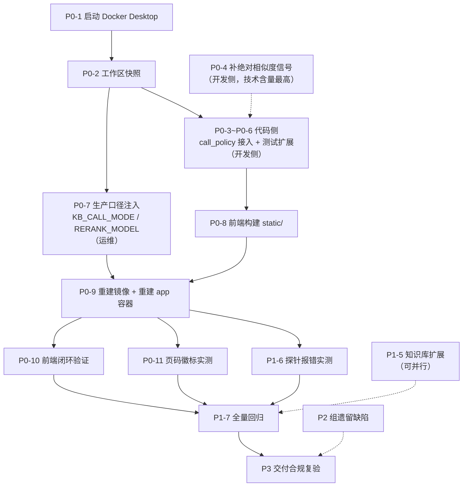

# enterprise-agent Phase5 后续待完善任务清单

> 项目：enterprise-agent — 工业知识库 AI Agent 内网全离线改造
> 项目路径：`C:\Users\hai\enterprise-agent`
> 运行环境：Windows + Docker Desktop（WSL2，纯 CPU，全内网离线）
> 生成时间：2026-09-27 18:43（CST）
> 核查方式：**纯只读**（源码/配置阅读 + git 状态 + 文件时间戳 + `py_compile`），未修改代码、未修改配置、未启停容器、未动数据卷
> 证据口径：所有结论附「文件路径 + 行号」；引用历史报告的条目已标注来源与日期

---

## 0. 结论速览

| 项 | 结论 |
|---|---|
| 项目整体 | Phase3 → Phase5 性能基准全部完成，核心目标达成，可进入运维/迭代阶段 |
| 唯一未收官主线 | **Phase5 主线「kb_call_mode 语义收口」只完成 1/6 步**（判据模块已写、未接节点） |
| 最致命风险 | **工作区 280 条改动未入库**，HEAD 停在 2026-09-22，一次误操作可能丢失 Phase3→Phase5 全部成果 |
| 当前阻塞 | **Docker daemon 未运行**，所有容器级动作停摆 |
| 技术含量最高的待办 | 补检索侧**绝对相似度信号**——不补，smart 语义上仍等价于 always |
| 代码与镜像的落差 | 4 项改动已落盘但**未上线**（static 托管、health_checker 修复、call_policy、logging） |

---

## 1. 当前状态基线（2026-09-27 只读实测）

### 1.1 阶段进度全景

| 阶段 | 内容 | 状态 | 回归基线 |
|---|---|---|---|
| Phase3 | 离线改造（LangGraph 工作流 + Chroma 检索 + WebSocket + 多租户） | ✅ 完成 | — |
| Phase4a | 外网残留收口 + local_bge 补齐（10 项改动） | ✅ 完成 | 1407 passed |
| Phase4b | 生产配置收口 + 镜像重建 + WS 联调 + L3/L4/L5 缺陷修复 | ✅ 完成 | 1413 → 1417 passed |
| Phase5 P0 | Q1/Q3 功能状态核查 | ✅ 完成 | — |
| Phase5 P1 | 前端页码徽标 + 4 个 kb_call_mode 测试 + 7 页 T90 PDF 入库 + WS keepalive 300s | ✅ 完成 | 1417 passed |
| Phase5 性能基准 | 镜像 14.7GB → 4.5GB；F02 查询 558s → 112s | ✅ 完成 | 1417 passed |
| **Phase5 主线** | **kb_call_mode 语义收口**（方案 v1.0 已冻结 2026-09-22） | ⚠️ **进行中（1/6 步）** | — |

### 1.2 关键实测发现（行号级证据）

#### A. Phase5 主线卡在第 2 步

| 事实 | 证据 | 判定 |
|---|---|---|
| 判据模块已写完 | `src/rag/call_policy.py`（337 行）；`tests/test_rag/test_call_policy.py`（299 行） | 方案 §8 第 2 步完成 |
| 两者均未入库 | `git status --short` → 均为 `??`（未跟踪） | 需随主线一并提交 |
| **未接入节点** | `src/graph/nodes.py` 全文命中 `call_policy\|decide_retrieval\|judge_probe\|retrieval_decided_by` = **0 处** | 方案 §8 第 3 步**未做** |
| 非法值回落目标未改 | `nodes.py:1100` → `logger.warning("未知 kb_call_mode=%s，回落 smart", _kb_mode)`，`nodes.py:1101` → `_kb_mode = "smart"` | 与冻结决策 3「回落 **always**」**不符** |
| 三分支仍为 Phase3 版 | `nodes.py:1098-1102`（归一化）／`:1106-1135`（never 直答）／`:1137-1163`（always 预检索） | smart 仍直落 Agent，无 A+C 判据 |
| 模块自述**设计缺口** | `call_policy.py` docstring：`metadata["score"]`（RRF 组内相对分）与 `rerank_score`（min-max 归一化）**top1 恒为 1.0，相对分不能作「是否检索」的判据**；无绝对信号时退化为「探测列表非空即命中」（`signal="nonempty"`） | **不补绝对信号，smart ≡ always** |

#### B. 生产口径未注入

| 文件 | `KB_CALL_MODE` | `RERANK_MODEL` | 其他 |
|---|---|---|---|
| `.env.production` | ❌ 无 | ❌ 无 | `LLM_MODEL=qwen2.5:7b` ✅；`AGENT_PROBE_ENABLED=false` ✅；`POSTGRES_PASSWORD`/`JWT_SECRET` 已轮换 ✅ |
| `deploy/prod/docker-compose.prod.yml`（`app.environment`，第 31-62 行） | ❌ 无 | ❌ 无 | `AGENT_PROBE_ENABLED=${AGENT_PROBE_ENABLED}` ✅（第 62 行） |

> 方案 §3 明确：**只写 env 不生效**，必须同时在 compose `environment:` 注入（Phase4b 已踩过同类坑）。

#### C. 镜像落后于代码（4 项改动未上线）

| 改动 | 落盘位置 | 时间 | 是否在现网镜像内 |
|---|---|---|---|
| `StaticFiles` 条件挂载 | `src/api/server.py:427-446`（HEAD 版为 `:397-412`，已提交） | 2026-09-22 | ❌ 镜像构建于 09-20 |
| `COPY static/` | `Dockerfile:72`（**HEAD 版无此行**，属未提交改动） | 未提交 | ❌ |
| `health_checker.py` 修复 | `src/protocols/health_checker.py`（469 行，`py_compile` 退出码 0） | 2026-09-22 | ❌ 容器内仍是损坏版 |
| `logging.py` 改动 | `src/utils/logging.py`（`git status` = `AM`） | 2026-09-24 | ❌ |

**现网镜像**：`enterprise-agent-app-ollama:latest` = `e798a4a3f4ee`，4.5GB，构建于 **2026-09-20 13:21**（来源：Phase4b 验收报告 2026-09-21）。

**坐实证据**：Phase4b 验收（2026-09-21）实测 `GET /` 返回 **404**、`/api/v1/health` 返回 200 —— 现网镜像不托管前端。

#### D. 前端产物滞后

| 项 | 时间戳 |
|---|---|
| `static/index.html` + `static/assets/` | 2026-09-17 17:06 |
| `frontend/src/App.tsx`、`App.css` | 2026-09-22 20:25 |

`static/assets/index-*.js` 内已含 `chat-citation-page` 类名（页码徽标在产物内），但**早于 09-22 的源码改动**，需重新构建。

#### E. 已确认修好的项

| 项 | 位置 | 状态 |
|---|---|---|
| pytest 并行参数 | `pyproject.toml:55-59` → `addopts` 已改 `-n=4` | ✅ `-n auto` 被杀的问题已解 |
| vite 端口冲突 | `frontend/vite.config.ts` → `server.port: 5173` | ✅ 与 Grafana 3000 冲突已解 |
| vite 构建输出 | `frontend/vite.config.ts` → `build.outDir: '../static'` | ✅ 与后端托管路径一致 |
| WS keepalive | `deploy/prod/docker-compose.prod.yml:67` → command 含 `--ws-ping-interval 300 --ws-ping-timeout 300` | ✅ C4 修复在位 |
| 探针开关 | `.env.production` `AGENT_PROBE_ENABLED=false` + compose 第 62 行透传 | ⚠️ 就位，**待容器级实测** |
| 前端页码徽标 | `frontend/src/App.tsx:759-761`（`page?: number \| null`）、`:1195-1196`（「第 N 页」徽标） | ✅ 代码就绪，**待生产验证** |

#### F. 仍未透出的字段

| 字段 | 产出层 | 透出层 | 状态 |
|---|---|---|---|
| `page` | `src/rag/loaders/pdf_loader.py:22-56` | `src/websocket/routes.py:519` | ✅ 贯通（仅 PDF 有值） |
| `chapter_path` | `src/rag/outline.py:236`、`src/rag/loaders/docx_loader.py:145` | **`routes.py` 全文 0 处命中** → 到此处被丢弃 | ❌ **断层未修** |

### 1.3 环境与风险

| 项 | 实测值 |
|---|---|
| Docker daemon | ❌ **未运行**（`failed to connect to the docker API at npipe:////./pipe/dockerDesktopLinuxEngine`） |
| git HEAD | `b119f24` 2026-09-22 20:44:14 `docs: 新增生产部署与运维手册` |
| 工作区改动 | **280 条**（大量 `M` / `MM` / `??`） |
| 生产数据卷 | `prod-agent-chroma` / `prod-postgres-data` / `prod-redis-data` —— 完整保留 |
| 知识库规模 | 322 块，其中 7 块带 `page`（T90 PDF），页码覆盖率 ≈ **2.2%**（来源：PM 视角文档 §3.1，2026-09-20） |
| 回归基线 | 1417 passed / 23 skipped / 0 failed（来源：Phase5 P1 验收报告，2026-09-18） |

**待核实异常**：《项目目标完成度总报告》（2026-09-21）记 `health_checker.py` 为 **529 行**，本轮实测为 **469 行**（可编译）。需确认 469 行是否为最终修复版、是否曾被回退 → 见任务 P1-8。

---

## 2. 任务清单

### P0 — 阻塞项，必须最先做

| # | 任务 | 依据 / 位置 | 验收标准 | 归属 |
|---|---|---|---|---|
| **P0-1** | 启动 Docker Desktop，确认 daemon 可用 | 实测 `docker version` 连接失败 | `docker version` 返回 Server 版本号 | 运维 |
| **P0-2** | **工作区快照**：先建分支或 stash 备份，再动手 | 280 条未提交改动；`call_policy.py` 未跟踪；HEAD `b119f24` | 存在可回滚的备份点（分支/stash/压缩包） | 运维 |
| **P0-3** | **Phase5 主线接入 `nodes.py`**：① smart 接 A→C 判据（探测即正式检索第一次调用、命中即复用不二次检索）；② 非法值回落改 `always`（`:1099-1101` + 告警文案）；③ always 预检索与 Agent 自主检索结果合并改**内容级去重**（`sha1(normalize(page_content))` + `(doc_id, page)` 辅助键）；④ 检索次数**软上限 3 次**、超限 `warning`（不硬截断） | 方案 §2.2 / §2.3 / §2.5；`nodes.py:1098-1163`；合并去重点约 `:1289-1302`（方案标注行号，接入时需重新定位） | 三模式分支用例全过；同一 query 检索调用**恰好 1 次** | **开发侧** |
| **P0-4** | 补检索侧**绝对相似度信号**（`metadata["vector_similarity"]`）或按生产数据标定 RRF 原始分下限 | `call_policy.py` docstring 自述缺口 | smart 下知识库外问题得 `score_reject`、闲聊得 `rule`，均不触发检索 | **开发侧** |
| **P0-5** | 可观测性三要素落 metadata 与日志：`kb_call_mode`、`retrieval_decided_by`、`retrieval_count` | 方案 §2.4 | 日志可对三种模式逐条取证 | 开发侧 |
| **P0-6** | 测试同步与扩展：改 `tests/test_graph/test_nodes_llm.py:432`（非法值断言 + 文案）；新增 never 零检索、smart 规则短路 / 探测命中 / 探测复用恰好 1 次 / 未命中 reject / 判据异常 fallback、去重与软上限用例 | 方案 §4.1-4.3 | 新增用例全过 | 开发侧 |
| **P0-7** | 生产口径注入：`.env.production` 加 `KB_CALL_MODE=always`；**同步** compose `app.environment` 加 `- KB_CALL_MODE=${KB_CALL_MODE}`；顺带固化 `RERANK_MODEL` | 方案 §3 / §1.4；实测两文件均无该键 | 容器内 `env` 可查到 `KB_CALL_MODE=always` | 运维 |
| **P0-8** | `npm run build` 重建 `static/` | `static/` 09-17 vs `App.tsx` 09-22 | 产物时间戳更新，页面行为与源码一致 | 前端 |
| **P0-9** | **重建镜像 + 重建 app 容器**（承载 static 托管、health_checker 修复、call_policy 接入、logging 改动） | `Dockerfile:72`；命令须带 `-f deploy/prod/docker-compose.prod.yml --env-file deploy/prod/.env.production` | 见「附录 A 验证清单」 | 运维 |
| **P0-10** | 前端生产闭环验证 | `src/api/server.py:427-446` StaticFiles 挂载 | `curl /` 返回前端 HTML（非 404）；**`/api/v1/health` 仍返回 JSON**（StaticFiles 挂载顺序覆盖 API 是已知风险，必验）；静态资源 200 | 运维 |
| **P0-11** | 浏览器实测页码徽标 | `App.tsx:759-761`、`:1195-1196` | 问「T90 热像仪的分辨率是多少」→ 引用卡片出现「第 N 页」 | 运维 |

### P1 — 功能补齐与质量收口

| # | 任务 | 依据 / 位置 | 备注 |
|---|---|---|---|
| **P1-1** | **章节字段 `chapter_path` 透出**：citations 输出字典补该字段 | 产出 `src/rag/outline.py:236`、`loaders/docx_loader.py:145`；断点 `src/websocket/routes.py`（`page` 在 `:519`） | 这是「page 对 md 文档恒为 null」的补偿项，性价比高于扩语料 |
| **P1-2** | 前端渲染 `chapter_path`（章节路径/锚点） | `App.tsx` 现无任何 chapter 消费 | 与 P1-1 配套 |
| **P1-3** | `pdf_loader` 定位失败时**不写** `page` 键（现写 `None`，被 Chroma 静默丢弃，造成「代码写了库里没有」） | Phase5-P0 核查报告 §2.7 建议 2；`pdf_loader.py:22-56` | 消除排查陷阱 |
| **P1-4** | DeepDoc `page_number` 字段名统一为 `page`（或构建层兼容读取） | `deepdoc_parser.py:217-224` vs `routes.py:519` | 当前未产生脏数据，预防性修复 |
| **P1-5** | 知识库页码覆盖率提升：从 322 块 / 7 块带页码 → 目标 >5% | PM 视角文档 T4；`scripts/generate_demo_pdf.py` 可作模板 | PDF 正文**必须含 `# 标题` 行**，否则不切章、页码注不进；入库后 Chroma 只读验证 + 备份数据卷 |
| **P1-6** | 多 agent 探针报错收口**实测** | `AGENT_PROBE_ENABLED=false` 已在 env + compose 就位 | 重建后 `docker logs prod-app-1` 不应再出现 `All connection attempts failed`；若仍报错则降日志级别 |
| **P1-7** | **全量回归**并按冻结口径出报告 | 基线 1417 passed / 23 skipped；方案 §4.4 | 须 `--deselect tests/test_mcp_tools/test_kb_phase2.py` 后并行 + 该文件单独串行（规避 Windows 下 `torch_cpu.dll` 并行崩溃导致的 xdist worker errors）；报告须区分 `failures` 与 `errors` |
| **P1-8** | 核实 `health_checker.py` 469 行 vs 报告 529 行的口径差异 | 完成度总报告（09-21）vs 本轮实测 | 确认当前是否为最终修复版 |
| **P1-9** | 运维手册补三模式口径、默认值、热更新方式 | `deploy/prod/README-生产部署与运维手册.md`；方案 §3 文档行 | 与 P0 同批 |

### P2 — 遗留缺陷与体验

| # | 任务 | 位置 / 来源 |
|---|---|---|
| **P2-1** | `session_id` 双写不一致（建连自生成 uuid 下发 vs 客户端传入在 `chat_message` 阶段才被采纳） | `src/websocket/routes.py:112` / `:332-333` |
| **P2-2** | WS 断开后后台推理不取消，CPU 持续被占用 | Phase4b 遗留观察 3 |
| **P2-3** | 端到端延迟过高：CPU 单题 5–12 分钟（Q1 725.7s / Q3 656.5s）；L4 放宽候选池后 rerank 单批 13.21s → 28.88s | Phase4b 报告 §七；demo 体验阻塞项 |
| **P2-4** | `session_ready` 帧无身份回执（可观测性缺口） | `routes.py:149-154` |
| **P2-5** | `role` 解析后零消费 | `routes.py:114` |
| **P2-6** | 容器内 `HTTP_PROXY` / `HTTPS_PROXY` 代理变量清理 | 完成度总报告遗留 #2 |
| **P2-7** | `OLLAMA_BASE_URL` 重复键且无消费者；`.env.production.example` 口径一致 | 完成度总报告遗留 #10 / #11 |
| **P2-8** | `backup-14.7gb` 旧镜像清理（飞书适配器仍占用旧镜像） | 完成度总报告遗留 #6 / #7 |
| **P2-9** | 本地 `chroma_data/` 开发残留清理（956 块句子粒度 + 0 记忆、旧 sqlite3 格式，**非生产基线**，勿混淆） | 完成度总报告遗留 #12 |
| **P2-10** | `dev` / `milvus` 废弃编排清理 | 遗留 #13（用户已决策：暂不处理） |

### P3 — 交付合规复验

- [ ] 外网审计复跑：扫描 `src/` + compose 的外网地址（预期仅第三方协作平台 Webhook，运行时默认不调用）
- [ ] `GET /api/v1/health` 返回 `aliyun_demo_fallback: false`
- [ ] 容器内 `HF_HUB_OFFLINE=1` / `TRANSFORMERS_OFFLINE=1`
- [ ] 知识库完整性：`knowledge_base ≥ 322`、`long_term_memory ≥ 2`
- [ ] 数据卷备份（`prod-agent-chroma` 等）
- [ ] 文档归档齐全（含 Phase5 主线封版报告）

---

## 3. 依赖关系与执行顺序



**推荐执行顺序**

1. P0-1（启动 Docker）→ P0-2（快照备份）
2. 并行推进：代码侧 P0-3 → P0-6（含前置 P0-4），运维侧 P0-7
3. P0-8（前端构建）→ P0-9（重建镜像 + 容器）
4. P0-10 / P0-11 / P1-6（重建后统一验证）
5. P1-7 全量回归 → P3 交付合规复验
6. P1-1~P1-5、P2 组按需排期（P1-5 知识库扩展可在 P0-9 构建期间并行）

---

## 4. 阻塞与前置条件

| # | 阻塞 | 影响 | 解除条件 |
|---|---|---|---|
| 1 | **Docker daemon 未运行** | 所有容器级任务（P0-9~P0-11、P1-6、P1-7 的容器部分、P3）全部停摆 | 人工启动 Docker Desktop |
| 2 | **280 条改动未入库** | 一次误操作可能丢失 Phase3→Phase5 全部成果 | 先做快照/分支备份（P0-2） |
| 3 | **call_policy 判据信号缺陷** | 不补绝对相似度（P0-4），smart 接入后语义上仍等价于 always，「语义收口」名不副实 | 检索侧补 `metadata["vector_similarity"]` 或标定 RRF 原始分下限 |

---

## 5. 协作分工

| 任务类型 | 归属 | 涉及任务 |
|---|---|---|
| 代码开发（含前后端功能、切块层逻辑透出） | **开发侧** | P0-3、P0-4、P0-5、P0-6、P0-8、P1-1、P1-2、P1-3、P1-4 |
| 配置 / 运维 / 部署 | 运维（Marvis） | P0-1、P0-2、P0-7、P0-9、P0-10、P0-11、P1-6、P1-9、P3 |

---

## 附录 A：P0-9 镜像重建验证清单

- [ ] 镜像 `latest` ≤ 5GB
- [ ] 三容器（`prod-app-1` / `prod-postgres-1` / `prod-redis-1`）healthy
- [ ] `GET /api/v1/health` → 200，且 `aliyun_demo_fallback: false`
- [ ] `GET /api/v1/metrics/prometheus` → 200
- [ ] `curl /` → 返回前端 HTML（非 404），且 `/api/v1/health` 未被 StaticFiles 覆盖
- [ ] 容器内 `torch` 为 `+cpu` 版，无 `nvidia` / `triton` 包
- [ ] rerank 权重存在（`/app/models/bge-reranker-base/model.safetensors`）
- [ ] `docker inspect prod-app-1 --format "{{.Config.Cmd}}"` 含 `--ws-ping-interval 300 --ws-ping-timeout 300`
- [ ] 容器内 `env` 可查到 `KB_CALL_MODE=always`
- [ ] 启动日志出现 `[kb_call_mode=always]`，且无 `health checker start failed`
- [ ] 数据卷未被重建，知识库块数不减少

## 附录 B：关键命令（必须显式指定 compose 文件）

```powershell
# 1. 只读检查
docker version
docker ps --format "table {{.Names}}\t{{.Status}}\t{{.Image}}"

# 2. 重建镜像（构建期需临时联网）
cd C:\Users\hai\enterprise-agent
docker compose -f deploy/prod/docker-compose.prod.yml --env-file deploy/prod/.env.production build app

# 3. 重建 app 容器（postgres / redis 不动，数据卷保留）
docker compose -f deploy/prod/docker-compose.prod.yml --env-file deploy/prod/.env.production up -d --force-recreate app

# 4. 健康检查
curl.exe -s http://localhost:8000/api/v1/health
curl.exe -s http://localhost:8000/api/v1/metrics/prometheus
docker inspect prod-app-1 --format "{{.State.Health.Status}}"
docker logs prod-app-1 --tail 80

# 5. 容器内口径核对
docker compose -f deploy/prod/docker-compose.prod.yml --env-file deploy/prod/.env.production exec app sh -c "env | grep KB_CALL_MODE"

# 6. 全量回归（仓库根目录，按冻结口径）
cd C:\Users\hai\enterprise-agent
.\venv\Scripts\python.exe -m pytest -o addopts="" -q -n 4 --basetemp=".pytest_tmp" -p no:cacheprovider --deselect tests/test_mcp_tools/test_kb_phase2.py
```

> ⚠️ compose 操作**必须**带 `-f deploy/prod/docker-compose.prod.yml`，否则会操作到项目根目录的旧编排/容器。

## 附录 C：证据索引（文件:行）

| 证据 | 位置 |
|---|---|
| kb_call_mode 归一化 + 非法值回落 smart | `src/graph/nodes.py:1098-1102` |
| never 分支（跳过检索、LLM 直答） | `src/graph/nodes.py:1106-1135` |
| always 分支（强制预检索） | `src/graph/nodes.py:1137-1163` |
| 判据模块（未接入） | `src/rag/call_policy.py`（337 行） |
| 判据模块单测（未接入） | `tests/test_rag/test_call_policy.py`（299 行） |
| 非法值回落断言 | `tests/test_graph/test_nodes_llm.py:432` |
| page 构建 | `src/websocket/routes.py:519` |
| chapter_path 断点 | `src/websocket/routes.py`（0 处命中） |
| 前端 page 字段 / 徽标 | `frontend/src/App.tsx:759-761` / `:1195-1196` |
| StaticFiles 挂载 | `src/api/server.py:427-446`（HEAD 版 `:397-412`） |
| static 复制进镜像 | `Dockerfile:72`（HEAD 版无此行） |
| pytest 并行参数 | `pyproject.toml:55-59` |
| vite 端口 / 输出目录 | `frontend/vite.config.ts` |
| WS keepalive | `deploy/prod/docker-compose.prod.yml:67` |
| 探针开关透传 | `deploy/prod/docker-compose.prod.yml:62` |
| 健康检查模块 | `src/protocols/health_checker.py`（469 行） |
| 页码注入（PDF） | `src/rag/loaders/pdf_loader.py:22-56` |
| chapter_path 产出 | `src/rag/outline.py:236`、`src/rag/loaders/docx_loader.py:145` |
| DeepDoc 字段名分歧 | `src/rag/deepdoc_parser.py:217-224` |

---

## 待复跑验证（本次未能实测）

以下项因执行环境工具超时未能在本轮完成，下次执行前建议先复跑：

1. `tests/test_rag/test_call_policy.py` 单测实际通过数（用于确认方案 §8 第 2 步「先自证」是否成立）
2. 全量回归当前真实通过数（估计基线 > 1417，但未实测）
3. 容器内 `KB_CALL_MODE` 实际取值（Docker 未启动，无法核对）
4. 现网镜像是否真的不含 static 托管（推断依据为镜像构建时间 09-20 早于代码 09-22，未经容器实测）

---

*本清单为只读核查产物，仅记录事实与证据，不含未经验证的推断；推断项已单独标注。*
*生成时间：2026-09-27 18:43（CST）*
